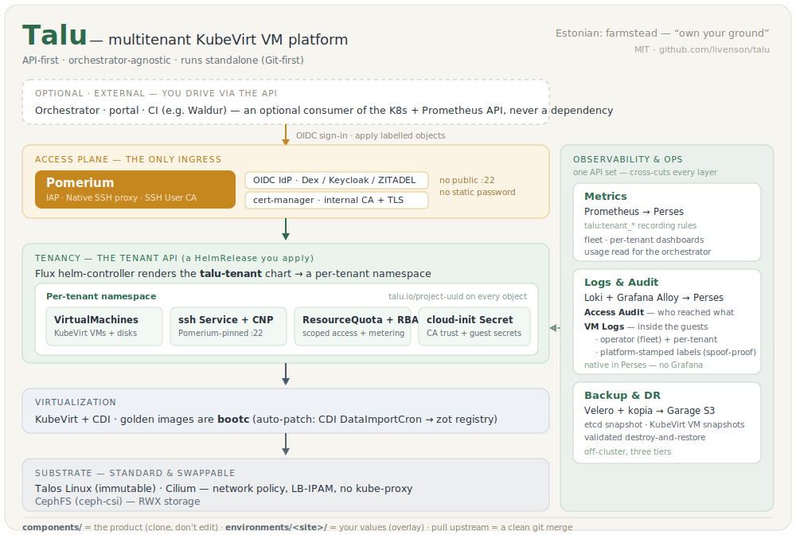

# Talu

**Talu** (Estonian: *farmstead* — "own your ground") is an open-source, multitenant VM
platform: fast tenant provisioning, HA, zero-downtime updates, with a deliberately small
operational footprint. It runs on a Kubernetes + KubeVirt substrate (Talos Linux, Cilium,
CephFS, KubeVirt/CDI, Pomerium, a generic OIDC IdP, Prometheus + Perses) and is **API-first and
orchestrator-agnostic** — the whole management surface is the Kubernetes declarative API plus
the Prometheus HTTP API. See [`docs/architecture/`](docs/architecture/) for the component
diagram and [runtime flows](docs/architecture/flows.md).

<p align="center">
  
</p>

**Talu works standalone — no external orchestrator required.** You can operate it entirely
through Git: Flux reconciles both the platform and its tenants from a repository you control.
An external billing/portal/automation system is an **optional** consumer of a stable contract
(the Kubernetes API + Prometheus; see [`docs/integrations/`](docs/integrations/)) — for example
[Waldur](https://waldur.com), a self-service portal, or a CI pipeline — never a dependency.

**Platform tiers** (deployed by the `ansible/` roles; per-component detail in each
[`components/platform/*/README.md`](components/platform/)):

- **Observability** — Prometheus + Perses dashboards: fleet, network/security, per-VM, Access &
  Identity, and backup/DR, plus per-tenant dashboards (data hard-scoped by prom-label-proxy).
- **Logging & audit** — Loki + Grafana Alloy, surfaced **natively in Perses** (no Grafana):
  an **Access Audit** view (*who accessed what, when*) and **VM Logs from inside the guests** — both a
  fleet-wide **operator** view and **per-tenant**, with tenant/VM labels stamped by the platform so a
  tenant can't spoof another's stream. See [`components/platform/logging/`](components/platform/logging/).
- **Backup & DR** — Velero + node-agent (kopia) → Garage S3, with validated destroy-and-restore; plus
  `talosctl etcd snapshot` and KubeVirt `VirtualMachineSnapshot`. See
  [`docs/operations/backup-restore.md`](docs/operations/backup-restore.md).

> Status: **early scaffold.** The architecture is settled (see `docs/architecture/`); the
> component manifests are being implemented per the single-node pilot plan. The
> remote-lab dev loop and the Rocky 10 validation path are runnable today.

## Repository layout

| Path | What it is |
|---|---|
| `components/` | **The product.** Reusable, parameterized bases (infrastructure, platform, tenancy). *You don't edit these to adopt.* |
| `environments/` | **Your config.** Values-only overlays. Copy `example/` to your own site; `rocky-sandbox/` is the no-KVM validation overlay. |
| `docs/` | `architecture/` (what & why), `install/`, `customize/` (the boundary + fork-and-track), `integrations/`, `operations/`, `development/`. |
| `images/` | Golden image pipeline (bake capabilities, inject identity). |
| `bootstrap/` | Host installers a newcomer runs (`rocky/`). |
| `dev/` | Contributor tooling: `talos/` patches, `loopdev/`, `lab/` (the remote-lab dev loop). |
| `ci/`, `examples/` | Forge-agnostic pipeline templates; example tenant/VM values. |

**The customization boundary:** `components/` is upstream you clone and never edit;
`environments/<site>/` is where your values live. Because you only add an overlay, pulling
a new Talu release is a clean `git merge`. See [`docs/customize/`](docs/customize/).

## Try it on one cloud VM (no KVM required)

Talu's quick-mode runs the whole stack on a single Linux VM with **no nested
virtualization** — Talos-in-container + KubeVirt software emulation + external CephFS storage.
It validates correctness (GitOps, identity, storage, the tenant API), not performance
(validated on **Rocky Linux 10.1**, OpenStack). You drive the remote lab from your laptop over
an SSH tunnel:

```sh
# 1. point env.sh at your VM (defaults to the project's Rocky 10 lab)
#    LAB_SSH=you@your-vm  ...
# 2. prep the host + create the cluster + open the tunnel + sync
make try
# 3. watch it reconcile, from your laptop
make lab-status
```

`make help` lists every target. The full walk-through and exit criteria are in
[`docs/development/validation-plan.md`](docs/development/validation-plan.md).

## The remote-lab dev loop

The cluster lives on the lab VM; you edit locally and sync:

- `make lab-tunnel` — persistent SSH forward to the remote API (+ zot); fetches kubeconfig.
- `make lab-sync` — `kustomize build environments/<env> | kubectl apply --server-side` through the tunnel (seconds; Flux suspended). `make lab-oci` for full reconcile-semantics.
- `make lab-status` — reconcile/health of the remote lab, rendered locally.

## License

[MIT](LICENSE) © Ilja Livenson.
