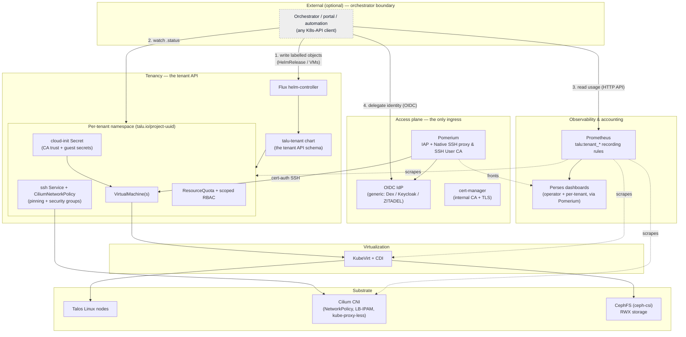

# Architecture

Talu is an open-source, multitenant **VM platform** built on a Kubernetes + KubeVirt substrate.
Its entire management surface is the **Kubernetes declarative API plus the Prometheus HTTP API** —
there is no proprietary control plane. That makes it **API-first and orchestrator-agnostic**: an
external billing/portal/automation system drives Talu through a stable contract, and Talu also runs
fully standalone (Git-first, no orchestrator at all).

- **Runtime flows with sequence diagrams:** [`flows.md`](flows.md).
- **Network architecture** (Cilium, VM security, L2/L3, IPv4/IPv6, IPAM, LB): [`networking.md`](networking.md).
- **How Talu compares** (Cozystack, Harvester, OpenShift Virt, OpenStack, Proxmox…): [`comparison.md`](comparison.md).
- Driving Talu from an external system: [`../integrations/`](../integrations/).
- Operating guide & validated gotchas (the hard-won lab lessons): [`../../CLAUDE.md`](../../CLAUDE.md)
  and [`../development/lab-notes.md`](../development/lab-notes.md).

## The layers

## Reading the diagram

- **The orchestrator boundary is dashed and optional.** Everything below it runs without it. An
  external system participates only through four verbs (write / watch / read / delegate — see
  [`flows.md`](flows.md#the-integration-contract)); Talu never calls out to it.
- **Access plane = the only ingress.** All human and machine access enters through **Pomerium**,
  which is both the HTTP identity-aware proxy *and* the native SSH proxy + SSH User CA. Authentication
  is delegated to a **generic OIDC IdP** (Dex on the lab; Keycloak/ZITADEL in production — a values
  swap). There is no public `:22` and no static VM password.
- **Tenancy = the tenant API.** A tenant is a set of values rendered by the **`talu-tenant` chart**.
  The chart's `values.schema.json` *is* the API. Applying a `HelmRelease` (directly to the K8s API, or
  from Git) makes Flux's helm-controller render the per-tenant bundle; deleting it garbage-collects the
  whole tenant. Every object carries **`talu.io/project-uuid`** — the join key any orchestrator uses.
- **Substrate is standard and swappable.** Talos immutable nodes, Cilium (network policy + LB-IPAM,
  no kube-proxy), CephFS for RWX storage. The no-KVM validation lab runs this same stack nested; real
  deployments run it on KVM nodes — a values change, not a rebuild.
- **Observability & accounting = one PromQL set.** Prometheus scrapes KubeVirt/Cilium/kube-state-metrics
  and computes the per-namespace **`talu:tenant_*`** recording rules — the *same* series feed the operator
  Perses dashboards (fleet, network/security, per-VM detail), the per-tenant dashboards, and the
  orchestrator's usage read (verb 3). Per-tenant data isolation is enforced by **prom-label-proxy**
  (hard-scopes every query to the tenant's namespace); all dashboards are fronted by Pomerium.
  Billing/€-conversion is the orchestrator's job — Talu only meters.
- **Golden images are bootc, delivery is automatic.** Images are built as **bootc** (image-mode) OCI
  containerDisks (CI or an in-cluster Job, no KVM needed) and pushed to **zot**. A CDI **`DataImportCron`**
  rolls a **`DataSource`** on each new digest; a tenant VM with `source: dataSource` clones from it, so a
  *new* VM always gets the latest patched image, and a *running* VM self-updates from the registry via
  bootc. The default `source: containerDisk` needs no catalog (standalone-first); `dataSource` is the
  opt-in auto-patching path. Sequence + why-bootc: [`flows.md`](flows.md#golden-image-lifecycle--patching);
  design/phasing: [`../../image-automation-plan.md`](../../image-automation-plan.md).

## Design rules (the invariants)

1. **Bake capabilities, inject identity.** Golden images carry the software; per-tenant identity/secrets
   arrive at boot via cloud-init from a Secret. Images are generic and reusable.
2. **`components/` is the product; `environments/<site>/` is your config.** Adopters add an overlay,
   never edit bases, so upstream releases merge cleanly. See [`../customize/`](../customize/).
3. **Labels are truth, names are handles.** Nothing joins on names; `talu.io/project-uuid` is the key.
4. **Declarative only.** No imperative side channels — the orchestrator writes objects and watches status.
5. **Standalone-first.** No object requires an orchestrator to exist.

## The building blocks (upstream docs)

Talu is an assembly of standard components — the authoritative reference for each is upstream:

| Layer | Component | Docs |
|---|---|---|
| OS | Talos Linux | <https://www.talos.dev/> |
| CNI / dataplane | Cilium | <https://docs.cilium.io/en/stable/> |
| Virtualization | KubeVirt · CDI | <https://kubevirt.io/user-guide/> · <https://github.com/kubevirt/containerized-data-importer> |
| Storage | ceph-csi (CephFS) · Rook (prod) | <https://github.com/ceph/ceph-csi> · <https://rook.io/docs/rook/latest/> |
| Images / patching | bootc (image mode) · bootc-image-builder · CDI DataImportCron · zot | <https://bootc-dev.github.io/bootc/> · <https://github.com/osbuild/bootc-image-builder> · <https://zotregistry.dev/> |
| Tenancy | Flux (helm-controller) | <https://fluxcd.io/flux/components/helm/helmreleases/> |
| Access | Pomerium (Native SSH) · Dex · cert-manager | <https://www.pomerium.com/docs/capabilities/native-ssh-access> · <https://dexidp.io/docs/> · <https://cert-manager.io/docs/> |
| Observability / accounting | Prometheus (kube-prometheus-stack) · Perses · prom-label-proxy | <https://prometheus-operator.dev/> · <https://perses.dev/> · <https://github.com/prometheus-community/prom-label-proxy> |
| Backup / DR | Talos etcd snapshot · KubeVirt snapshot/restore · Velero (+ kubevirt-velero-plugin) · Garage (S3 target) | <https://www.talos.dev/v1.11/advanced/disaster-recovery/> · <https://kubevirt.io/user-guide/storage/snapshot_restore_api/> · <https://velero.io/docs/main/> · <https://github.com/kubevirt/kubevirt-velero-plugin> · <https://garagehq.deuxfleurs.fr/> |
| Platform | Kubernetes (Pod Security Admission) | <https://kubernetes.io/docs/concepts/security/pod-security-admission/> |
