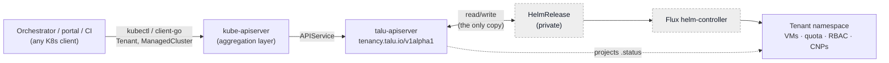

# ADR — a typed Talu API layer (`tenancy.talu.io`)

**Status:** Proposed · 2026-08-04 · supersedes nothing; amends the "write" verb of
[the integration contract](flows.md#the-integration-contract).

**Decision in one line:** expose Talu's tenant surface as **typed Kubernetes kinds
(`tenancy.talu.io/v1alpha1` — `Tenant`, `ManagedCluster`) served by an aggregated API server that
projects onto Flux `HelmRelease`s**, keeping the charts as the private implementation.

---

## 1 · Context — what integrators write today

An external consumer ([`../integrations/`](../integrations/)) writes a `HelmRelease` referencing the
`talu-tenant` or `talu-cluster` chart, watches its `.status`, and reads Prometheus for usage. The
charts' `values.schema.json` files are declared to be "the API".

That has carried the project a long way — it is standalone-first, Git-reconcilable, and required no
Talu-specific runtime. But it has six structural problems, roughly in order of cost:

1. **The API is a payload inside another product's object.** The apiserver validates the
   `HelmRelease` envelope, not Talu's schema. A bad `memory:` is not rejected at admission — it
   surfaces minutes later as `Ready=False`. There is no `kubectl explain`, no printer columns, and
   nothing published at `/openapi/v3`, so no consumer can generate a client.
2. **RBAC is the wrong shape, and that is a security problem.** Granting an orchestrator
   `create helmreleases` in `tenants` grants *"install any chart"* — including one that binds
   `cluster-admin`. "May create tenants" is not expressible as an RBAC rule today.
3. **Flux leaks into a contract that claims to be orchestrator-agnostic.** `chartRef`,
   `OCIRepository` coordinates, and the `valuesFrom`/`targetPath` trick used to inject
   `pomerium-user-ca` (which the consumer must first *mirror into its own namespace*) are all
   platform plumbing sitting in the integrator's payload.
4. **The integrator API and the operator API are the same schema.** `values.schema.json` mixes
   fields a consumer owns (`vms`, `resourceQuota`, `allowedUsers`) with fields only an operator
   should ever set — `persesImage`, `proxyImage`, `gatewayImage`, `lokiUrl`, `aptRepoLine`,
   `ciliumVersion`, `wiring.csi.image`, `autoscaling.image`, `veleroChartVersion`,
   `podCidr`/`serviceCidr`. The sharpest case: **`debugPublicKey` is a *required* field of
   `talu-cluster` and is an operator break-glass key** — the consumer is forced to supply something
   that is not theirs to own.
5. **No status rollup.** `HelmRelease Ready` means "chart applied", not "VM running" or "cluster
   usable". For KaaS the consumer must correlate four signals across three kinds in two namespaces
   plus a blackbox probe — as [`../integrations/integrations.md` §6](../integrations/integrations.md#6--managed-kubernetes-kaas)
   documents in a table. That table is the bug report.
6. **No API versioning story.** Chart version is the only version: no `served`/`storage` versions, no
   conversion. One breaking values change breaks every consumer simultaneously.

### What the field does

Nobody makes the integrator write the packaging tool's object.

| System | Consumer-facing API | Mechanism |
|---|---|---|
| **[Cozystack](https://kubernetes.io/blog/2024/11/21/dynamic-kubernetes-api-server-for-cozystack/)** | `apps.cozystack.io/v1alpha1` — `VirtualMachine`, `VMDisk`, `Kubernetes`, `Tenant` | **aggregated apiserver** projecting onto `HelmRelease`; `ApplicationDefinition` declares kind ↔ chart ↔ schema |
| **[Gardener](https://gardener.cloud/docs/getting-started/architecture/)** | `Shoot` — one object per cluster | aggregated apiserver; extension CRDs internal |
| **Cluster API** | `Cluster` + `ClusterClass` | CRDs; provider CRs internal |
| **[Crossplane v2](https://docs.crossplane.io/latest/composition/composite-resource-definitions/)** | XRD-generated CRDs | `CompositeResourceDefinition` + `Composition` |
| **[kro](https://kro.run/docs/concepts/rgd/overview/)** (SIG Cloud Provider, 0.9.x) | RGD-generated CRD | dynamic micro-controller, CEL + `readyWhen` |
| **[KubeVela](https://kubevela.io/docs/platform-engineers/oam/x-definition/)** | `Application` | `ComponentDefinition` in CUE |

**Cozystack is the load-bearing precedent**: same substrate (Talos + KubeVirt + Kamaji + Flux), same
starting point (HelmRelease-as-API), and it made exactly this migration — for reasons that map onto
problems 1, 2, 3 and 5 above. [`comparison.md`](comparison.md) already records the contrast; this ADR
closes the gap it identified.

---

## 2 · Decision

Introduce **`tenancy.talu.io/v1alpha1`** with two namespaced kinds — **`Tenant`** and
**`ManagedCluster`** — served by an **aggregated API server** (`APIService` +
`k8s.io/apiserver`-based binary) whose **backing storage is the `HelmRelease` it renders**. The
charts stay exactly as they are and become **private implementation**.



**Why aggregation and not a CRD.** The decisive property is that **there is no second copy of the
truth**. A CRD (hand-written, kro-generated, or Crossplane XRD) stores the `Tenant` in etcd *and*
renders a `HelmRelease` next to it — two objects, two lifecycles, drift between them, and
`kubectl get helmrelease` still showing the internals to anyone with the RBAC to look. The
aggregated server makes the `Tenant` a **view** over the `HelmRelease`: one object, no reconcile lag
between the API and the thing it describes, and the internals genuinely hidden behind RBAC on the
Talu kinds. It is also the only option that can grow **subresources** (§6).

**Rejected alternatives**, recorded so this is not relitigated:

| Option | Why not |
|---|---|
| Harden the current contract (`ValidatingAdmissionPolicy` on `HelmRelease`, published OpenAPI, client SDK) | Fixes 2 and partly 1/4/6; leaves the API structurally inside someone else's object. **Its schema-split half is adopted anyway — see §4.** |
| **kro**-generated CRD wrapping a `HelmRelease` | Cheapest real typing (~1–2 weeks, no Go), but dual state, pre-1.0 dependency, and SimpleSchema friction on free-form fields. Viable fallback if §7 stalls. |
| Crossplane XRD + Composition | Pulls in a large platform whose model (managed resources, providers) Talu does not otherwise use. |
| Own CRDs + controller-runtime operator | Same dual-state problem as kro, at 4× the effort, and still no subresources. |
| Operator-SDK **Helm** operator | Replaces Flux as the tenant renderer, losing the Git-reconcilable path — violates *standalone-first*. |
| Ship only a client SDK, keep `HelmRelease` | Ergonomic bandage; fixes nothing about validation, RBAC, or versioning, and only helps consumers using the SDK. |

---

## 3 · The API surface

### `Tenant`

```yaml
apiVersion: tenancy.talu.io/v1alpha1
kind: Tenant
metadata:
  name: acme
  namespace: tenants
spec:
  projectUuid: aaaaaaaa-1111-2222-3333-444444444444   # required, immutable
  members: [alice@example.org]                        # was allowedUsers
  quota:                                              # was resourceQuota (free-form map)
    cpu: "4"
    memory: 8Gi
    storage: 200Gi
  network:
    baseline: deny            # was networkBaseline.enabled: true
    internalIpPool: ""        # optional tier-1 LB pool CIDR
  observability:
    dashboard: true           # was dashboards.enabled
    logs: agent               # off | console | agent  (was logging.{consoleLevel,agent})
  vms:
    app1:
      size: small             # named size, not raw memory/cores (see §8)
      image: rocky-10         # catalog name; resolves to DataSource or containerDisk
      principal: alice
      rootDiskSize: 20Gi
      guestSecretsRef: acme-app1     # Secret name, not inline values
  securityGroups:
    web:
      vms: [app1]
      ingress:
        - ports: [{ port: 80, protocol: TCP }, { port: 443, protocol: TCP }]
          fromCIDR: ["0.0.0.0/0"]
status:
  phase: Ready                            # Pending | Provisioning | Ready | Degraded | Deleting
  observedGeneration: 3
  vms:
    running: 1
    desired: 1
  sshEndpoint: ssh.talu.example:2222
  dashboardUrl: https://acme.talu.example
  conditions:
    - type: Ready          # rolled up: chart applied AND every VMI Running
    - type: Reconciled     # the HelmRelease applied cleanly
    - type: QuotaExceeded
```

Printer columns: `PROJECT` · `VMS` (running/desired) · `PHASE` · `AGE`.

### `ManagedCluster`

```yaml
apiVersion: tenancy.talu.io/v1alpha1
kind: ManagedCluster
metadata: { name: acme-prod, namespace: tenants }
spec:
  projectUuid: aaaaaaaa-1111-2222-3333-444444444444
  kubernetesVersion: v1.34.1
  controlPlane: { replicas: 2 }
  workers:
    replicas: 2
    size: medium
    autoscaling: { enabled: true, min: 1, max: 3 }
  adminUser: alice@example.org       # was wiring.inTenant.adminUser
  backup: { enabled: false }
status:
  phase: Ready
  endpoint: https://10.0.0.42:6443
  kubernetesVersion: v1.34.1
  controlPlane: { ready: true }
  workers: { ready: 2, desired: 2 }
  conditions: [...]                  # rolled up from Cluster + TenantControlPlane + MachineDeployment
```

Printer columns: `PROJECT` · `VERSION` · `CP` · `WORKERS` · `PHASE` · `AGE`.

**Name it `ManagedCluster`, not `Cluster`.** `cluster.x-k8s.io/Cluster` already exists on this
substrate; a second `Cluster` makes `kubectl get cluster` ambiguous for operators.

**The `.status` rollup is the point of problem 5.** Flux's `HelmRelease.spec.healthCheckExprs`
(CEL, evaluated under the `poller` wait strategy) already lets the underlying release report Ready
only once the rendered CRs are healthy — VMIs `Running`, `TenantControlPlane` `Ready`,
`MachineDeployment` at desired. The API server projects that plus the counts; the consumer stops
needing to know that KubeVirt, Kamaji or CAPI exist.

---

## 4 · The split: integrator API vs operator config

**This is the change that makes the API "concise", and it is worth doing regardless of §2's
mechanism.** The typed spec is deliberately *narrower* than the chart. Everything below leaves the
consumer-facing surface and becomes operator-owned chart values (site defaults in
`environments/<site>/`):

| Chart | Moves out of the consumer API |
|---|---|
| `talu-tenant` | `sshUserCaPubKey`, `caTrust.*`, `dashboards.{persesImage,proxyImage,prometheusUrl}`, `logging.{lokiUrl,gatewayImage}`, and the image-addressing leaves `defaults.{source,dataSource,dataSourceNamespace,image}` + the same four per VM |
| `talu-cluster` | `debugPublicKey`, `ciliumVersion`, `podCidr`, `serviceCidr`, `dataStore`, `namespace`, `wiring.*` (except `adminUser`), `workers.autoscaling.{image,maxNodeProvisionTime}`, `backup.inTenant.{s3Url,bucket,existingSecret,veleroChartVersion}`, `healthCheck.*` |

Note `defaults` splits at the leaf, not wholesale: *how* an image is addressed
(`source`/`dataSource`/`dataSourceNamespace`/`image`) is catalog plumbing the site owns, while sizing
and the guest principal stay with the consumer. `rocky-sandbox`'s `beta` tenant is the proof — it
overrides the image-addressing leaves to demonstrate the persistent bootc path against a site whose
default is ephemeral, which is exactly the case the typed API collapses into one catalog name.

The `pomerium-user-ca` mirroring and the `valuesFrom`/`targetPath` dance disappear entirely once §2
ships — the API server injects them when it writes the `HelmRelease`. That removes the most-copied
wart in [`../../components/tenancy/flux/helmrelease.example.yaml`](../../components/tenancy/flux/helmrelease.example.yaml).
Until then Phase 0 keeps them, and adds one more `valuesFrom` entry (the site defaults) — the split
is delivered by the merge order, which Flux already guarantees:

```
chart values.yaml  <  talu-tenant-defaults  <  pomerium-user-ca (targetPath)  <  spec.values
```

---

## 5 · Mechanics and failure modes

| Concern | Approach |
|---|---|
| Registration | `APIService` for `v1alpha1.tenancy.talu.io`, `Service` → `talu-apiserver` in `talu-system` |
| Serving certs | **cert-manager** (already a platform component): `Certificate` for the serving pair, `cert-manager.io/inject-ca-from` on the `APIService` for the `caBundle` — rotation is automatic |
| Storage | **none of its own** — every read/write is a projection of the `HelmRelease` in the same namespace. No second etcd registry, no migration story, no drift |
| AuthN / AuthZ | delegated to kube-apiserver (`TokenReview` / `SubjectAccessReview`) — standard `k8s.io/apiserver` wiring, so RBAC on `tenants`/`managedclusters` behaves exactly like any built-in resource |
| Availability | ≥2 replicas, `PodDisruptionBudget`, anti-affinity, `--enable-aggregator-routing` on the substrate |
| Schema changes | kinds are registered from config at startup (Cozystack restarts its API pod on `ApplicationDefinition` change; Crossplane likewise restarts on XRD change) — **a schema change is a rollout, not a hot reload** |

### The failure mode that must be designed for

**An unavailable `APIService` degrades the whole cluster, not just Talu.** If the backend is down,
`Available=False` on the `APIService` makes the namespace controller's discovery fail, and
[**no namespace anywhere in the cluster finishes terminating**](https://github.com/kubernetes/kubernetes/issues/119662);
`kubectl` discovery also degrades cluster-wide on clients ≥1.20. This is the price of §2 and it is
real. Mitigations, all mandatory before this ships to a production site:

- ≥2 replicas + PDB + anti-affinity; liveness/readiness on `/readyz`; resource requests set so it is
  never the first thing evicted.
- A Prometheus alert on `aggregator_unavailable_apiservice{name="v1alpha1.tenancy.talu.io"}` and on
  the `APIService` `Available` condition, wired into the existing alert rules.
- A documented **break-glass**: `kubectl delete apiservice v1alpha1.tenancy.talu.io` restores full
  cluster function immediately, because the `HelmRelease`s — the actual state — are untouched and
  Flux keeps reconciling them. **The old contract remains a working escape hatch by construction.**
  This is a direct consequence of choosing HelmRelease-backed storage over a private registry, and
  it is the strongest argument for that choice.

---

## 6 · Subresources — and the invariant they collide with

Aggregation's unique capability is subresources, and Talu will want them: `tenants/{name}/kubeconfig`,
`managedclusters/{name}/kubeconfig`, `vms/{name}/console-url`, and eventually `vm/start`, `vm/stop`,
`vm/restart`.

**But design rule 4 in [`README.md`](README.md#design-rules-the-invariants) says "Declarative only —
no imperative side channels".** An action subresource is exactly such a channel. This ADR therefore
scopes v1alpha1 to:

- **`/status`** — read + operator-only write.
- **Read-only projection subresources** (`/kubeconfig`, `/console-url`) — these mint or fetch a
  credential rather than mutate desired state; they are the same category as
  `virtualmachineinstances/vnc`, which Talu already exposes, so they are within the existing rule.

**Imperative action subresources are out of scope and require an explicit amendment to design
rule 4.** Notably, RBAC on subresources is what makes them safe (`create tenants/kubeconfig` without
`update tenants`) — that argument should be made on its merits when someone actually needs
`vm/stop`, not smuggled in with this ADR.

---

## 7 · Build vs adopt

Cozystack's `cozystack-api` is Apache-2.0, built on `k8s.io/apiserver`, and driven by a **fully
chart-agnostic** cluster-scoped CRD:

```go
type ApplicationDefinitionSpec struct {
    Application ApplicationDefinitionApplication // Kind, Plural, Singular, OpenAPISchema
    Release     ApplicationDefinitionRelease     // ChartRef, Prefix, Labels, WaitStrategy, HealthCheckExprs
    Secrets, Services, Ingresses ApplicationDefinitionResources
    Dashboard   *ApplicationDefinitionDashboard
}
```

`ChartRef` is a plain Flux `CrossNamespaceSourceReference` — it can point at Talu's existing
`talu-tenant` / `talu-cluster` `OCIRepository` unchanged. In principle Talu could deploy
`cozystack-api` plus two `ApplicationDefinition`s and have §3 working without writing an API server.

### Findings from the source review (2026-08-04)

The mapping layer really is generic — `pkg/registry/apps/application/rest.go` drives everything off
`releaseConfig.Prefix`, `kindName` and `gvk`, all supplied by the `ApplicationDefinition`. But
adopting it **unmodified is blocked today**, and the blocker is the one thing that can never be fixed
later:

> `pkg/apis/apps/v1alpha1/register.go`: `const GroupName = "apps.cozystack.io"`

The **kind** is configurable per definition; the **group is a compile-time constant**. Talu's kinds
would be served as `apps.cozystack.io/v1alpha1 Tenant` — another project's group name on Talu's
integration contract, and §10's open question 3 already notes the group is unversionable.

Upstream is fixing exactly this. Draft PR
[**cozystack#3448 — "dynamic API group registration via `ApplicationGroupDefinition`"**](https://github.com/cozystack/cozystack/pull/3448)
(opened 2026-07-24 by **@lllamnyp, a core maintainer**; +1339/−65 across 23 files, `size/XXL`, no
human review yet) adds a cluster-scoped `ApplicationGroupDefinition` plus an optional
`spec.application.group`, so a third party can bring its own group. Its stated motivation is
verbatim Talu's problem: *"Third-party catalogs and platform extensions cannot bring their own API
group — everything lands in the platform's namespace."*

Residual coupling that survives even if #3448 merges:

- **No per-group versions.** #3448 fixes every group at `v1alpha1` ("a `versions` field can be added
  compatibly later"). That collides head-on with **§1 problem 6 — "no API versioning story"**, which
  is one of the ADR's core motivations. Adopting would trade a chart with no versions for an API with
  one hardcoded version.
- **RBAC for custom groups is explicitly deferred** — Talu would stamp its own ClusterRoles.
- **Three extra API groups come along for the ride.** `start.go` registers `corev1alpha1`,
  `appsv1alpha1` and `sdnv1alpha1` unconditionally, so a Talu cluster would also serve Cozystack's
  `tenantnamespaces` / `tenantsecrets` / `tenantmodules` and its SDN kinds — concepts Talu does not
  have. Hierarchical `quota.go` and `validateTenantNamespaceLength` likewise assume Cozystack's
  nested-tenant model.
- **The config-rollout mechanism comes too:** `ApplicationDefinition` is a `cozystack.io` CRD
  reconciled by *cozystack-operator*, which hashes definitions into a pod annotation to restart
  `cozystack-api`. Adopting means taking that, or reimplementing it.

### Recommendation

**Lean: build a minimal Talu apiserver, using Cozystack as the design reference, not the dependency.**
The appeal of adopting was "don't write an apiserver" — but the integration surface above is not
obviously smaller than a purpose-built server for **two kinds** with no nested tenancy, no quota
hierarchy and no SDN. And adopting would import the very defect (a single hardcoded API version) that
this ADR exists to fix.

**Do not fork.** Changing one constant is trivial; owning a fork of a fast-moving XXL codebase to
keep that constant changed is the worst of the three options, and #3448 would make the fork pointless.

**Do engage upstream anyway.** Talu is precisely the second real-world consumer #3448 needs to
justify merging; a comment on the PR costs nothing and improves the ecosystem either way. If it lands
*and* grows per-group versions, adopting becomes attractive again and this recommendation should be
revisited — the schema (§3/§4) is portable between the two paths, which is why Phase 0 was worth
doing first regardless.

**What is *not* negotiable either way:** §4's schema split and §3's kinds. Those are Talu's design
work and they survive any choice of serving code.

---

## 8 · Migration

| Phase | Content | Breaks anyone? |
|---|---|---|
| **0** ✅ **done, validated on rocky-phys 2026-08-04** | Land §4's split: `x-talu-owner` on every property of both schemas; `environments/<site>/tenant-defaults.yaml` → ConfigMap `talu-tenant-defaults`, merged by every tenant HelmRelease; tenant files reduced to consumer-owned fields. Operator fields stay *accepted* — nothing is removed. | no |
| **1** | Ship `talu-apiserver` behind a site flag, **off by default**. Both paths write the same `HelmRelease`; the typed API is additive. | no |
| **2** | Point `docs/integrations/` at the typed API as *the* contract; demote `HelmRelease` to "documented escape hatch, no compatibility promise". Ship the alert + break-glass runbook. | no |
| **3** | Graduate `v1alpha1` → `v1beta1` once a real consumer (Waldur or the reference portal) has driven it end-to-end, with a conversion path. | versioned, so no |

### Phase 0 — what was validated (rocky-phys, 2026-08-04)

Locally, all four tenant files (`rocky-phys` + `rocky-sandbox`, acme + beta) render **byte-identical**
under `site-defaults + slim tenant file` versus the previous fat tenant file, and the schema
annotations are inert (`helm template` output unchanged; Helm ignores the unknown keyword).

On the physical lab, with the chart republished from the working tree:

- `HelmRelease acme` → `Ready=True` ("Helm upgrade succeeded … talu-tenant@0.1.0").
- `VirtualMachine`, cloud-init `Secret`, `ResourceQuota`, `CiliumNetworkPolicy` and ssh `Service`:
  **no diff** before → after. The running `app1` VMI was not restarted.
- `helm get values acme -n tenants` shows `defaults.image` and `defaults.source` in the composed
  values *while the tenant file contains neither* — proving the ConfigMap, not the chart default,
  supplied them, and that the merge order behaves as specified.

Two pre-existing lab defects surfaced and are **not** caused by this change:

1. **The in-cluster chart registry had no persistence** — `registry:2` with no volume, so charts lived
   on the container's writable layer. Its pod restarted 8 days ago, the chart vanished, and every
   tenant `HelmRelease` had been `Ready=False` ("OCIRepository … does not have an artifact") since,
   silently (the VMs keep running off the last good render, which is why nobody noticed).
   **Fixed:** `local-path` PVC at `/var/lib/registry`, `strategy: Recreate` (an RWO PVC deadlocks a
   RollingUpdate — that is also what left an orphaned `Error` pod behind), readiness/liveness on
   `/v2/`. Verified by deleting the pod: chart, `OCIRepository` and `HelmRelease` all came back Ready.
   Accepted trade-off: `local-path` is node-local, so it survives a pod restart but not node loss —
   fine, because `chart-publish-job.yaml` can reproduce the chart. Details and the two misleading
   probe traps hit while debugging it: `../development/lab-notes.md` **#41**.
2. **`environments/rocky-phys/` has no `kustomization.yaml`**, so `make kbuild` has always errored on
   it (that site is ansible-driven, not kustomize-driven). Either add a stub or make the target skip
   overlay-less directories.

Also worth knowing for anyone repeating this: on the gateway a **host registry mirror already binds
`:5000`**, so `kubectl port-forward … 5000:5000` silently serves the mirror instead of the in-cluster
registry — and the mirror is a pull-through cache, so pushes fail with a confusing `500`. Forward to a
free local port (`15000:5000`).

Standalone/Git-first stays intact: a `Tenant` object commits to `environments/<site>/tenants/` and is
applied by Flux exactly like the `HelmRelease` it replaces. **Design rule 5 (standalone-first) is
preserved; the API server is on the write path, not the reconcile path** — VMs keep running and Flux
keeps reconciling while it is down.

---

## 9 · Consequences

**Good.** One typed object per tenant; admission-time validation; `kubectl explain`/`get`/printer
columns; RBAC that can express "may create tenants" without granting arbitrary chart installation;
rolled-up status that hides KubeVirt/CAPI/Kamaji; a real versioning story; published OpenAPI so
consumers generate clients; Flux and the chart internals become private and refactorable.

**Bad.** Talu gains its first compiled artifact — a Go binary, an image build/publish pipeline, and a
CVE/upgrade surface — in a repo that today has none; that is a genuine trade against "minimal,
auditable substrate". The `APIService` becomes a cluster-wide failure domain (§5). Operators now have
two views of the same object, and must learn that `HelmRelease` is the private one.

**Explicitly unchanged.** Billing stays verb 3: Prometheus remains the source of truth for usage.
Folding usage into `.status` would make invoices depend on a controller's write and is rejected on
auditability grounds — any `status.usage` is convenience only.

---

## 10 · Open questions

1. **Fat `Tenant` vs `Tenant` + child `VirtualMachine`.** v1alpha1 keeps `vms` inline (it mirrors the
   chart and keeps one object per project). Cozystack split `VMInstance`/`VMDisk`. Splitting buys
   per-VM RBAC, per-VM status, and safe concurrent edits from a portal UI; it costs the "one object
   per tenant" simplicity. Decide before `v1beta1` — it is not a compatible change afterwards.
2. **Named sizes (`size: small`) vs raw `cores`/`memory`.** Named sizes are a cleaner integrator API
   and map to KubeVirt instancetypes, but need a site-owned catalog and a story for a consumer that
   wants something not in it.
3. **Group name.** `tenancy.talu.io` leaves room for a future `compute.talu.io` / `net.talu.io`.
   Confirm before anything is served, since the group is unversionable.
4. **`v1alpha1` sequencing vs the physical lab.** The KaaS path is validated on `rocky-phys`; the
   typed `ManagedCluster` should be exercised there before it is documented as the contract.
