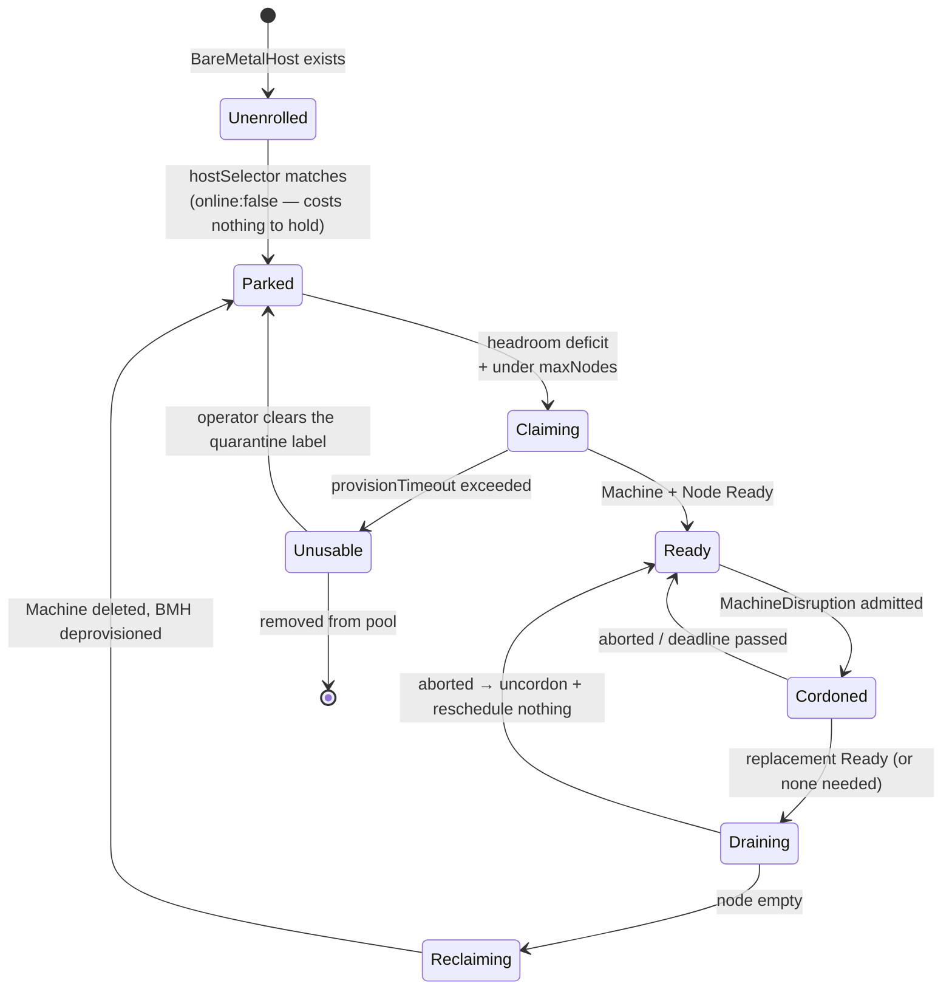
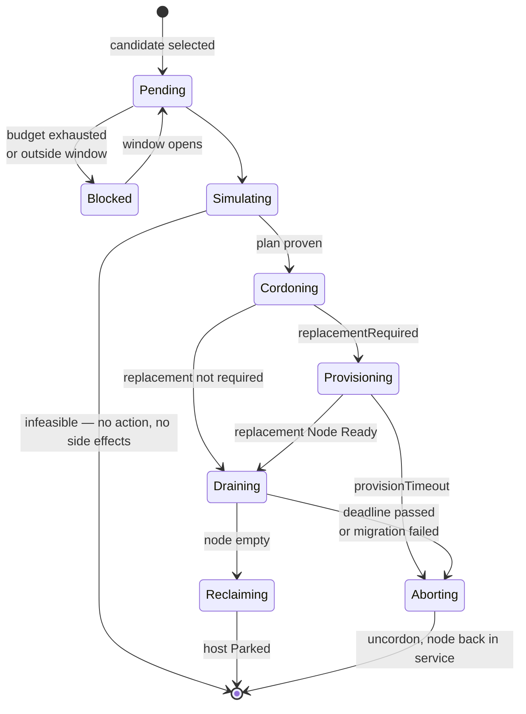

# ADR — elastic bare metal: an owned machine pool behind the KubeVirt substrate

**Status:** Proposed · 2026-08-14 · depends on nothing; feeds
[`performance-testing.md`](performance-testing.md) §9 (bare-metal Talos) and shares machinery with
Workstream D of [`../development/production-readiness-plan.md`](../development/production-readiness-plan.md).

**Decision in one line:** treat physical machines as an **owned, bounded pool** that Talu grows and
shrinks itself — provisioned by **Metal3/CAPM3**, decided by a **pool-manager reconciler shaped like
Karpenter's disruption engine** — and get there in stages, starting with a *synthetic* BMC plane that
needs no cooperation from the hardware provider.

---

## 1 · Context — what "add a node" means in Talu today

On the physical lab ([`../development/lab-notes.md`](../development/lab-notes.md), memory
`talu-phys-lab`) a Talos node is a **libvirt VM** on one of compute1–4. Adding one is
[`ansible/roles/phys_talos_vms`](../../ansible/roles/phys_talos_vms/): `virt-install` from a
`metal-amd64.raw.zst` written straight to a virtio disk, a DHCP-reserved address, then
`talosctl apply-config`. Two tags, `vm-create` and `talos-bootstrap`. It works, it is idempotent, and
it is entirely imperative and human-triggered.

One layer up, Talu already does the thing this ADR is about. For managed tenant clusters,
[`components/tenancy/cluster-chart/templates/wiring-autoscaler.yaml`](../../components/tenancy/cluster-chart/templates/wiring-autoscaler.yaml)
runs a **per-tenant `cluster-autoscaler` (clusterapi provider) inside the management cluster**,
watching the tenant's pending pods over one kubeconfig and scaling its worker `MachineDeployment`
over another. The bounds are annotations; the caveats are already documented in
[`values.yaml`](../../components/tenancy/cluster-chart/values.yaml) — `min: 1` because scale-from-zero
is broken on the current provider, `maxNodeProvisionTime: 20m`, and the Flux-versus-autoscaler fight
over `spec.replicas` that needs `driftDetection.ignore`.

So the question is not *whether* Talu can run a self-scaling controller. It already does. The question
is whether the same pattern can be pushed **one layer down** — from KubeVirt worker VMs onto physical
machines — and what has to change for that to be safe.

Three sub-questions were investigated, and are answered in §2–§5:

1. Is **Metal3** the right provisioning layer?
2. What would it mean for Talu to **own the BMC plane**, which today it does not?
3. Should the elasticity controller **live inside Talu**, and what shape should it take?

## 2 · Decision

1. **The pool is owned, not rented.** A fixed set of racked machines. "Release" means power-park and
   reassign, not return-and-stop-paying. §3.
2. **Metal3/CAPM3 is the provisioning layer, deferred behind a validation gate.** It is CNCF
   Incubating (since 2025-08-14), it is the only option combining a Kubernetes-native host API with
   CAPI, declarative firmware, and BMC-based remediation — and it is blocked today only by BMC
   ownership, which §6 shows is *simulable*.
3. **Talu does not own the BMC plane where it runs, and Phase 0 does not require it to.** The
   provider owns `10.9.0.0/16` and runs MAAS. Instead, stand up a **synthetic BMC plane** with
   `sushy-tools` against libvirt, which exercises the identical API surface. §6.
4. **Do not write a new autoscaler.** Reuse `cluster-autoscaler` with the clusterapi provider — the
   same wiring already shipping for KaaS — and add the one component that genuinely does not exist:
   a **consolidation reconciler** that live-migrates VMs to empty a machine. §7, §9.
5. **Do not adopt Karpenter.** Read it as a design document. `karpenter-provider-cluster-api` is
   v0.2.0 and self-described as an experimental proof of concept, with create/delete implemented and
   **drift, disruption, and consolidation not implemented** — precisely the parts worth having. §7.
6. **Control-plane nodes and the storage tier are never pool members.** §4, §5.

## 3 · The pool is owned, not rented — and that changes the objective

Two readings of "pool" were on the table, with opposite economics:

| | **(a) Owned — decided** | **(b) Rented** |
|---|---|---|
| Membership | fixed, racked, bounded | acquired per-hour via provider API |
| "Release" means | power-park (`BareMetalHost.online: false`) and reassign | stop paying |
| Marginal cost of a machine | **zero** | real |
| Objective function | minimize *powered-on machines*, subject to a headroom floor | minimize **spend** |
| Provider | Metal3/CAPM3 | CAPH (Hetzner robot), CAPP… |
| Landscape risk | none — you own it | consolidating: **Equinix Metal sunsets 2026-06-30** |

This is the single most consequential choice in the ADR, because **it invalidates most of the
published prior art**. Every cloud autoscaler — Karpenter especially — is a cost minimiser over an
effectively unbounded catalogue of priced instance types. Talu's pool is bounded, near-homogeneous,
and free at the margin. The mechanism transfers; the objective does not (§7).

The one place the field *does* model this: Karpenter's dedicated
[`karpenter.sh/capacity-type: reserved`](https://github.com/aws/karpenter-provider-aws/blob/main/designs/odcr.md)
for pre-purchased capacity reservations — *capacity you already paid for, consumed before anything
else*. An owned rack is conceptually one permanent reservation. That also gives a clean future
expression for overflow, should (b) ever be revisited: the owned pool as a high-`weight`,
`limits`-bounded pool, a rented tier at lower weight. **Design the API so that is expressible, and
build only the first tier.**

## 4 · The blockers are not Metal3

Three things block elastic node churn in Talu today. Only the third is about provisioning.

### 4.1 · Hyperconvergence — the hard one

[`ansible/roles/phys_rook/defaults/main.yml`](../../ansible/roles/phys_rook/defaults/main.yml) sets
`rook_osd_device_filter: "^vdb$"`, and `phys_talos_vms`'s `vm-create.yml` attaches a 129 GiB Ceph disk
to **every** node. A node is therefore not a unit of compute — it is a unit of compute *and* a Ceph
OSD. Removing one means draining an OSD and backfilling ~129 GiB.

**Elastic node churn and hyperconverged storage are incompatible.** The fix is a role split, and it is
the same split KubeVirt's own autoscaling guidance recommends (infra tainted `CriticalAddonsOnly`, VM
node groups free to scale to zero):

- a **fixed tier** — control plane + Ceph OSDs + platform singletons; never a pool member;
- an **elastic tier** — no OSD, no control plane, only tenant VMs and tenant-cluster workers.

This is worth doing on its own merits regardless of Metal3: it also isolates perf-sensitive VM nodes
from platform overhead, which is exactly what
[`performance-testing.md`](performance-testing.md) §9 is trying to measure.

### 4.2 · VMs block scale-down

`virt-launcher` pods are not owned by a ReplicaSet or DaemonSet — KubeVirt's own controllers manage
them — so a node-drain cannot assume eviction is safe, and `cluster-autoscaler` will not reap the
node. Left alone, a machine empties only when tenants happen to delete their VMs, which on a
multi-tenant VM platform is approximately never. **"Remove as needed" silently degrades into "remove
never", and the pool ratchets to fully allocated.**

Closing this needs an explicit **consolidation** step: pick the least-loaded elastic node,
live-migrate its VMs off (`evictionStrategy: LiveMigrate` — viable here because the physical lab is
real KVM), cordon, let the node be reclaimed. This is the one genuinely new component (§9).

### 4.3 · Timescale — this is capacity planning, not request-time autoscaling

Bare-metal provisioning is inspect → write image → reboot → join: order of **10–20 minutes**.
Deprovisioning adds Ironic cleaning (`automatedCleaningMode: metadata` is the default and wipes
partition tables; `disabled` is faster but risks conflicts on the next provision). Compare Talu's own
KaaS pass criterion of **"new Node `Ready` ≤ 6 min"**
([`../development/kaas-test-plan.md`](../development/kaas-test-plan.md)) for KubeVirt workers, and the
`maxNodeProvisionTime: 20m` already needed at that layer.

Consequences that must be designed in, not discovered:

- **Drive scale-up from a headroom target, not per-pod pressure.** Reacting to individual pending
  VMIs through a 15-minute actuator is a badly-tuned control loop; maintaining *N* spare nodes is a
  well-behaved one.
- **Hysteresis must scale with actuator latency.** The anti-thrash delay has to be a large multiple
  of provisioning time, or the pool oscillates and burns whole provision cycles reclaiming capacity
  it needs again minutes later.

## 5 · What owning a BMC plane would buy — and cost

Ranked by value to Talu, which is roughly the inverse of how it is usually pitched.

1. **Fencing.** Metal3's power-based remediator fences a node by powering it *off*, deleting the Node
   object, then powering it back on. Talu has no fencing device at all today. Auto-remediation on a
   cluster running **Ceph OSDs and etcd** without fencing cannot distinguish "dead" from "partitioned
   and still writing". Highest value, and it needs no elasticity machinery.
2. **Console.** `lab-notes` **#1** (the MTU-1400 SSH blackhole), the `phys_reboot: false` default, the
   "reboot has no safety net" warning in [`../../ansible/README.md`](../../ansible/README.md) — all
   exist *because there is no console*. Redfish SerialConsole removes the class.
3. **Firmware as declarative state.** `HostFirmwareSettings` + `FirmwareSchema` make BIOS a reconciled
   resource. Concretely: `intel_iommu=on iommu=pt` is currently a `grubby` edit on a host with no
   console, done to unlock VFIO/SR-IOV for the perf work.
4. **Hardware telemetry** into the existing PromQL set via a Redfish exporter — PSU/thermal/DIMM
   health as `talu:*` series. **This needs read-only BMC access, not ownership**, and is the cheapest
   item on the list.
5. **Trusted boot** — Talos SecureBoot (signed UKI) + TPM-sealed LUKS2. Caveat: the public
   `factory.talos.dev` does not accept user-supplied SecureBoot keys, so owning keys means
   self-hosting `imager`.
6. **Zero-touch install** — genuinely the *least* valuable item, because §1's path already works.

**The cost is a real security obligation, and it is not optional.** CISA/NSA guidance is a
*physically separate* out-of-band network with default-deny. BMC firmware is fully privileged and
pre-boot: CVE-2024-54085 (AMI MegaRAC) is in CISA's Known Exploited Vulnerabilities catalogue, and
CVE-2025-6198 (Supermicro) allows BMC-persistent malware that **survives OS reinstallation** and can
disable TPM/SecureBoot undetected. Owning the BMC plane therefore means owning **BMC firmware
patching** — a lifecycle Talu does not have. Note the ordering trap: a compromised BMC defeats the
very trusted-boot chain in item 5. Trusted boot is downstream of BMC hygiene, not a substitute.

Secondary: BMC credential sprawl makes **Workstream B (SOPS + age)** a hard prerequisite rather than a
parallel track.

## 6 · Why this is not blocked — the synthetic BMC plane

[`ansible/roles/phys_host_prep/defaults/main.yml`](../../ansible/roles/phys_host_prep/defaults/main.yml)
is explicit: the BMC network `10.9.0.0/16` is **not reachable** from the hosts, only in-band
`ipmitool` KCS works, there is no console, and the provider runs MAAS. Acquiring the real BMC plane is
a commercial conversation, not a technical one.

It does not have to block anything. Talu **already owns every other input Metal3 needs**:

| Metal3 requirement | Talu today |
|---|---|
| Provisioning L2 | VLAN 40, trunked to all four hosts (`talos_overlay.uplink_mode: vlan`) |
| DHCP | dnsmasq on compute1, `172.18.9.100–200` |
| Image server | `phys_registry_mirror` + zot |
| CAPI management cluster | `phys_capi` — clusterctl with Kamaji CP, CAPK infra, CAAPH |
| **BMC** | **missing** |

`sushy-tools` — a **libvirt-backed virtual Redfish BMC, shipped as a container image by the Metal3
project itself** and used by Metal3's own dev environment — closes that last row. Running it on
compute1–4 gives every Talos node VM a Redfish endpoint on a network Talu fully controls.

This is the highest-leverage move in the ADR:

- the full BMO + Ironic + CAPM3 chain becomes testable **without provider cooperation**;
- it exercises the *identical* API surface that real hardware would;
- it de-risks the one genuinely unproven link — **Talos has no first-class Metal3 integration**.
  Metal3 injects config through an Ironic config drive (gzip+base64 ISO9660 labelled `config-2`,
  read by cloud-init/Ignition/Glean), and Talos speaks none of those. A path exists — boot with
  `talos.platform=openstack` so Talos reads machine config from the config drive's `user_data`, and
  CAPM3's `userData` field is bootstrap-provider-agnostic — so the chain **CABPT → CAPM3 `userData` →
  Ironic `config-2` → Talos `openstack` platform** should hold. Neither project documents the other.
  **Talu would own this integration**, and Phase 0 is where that is proven or abandoned cheaply.

## 7 · What Karpenter teaches, and what to ignore

Karpenter was studied because it is the most advanced published design for this problem. The
conclusion is to **copy the mechanism and replace the objective**.

**Transfers directly:**

1. **A tiny provider seam.** `sigs.k8s.io/karpenter` (provider-agnostic core) owns scheduling
   simulation, bin-packing, consolidation, drift, budgets and drain; a provider implements roughly
   `Create`, `Delete`, `Get`, `List`, `GetInstanceTypes`, `IsDrifted`. Keep that seam: the decision
   engine must not know about Metal3, and the Metal3 plumbing must not make decisions.
2. **The disruption ordering.** Identify candidates (excluding blocking PDBs / unevictable pods) →
   check budget → **scheduling simulation** → taint `NoSchedule` → **provision the replacement and
   wait for `Ready`** → drain respecting PDBs → iterate. Three inversions naive designs get backwards:
   *simulate before disrupting*, *cordon before drain*, *replacement ready before drain*. With a
   15-minute actuator, the third is what separates a consolidation from an outage.
3. **Three consolidation actions in priority order** — empty-node deletion, multi-node consolidation,
   single-node consolidation. **Empty-first needs no live migration and is most of the value.**
4. **Budgets scoped by reason, with cron windows.** `Drifted` / `Underutilized` / `Empty` each
   rate-limited separately, most-restrictive-wins. Live migration is tenant-visible, so a
   "no voluntary consolidation during business hours" budget is a day-one requirement.
5. **Pin-with-a-deadline.** `karpenter.sh/do-not-disrupt` accepts `"true"` *or a duration*, and
   `terminationGracePeriod`/`expireAfter` bound how long anything can block. **This is a tenancy API
   decision**: a tenant may pin a VM, but only with a TTL and only against *voluntary* disruption —
   otherwise one annotation permanently strands a machine, and bounded is the whole point.
6. **Drift as its own disruption reason.** "Node no longer matches its class" — Talos version, machine
   config, and later `HostFirmwareSettings` — rate-limited by its own budget. That is
   **Workstream D (upgrade orchestration)** solved by the same controller. Two workstreams, one
   component: the strongest argument for building this shaped like Karpenter rather than ad hoc.
7. **Forced expiry** (`expireAfter`, 720 h default) that deliberately *bypasses* budgets — a conscious
   liveness-over-politeness valve, worth copying knowingly.

**Does not transfer:**

| Karpenter feature | Why not |
|---|---|
| Price-based consolidation | Zero marginal cost. `NodeOverlay` exists *because* Karpenter's price model is often wrong — an admission this is the weak spot |
| Instance-type diversity | ~4 near-identical boxes. Bin-packing a bounded homogeneous pool is "how many", not "which shape" |
| Spot / interruption handling | N/A for owned |
| Synchronous `Create()` | The documented core mismatch in the CAPI provider: CAPI creates asynchronously via scale subresources, so you bump replicas then *wait* to learn the Machine's identity. Metal3 makes this worse |
| `GetInstanceTypes()` | CAPI exposes no cost data at all. Mild silver lining: for an owned pool this can be synthesised from BMH `HardwareData`, which Metal3 produces free during inspection |

**Rejected outright:**

- **Omni + its Bare-Metal Infrastructure Provider** — the best *Talos* experience and Sidero's official
  successor, but **BUSL 1.1: free for non-production only**. Talu is MIT. Dead end for a shippable product.
- **Sidero Metal** — no longer actively developed; community support only.
- **Tinkerbell** — CNCF Sandbox, provisions the OS and stops; no inspection or firmware story. Its
  BMC layer (`bmclib`, formerly Rufio, now folded into the `tinkerbell/tinkerbell` monorepo) remains a
  credible *lightweight* option if Talu ever wants fencing **without** Ironic's weight.
- **OpenCHAMI** — HPC-shaped: a parallel management plane with its own APIs, colliding head-on with
  Talu's "the Kubernetes API is the only management surface" invariant, and no CAPI story. **But
  `magellan` is worth taking standalone** — Redfish subnet scan → inventory, explicitly designed to
  run without the rest of OpenCHAMI. It fills the gap Metal3 leaves: BMO requires you to *already
  know* BMC addresses.

## 8 · Staging

Each phase is independently valuable and independently abandonable.

| Phase | Work | Gate to the next |
|---|---|---|
| **0 · Split node roles** | fixed storage/infra tier vs elastic compute tier; OSDs only on the fixed tier | elastic-tier node can be destroyed without Ceph backfill |
| **1 · Synthetic BMC plane** | `phys_sushy` role: `sushy-tools` on compute1–4 over libvirt | every node VM answers Redfish; BMO enrols it |
| **2 · Prove the Talos chain** | BMO + Ironic + CAPM3 + CABPT; `talos.platform=openstack` ← `config-2` ← `userData` | a Talos node provisions end-to-end from a `BareMetalHost` |
| **3 · Fencing** | Metal3 remediation + `MachineHealthCheck` on the elastic tier only | a wedged node is power-cycled and replaced |
| **4 · Telemetry** | Redfish exporter → Prometheus → Perses | node-health alerts fire |
| **5 · Empty-node reclaim** | pool-manager, scale-up on headroom + reclaim of *empty* nodes only | pool grows and shrinks with no VM migration |
| **6 · Consolidation** | live-migrate-and-pack, with budgets and windows | a partially-loaded node is emptied and reclaimed inside its window |

Phases 0 and 4 need no BMC ownership at all. Phases 1–3 need only the *synthetic* plane. Real BMC
ownership (§5) is required only on hardware Talu controls, and is a prerequisite for nothing in this
list except running it in production.

## 9 · The pool-manager reconciler — CRD and state machine

Two CRDs, `pool.talu.io/v1alpha1`. The split is deliberate: **`MachinePool` is policy, `MachineDisruption`
is a single in-flight action made into an object.** The second exists because the hardest operational
question about any autoscaler is *"why did it do that, and how do I stop it?"* — and the answer should
be `kubectl get` and `kubectl delete`, not a log grep.

Nothing here introduces a new node abstraction: a pool member **is** a `BareMetalHost` plus the CAPI
`Machine` that consumes it. Karpenter needs a `NodeClaim` because EC2 has no Kubernetes object for an
instance; Metal3 already gives Talu one.

### 9.1 · `MachinePool` — the bounded pool and its policy

```yaml
apiVersion: pool.talu.io/v1alpha1
kind: MachinePool
metadata: { name: elastic-compute }
spec:
  paused: false                       # global kill switch; honoured before anything else

  # ── membership ───────────────────────────────────────────────────────────────
  hostSelector:                       # which BareMetalHosts may join. The fixed tier
    matchLabels:                      # (control plane + Ceph OSDs) simply never carries
      talu.io/tier: elastic           # this label — §4.1 is enforced by omission.
  target:
    machineDeploymentRef: { name: talu-phys-elastic, namespace: talu-system }

  # ── scale-up: headroom, not pod pressure (§4.3) ──────────────────────────────
  bounds: { minNodes: 2, maxNodes: 8 }
  headroom:
    nodes: 1                          # keep N spare machines Ready at all times
  provisionTimeout: 30m               # exceeded ⇒ claim failed, host released, alert

  # ── scale-down ───────────────────────────────────────────────────────────────
  disruption:
    consolidationPolicy: WhenEmpty    # WhenEmpty | WhenEmptyOrUnderutilized | Never
    consolidateAfter: 2h              # hysteresis. MUST be >> provisionTimeout (§4.3)
    maxPinDuration: 4h                # ceiling on tenant do-not-disrupt (§7 lesson 5)
    budgets:                          # most-restrictive-wins, scoped by reason
      - { reason: Empty,         nodes: "1" }
      - { reason: Underutilized, nodes: "0" }                                  # default: never
      - { reason: Underutilized, nodes: "1", schedule: "0 22 * * *", duration: 6h }
      - { reason: Drifted,       nodes: "1", schedule: "0 22 * * 6", duration: 8h }

  # ── what "correct" looks like; mismatch ⇒ Drifted (§7 lesson 6) ──────────────
  machineClass:
    talosVersion: v1.13.7
    machineConfigSecretRef: { name: elastic-node-config }
    firmwareSettingsRef:    { name: elastic-bios }        # HostFirmwareSettings template
  expireAfter: 720h                   # forced recycle; deliberately bypasses budgets
status:
  phase: Steady                       # Steady | ScalingUp | Disrupting | Degraded | Paused
  nodes: { total: 5, ready: 5, empty: 1 }
  hosts: { available: 2, parked: 2, provisioned: 5, unusable: 1 }
  headroomSatisfied: true
  lastDecision: "no action — headroom satisfied (1 empty ≥ 1 required)"
  conditions: [ ... ]
```

`status.lastDecision` is **required to be populated on every tick, including no-ops.** It is the
single highest-value field in the API: it turns "the pool didn't scale and I don't know why" into a
one-line read. This is the lesson `route-sync` taught the hard way — a reconciler that fails silently
produced three separate incidents (`lab-notes` **#40**, and
[`adr-pomerium-ingress.md`](adr-pomerium-ingress.md) §2.6).

### 9.2 · `MachineDisruption` — one action, as an object

```yaml
apiVersion: pool.talu.io/v1alpha1
kind: MachineDisruption
metadata: { name: elastic-compute-w3-20260814t2201 }
spec:
  poolRef: { name: elastic-compute }
  nodeName: talu-phys-w3
  reason: Underutilized               # Empty | Underutilized | Drifted | Expired | Repair
  plan:                               # computed by simulation, then FROZEN
    migrations:
      - { namespace: t-acme, vm: db-1,  targetNode: talu-phys-w1 }
      - { namespace: t-beta, vm: web-2, targetNode: talu-phys-w4 }
    replacementRequired: false
  deadline: 2026-08-14T23:30:00Z      # ≈ terminationGracePeriod; past it ⇒ abort, uncordon
status:
  phase: Draining
  migrated: 1
  message: "migrating t-beta/web-2 → talu-phys-w4 (VMIM Running, 41%)"
```

**Deleting a `MachineDisruption` aborts it at the next safe point** — uncordon, cancel outstanding
migrations, return the node to service. That is the operator's stop button, and it costs nothing to
implement because every phase transition already has to be resumable.

The plan is **frozen at simulation time**. If the cluster changes underneath it, the disruption is
aborted and recomputed on a later tick rather than adapted mid-flight — adapting is where this class
of controller gets subtly wrong.

### 9.3 · Host lifecycle



Two states earn their keep:

- **`Parked`** — a pool member that is *owned but powered off* (`BareMetalHost.online: false`). This is
  what "release" means for an owned pool (§3). Holding a parked host costs nothing, so the pool should
  bias toward parking rather than un-enrolling: re-claiming a parked host skips inspection.
- **`Unusable`** — a host that failed provisioning or inspection is **quarantined and alerted on, never
  silently retried in a loop.** A machine that fails to provision three times is a hardware problem,
  and burning the pool's disruption budget rediscovering that is the classic bare-metal failure mode.

### 9.4 · Disruption lifecycle

Karpenter's ordering (§7 lesson 2), made explicit. The two gates in bold are the ones that make this
safe on a 10–20 minute actuator:



**Invariants — every one of these is a "never", and they are the actual specification:**

1. **Never cordon before simulation succeeds.** Simulation has no side effects; it is the free veto.
2. **Never drain before the replacement is `Ready`.** Not "created" — `Ready`.
3. **Never act on a node outside `hostSelector`.** Control-plane and storage-tier nodes are
   unreachable by construction, not by check.
4. **At most one in-flight `MachineDisruption` per pool.** Budgets permit more; Talu should not, until
   phase 6 is proven. A four-machine pool has no room for concurrent mistakes.
5. **Scale-up strictly preempts scale-down.** A pool never grows and shrinks in the same tick, and a
   headroom deficit cancels any pending consolidation. This is the anti-thrash rule that
   `consolidateAfter` alone does not provide.
6. **On any error, ambiguity, or stale observation: do nothing and say so** in `lastDecision`. The
   failure mode of doing nothing is a full pool; the failure mode of guessing is a destroyed one.
7. **On controller restart, state lives in the objects.** A `MachineDisruption` past its `deadline` is
   aborted and the node uncordoned — the controller must be safely killable at any instant, because
   it will be.

### 9.5 · The decision function

One action per tick, evaluated in strict priority order. This is the whole controller:

```
tick(pool):
  if pool.paused:                      return decide("paused")
  obs = observe(hosts, nodes, vmis, disruptions)     # single consistent read
  if obs.stale:                        return decide("stale observation — no action")

  if d := obs.inFlightDisruption:      return advance(d)        # invariant 4

  if obs.headroomDeficit > 0:                                   # invariant 5
      if len(obs.ready) >= pool.bounds.maxNodes:
          return decide("at maxNodes, headroom unsatisfiable")  # → alert
      return claimHost()

  if len(obs.ready) - 1 < max(pool.bounds.minNodes, obs.headroomFloor):
      return decide("at floor — scale-down would breach headroom or minNodes")

  for reason in [Expired, Drifted, Empty, Underutilized]:       # correctness before thrift
      if not (budgetAllows(reason) and windowOpen(reason)):     continue
      c := candidate(reason)
      if c is nil or not quietFor(c, pool.disruption.consolidateAfter): continue
      plan := simulate(c)                                       # invariant 1
      if plan.feasible:                return createDisruption(c, reason, plan)

  return decide("no action — %d ready, %d empty, headroom satisfied", …)
```

Priority ordering is load-bearing: **`Expired` and `Drifted` come before `Empty` and `Underutilized`**
because they are correctness (a node running the wrong Talos version or wrong firmware), not thrift.

### 9.6 · Implementation shape

Phase 5 (empty-node reclaim) is a **CronJob in the `route-sync`/`cluster-sync` idiom** the
production-readiness plan already identifies as Talu's reusable pattern — `*/2`,
`concurrencyPolicy: Forbid`, diff-and-apply. That works precisely *because* `MachineDisruption` holds
the state: the job is level-triggered and idempotent, computing at most one action per tick from a
fresh read.

Phase 6 (consolidation) wants a real controller — it needs to watch `VirtualMachineInstanceMigration`
status to advance a drain, and 2-minute polling makes an already-slow loop slower. **Write the CronJob
first anyway**: it forces the state into the objects rather than into controller memory, which is what
makes the eventual promotion a re-host rather than a rewrite.

### 9.7 · The tenant-facing surface

Consolidation live-migrates tenant VMs, so it must be visible in the tenant API — a single field in
`talu-tenant`'s `values.schema.json`, capped by the pool's `maxPinDuration`:

```yaml
vms:
  - name: db-1
    doNotDisrupt: "2h"     # duration or "true"; clamped to pool.disruption.maxPinDuration
```

It blocks **voluntary** disruption only. `Expired` and `Repair` override it (§7 lesson 5) — otherwise
one tenant annotation permanently strands a machine in a bounded pool, which is the failure this whole
ADR exists to avoid.

### 9.8 · Observability

The pool emits the same shape as everything else in Talu — recording rules feeding Perses and
Alertmanager (`talu:pool_nodes_ready`, `talu:pool_hosts_parked`, `talu:pool_headroom_satisfied`,
`talu:pool_disruption_seconds`). Four alerts are non-negotiable:

| Alert | Fires when | Why it matters |
|---|---|---|
| `TaluPoolAtMax` | headroom unsatisfiable at `maxNodes` | the pool is out of machines — buy hardware |
| `TaluPoolHeadroomUnsatisfied` | deficit persists > 2 × `provisionTimeout` | provisioning is broken |
| `TaluPoolDisruptionStuck` | a `MachineDisruption` past `deadline` | a drain is wedged, a node is cordoned and idle |
| `TaluPoolHostUnusable` | any host in `Unusable` | hardware fault, or the Talos/Metal3 chain regressed |

## 10 · Consequences

- **A new, load-bearing controller.** Talu gains a component whose bugs cost machines. It must be
  fail-safe by construction: on any uncertainty, do nothing.
- **Self-hosting circularity.** A controller that provisions nodes, running on the nodes it
  provisions, is a bootstrap loop — Ironic must never reprovision its own host, and losing management
  quorum leaves nothing to rebuild the cluster. Mitigations, all cheap and all mandatory: pool
  membership is **workers only**; the etcd-snapshot + Velero DR story becomes load-bearing rather than
  prudent; and **the ansible + `talosctl` path in §1 is kept as the escape hatch** — it depends on no
  CAPI and must not be deleted when CAPM3 works.
- **Two writers of node count.** Exactly the `route-sync` failure shape (`lab-notes` **#40**): Flux
  and the pool-manager must not both own replica counts. `driftDetection.ignore` is required, as it
  already is for the KaaS autoscaler.
- **Ironic is a heavy dependency** — a conductor, a DHCP/callback path, and an IPA ramdisk added to
  the platform. `redfish-virtual-media` removes TFTP/PXE but not the callback network.
- **An unvalidated upstream integration.** Talos-on-Metal3 is documented by neither project. Phase 2
  exists to make that cheap to discover.
- **Tenant-visible behaviour.** Consolidation live-migrates tenant VMs. This must be surfaced in the
  tenant API (pin-with-TTL) and in the docs, not left implicit.

## 11 · Open questions

1. **Does the Talos config-drive chain actually hold?** Phase 2 decides. If it does not, the fallback
   is Ironic writing the Talos disk image and the existing `talosctl apply-config` step staying
   imperative — which loses most of the value.
2. **Does Ironic accept `metal-amd64.raw.zst` directly**, or does the image need decompressing and
   re-hosting on zot?
3. **What is the headroom unit?** Whole machines, or a resource target (vCPU/GiB)? A bounded
   homogeneous pool argues for whole machines; mixed hardware later would argue otherwise.
4. **Where does tenant-cluster capacity come from** — the same pool as tenant VMs, with policy-based
   allocation, or reserved partitions? Metal3 has considered cross-cluster host reclaim
   (`metal3-docs#82`) and ships `metal3.io/autoscale-to-hosts` for pool-sized MachineSets, but priority
   inversion between tenants is a policy question Talu has not answered.
5. **Does the fixed/elastic split change the Ceph topology assumptions** in
   [`disaster-recovery.md`](disaster-recovery.md) — failure domains, replica placement, and the
   minimum viable fixed tier?
6. **Revisit Karpenter when?** Its CAPI provider gaining consolidation and drift would subsume most of
   §8's phase 6. Track `kubernetes-sigs/karpenter-provider-cluster-api`; do not build on it now.
