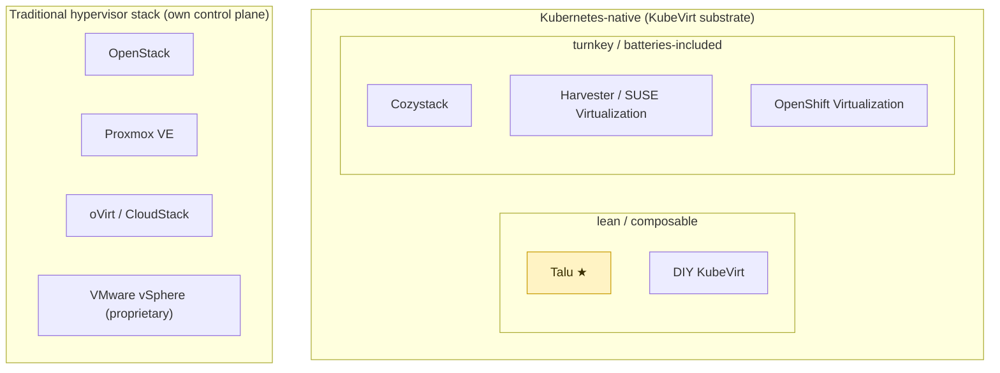

# Comparison — Talu vs alternatives

Talu is one point in a crowded landscape of "run VMs for tenants." This page places it honestly
against the main alternatives — what they share, where they diverge, and when you'd pick each. The
short version: **Talu is a lean, open-source, Kubernetes-native VM *substrate* that an external system
drives through the K8s API — not a portal, not an appliance, not a distro.** Several alternatives are
more complete products; that completeness is exactly the trade Talu makes.

> Competitor facts below were verified against upstream docs in **2026-07** (versions/status cited in
> the sources section). Where a claim couldn't be confirmed it is flagged rather than guessed.

## Where Talu sits

Two axes underlie this: **Kubernetes-native ↔ traditional hypervisor control plane**, and **lean/
composable ↔ turnkey/batteries-included**. Talu deliberately occupies "K8s-native + lean." (Notably,
**Cozystack is also built on Talos Linux** — the closest relative on the substrate itself.)

## The landscape at a glance

| Solution | Substrate | Control API | Multi-tenancy | Bundled portal/UI | GitOps-native | Footprint | Model / license |
|---|---|---|---|---|---|---|---|
| **Talu** | KubeVirt on Talos + Cilium + CephFS (Rook/RBD in prod) | **K8s API + Prometheus** (no proprietary API) | namespace + `HelmRelease` tenant, per-tenant Cilium policy, Kyverno guardrails | **no management portal** (orchestrator-agnostic; Perses dashboards, optional kubevirt-manager) | **yes** (Flux) | **lean** | OSS clone-and-adjust (MIT) |
| **Cozystack** | KubeVirt on **Talos** + Cilium/Kube-OVN | K8s **aggregation apiserver** (`apps.cozystack.io`) + dashboard | `Tenant` CRD (**nested**, hierarchical quotas), HelmRelease-backed | yes (dashboard) | yes (Flux) | medium–large — full PaaS | OSS (Apache-2.0), **CNCF Sandbox** |
| **Harvester** *(= "SUSE Virtualization")* | KubeVirt on **SUSE Linux Micro / Elemental** (RKE2) + Longhorn | K8s API + Harvester UI / Rancher | **soft** — namespaces + Rancher RBAC (single cluster) | yes (built-in UI) | partial | turnkey **HCI appliance** (bare metal) | OSS (Apache-2.0) |
| **OpenShift Virtualization** | KubeVirt on OpenShift | OpenShift API + web console | OpenShift projects | yes (console) | via OpenShift GitOps (Argo) | large — enterprise distro | commercial (**OKD Virtualization** community) |
| **OpenStack** | Nova/libvirt (KVM) | **OpenStack API** (Nova/Neutron/Cinder/Keystone) | projects/domains (Keystone) — strong | Horizon | no (imperative) | very large | OSS (Apache-2.0) |
| **Proxmox VE** | KVM + LXC | Proxmox API + web UI | pools/users (limited) | yes | no | small–medium appliance | OSS (AGPLv3) + paid support |
| **oVirt / CloudStack** | libvirt (KVM) | own API + UI | yes | yes | no | large | OSS — **oVirt now community-only** (see below) |
| **DIY KubeVirt** | KubeVirt on your K8s | raw K8s API | roll your own | no | if you add Flux | minimal (no platform) | you build it |

Status notes (2026-07): **Cozystack** is a CNCF Sandbox project (accepted 2025-03) at v1.6; **Harvester**
was rebranded **SUSE Virtualization** commercially (upstream stays "Harvester", Apache-2.0, GA v1.8.1);
**oVirt** is community-maintained only — **Red Hat fully withdrew** and the commercial RHV reaches
end-of-life (Extended Life to **2026-08-31**), though oVirt itself still ships (4.5.7, Dec 2025);
**Proxmox VE** is at 9.2 (Debian 13, kernel 7.0); **OpenStack** current release is 2026.1 "Gazpacho".

## By category

### Kubernetes-native platforms — Cozystack, Harvester, OpenShift Virtualization
**Common with Talu:** the KubeVirt + Kubernetes substrate — VMs as API objects, CDI for images, live
migration, containerDisks/DataVolumes. Cilium is usable across all of them.

**Differences:**
- **Cozystack** is the closest relative and the most instructive contrast — and, like Talu, it's built
  on **Talos Linux**. It goes *further*: a **dynamic aggregation apiserver** (`apps.cozystack.io`) exposes
  high-level kinds (`kind: VMInstance` + `VMDisk`, `kind: Tenant`) with imperative lifecycle
  subresources, a **managed-app catalog** (Postgres, Kafka, ClickHouse, Harbor, OpenBao…), a **dashboard**,
  and **nested tenants** with hierarchical quotas (v1.6). Its storage/DR bet also differs from Talu's:
  **DRBD + LINSTOR**, with DR via a **stretched LINSTOR cluster** (DRBD-replicated volumes across sites).
  Talu deliberately stops at the chart+HelmRelease core Cozystack is *built on*
  ([`../../components/tenancy/`](../../components/tenancy/)), adds an access plane and policy layer, and
  leaves the portal to whatever external system drives it. Talu is lighter and orchestrator-agnostic;
  Cozystack is a fuller product (now CNCF Sandbox) you adopt whole.
- **Harvester** (commercially **SUSE Virtualization**) is a **turnkey HCI appliance** — it ships its own
  immutable OS (**SUSE Linux Micro / Elemental**, RKE2-orchestrated) + **Longhorn** storage + a built-in
  UI, aimed at bare metal, with Rancher integration. Two honest caveats vs. Talu's multi-tenant framing:
  Harvester is a **single cluster with *soft* tenancy** (namespaces + Rancher RBAC — SUSE points to a
  *separate* Virtual-Clusters/K3k product for hard isolation), and its **DR is backup/restore-based**
  (VM backup to S3/NFS + cross-cluster image sync since v1.4; **no active/passive replication or
  automated cross-cluster failover**). Harvester wins on "insert USB, get a cluster"; Talu wins on
  composability, stronger per-tenant isolation, and a minimal, auditable substrate.
- **OpenShift Virtualization** is KubeVirt inside an enterprise distro — integrated console, support,
  compliance, and the field's **most complete VM DR**: **ODF (Ceph) + Ramen + RHACM**, offering both
  **Metro-DR** (synchronous, RPO 0, <10 ms RTT) and **Regional-DR** (async), current through ODF 4.20.
  That completeness is heavy (an RHACM hub cluster + ODF). Talu is vanilla-K8s-on-Talos, no distro
  lock-in, self-supported; its DR is a lean async design (below), not a productized hub-orchestrated one.
  (Community edition: **OKD Virtualization**; it is the designated successor to the now-EOL RHV.)

### Traditional VM clouds — OpenStack, Proxmox VE, oVirt/CloudStack, vSphere
**Common with Talu:** the *problem* — tenants, quotas, network isolation ("security groups"), storage,
VM lifecycle, images/templates, live migration. Talu's `securityGroups`/`ResourceQuota`/tenant model
maps directly onto concepts these platforms established.

**Differences:** they run their **own control plane and API** (not Kubernetes).
- **OpenStack** (2026.1 "Gazpacho") — a mature, large-scale IaaS with strong Keystone multi-tenancy and
  a vast ecosystem, but heavy operations and an imperative API. DR is a **composed pattern**: **Masakari**
  for in-region instance HA (auto-evacuation) + **Cinder replication ("cheesecake")** for admin-triggered
  storage failover to a second site — no single native cross-region VM-DR feature.
- **Proxmox VE** (9.2) — delightfully simple for on-prem (VMs + LXC, one UI), but single-cluster-scoped
  and not declarative. Native **ZFS `pvesr`** gives async, per-guest replication (down to ~1 min RPO) but
  **intra-cluster only**; `ha-manager` failover is intra-cluster; the new **Proxmox Datacenter Manager**
  (GA 1.x, Dec 2025) adds cross-cluster *live migration* (operator-initiated) but **no automatic cross-site
  failover**.
- **oVirt** — still ships (4.5.7) but is **community-maintenance only after Red Hat's full withdrawal**;
  the commercial RHV is EOL — a real risk factor for new adoption. **CloudStack** (4.22 LTS) is active,
  hypervisor-agnostic (KVM/VMware/XCP-ng), with its own API+UI; it has **no KubeVirt relationship** (its
  Kubernetes service runs clusters *on top of* CloudStack VMs, the inverse of KubeVirt).
- **vSphere** is the proprietary incumbent these OSS options exist to replace.

Talu's bet is that the **Kubernetes declarative API is a better integration surface** than a bespoke
cloud API — so an external orchestrator writes objects and watches `.status` instead of calling
Nova/Neutron.

### DIY KubeVirt
Just KubeVirt on your own cluster. **Talu *is* the platform layer** you would otherwise hand-build:
the tenant API (chart + HelmRelease), the access plane (Pomerium Native SSH + generic OIDC + per-tenant
Cilium policy), the security layer (Kyverno + Tetragon), the image catalog, the golden-image discipline,
and the validated operational gotchas.

## Disaster recovery & multi-site (how each fails over)

Talu now has a designed active/passive DR story (Ceph RBD mirroring) — see
[`disaster-recovery.md`](disaster-recovery.md). Placed against the field:

| Solution | DR / multi-site approach | Type | RPO | Automatic cross-site failover? |
|---|---|---|---|---|
| **Talu** | Ceph RBD **snapshot mirroring** (async) primary↔standby pair + GitOps failover runbook; Velero as an independent cold tier | async *(designed — not yet validated)* | ~minutes | operator-gated (a 3rd witness site enables auto) |
| **Cozystack** | **Stretched LINSTOR/DRBD** — one LINSTOR cluster across sites, DRBD-replicated volumes | synchronous/replicated (metro) | ~0 (metro) | storage-layer stretch (latency-bound) |
| **Harvester** | VM **backup/restore** to S3/NFS + cross-cluster image sync | backup-based | = backup interval | no (manual restore) |
| **OpenShift Virt** | **ODF (Ceph) + Ramen + RHACM** — Metro-DR (sync) / Regional-DR (async) | both | 0 (metro, <10 ms) / minutes (regional) | **yes** — but needs an RHACM hub + ODF (heavy) |
| **OpenStack** | **Masakari** in-region instance HA + **Cinder** replication (admin-triggered `failover-host`) | composed | in-region auto; cross-site manual | in-region only |
| **Proxmox VE** | **ZFS `pvesr`** async replication + `ha-manager` (both **intra-cluster**); PDM cross-cluster live-migration (manual) | intra-cluster + manual | ~1 min (pvesr) | no (intra-cluster HA only) |
| **oVirt / CloudStack** | Traditional storage-array / backup DR + in-cluster HA | varies | varies | no native cross-site orchestrator |

**Honest placement:** OpenShift's DR is the most complete and productized (and by far the heaviest —
an RHACM hub + ODF). Talu's design is closest to OpenShift **Regional-DR** in spirit (async Ceph +
GitOps failover) but deliberately far leaner — no OCM/RHACM hub, a scripted GitOps runbook instead of
Ramen. Cozystack takes the opposite bet (stretched DRBD, metro-synchronous). Harvester and Proxmox are
backup- or intra-cluster-only for practical purposes. Talu's DR is a **lean design, not yet validated** —
that honesty is the trade for the smaller footprint.

## What Talu shares with the field
- **KubeVirt + Kubernetes** substrate (with the K8s-native camp): declarative VMs, CDI, live migration.
- **The tenancy problem** (with everyone): namespaces/projects, quotas, network security, storage, images.
- **Open source** (with all but vSphere): forkable, no vendor lock-in.

## What makes Talu different
1. **Orchestrator-agnostic — it is a substrate, not a portal.** Its whole surface is the K8s API +
   Prometheus, driven by *any* external billing/portal/automation system through a four-verb contract
   ([`../integrations/`](../integrations/)). Cozystack/Harvester/OpenShift each bring their own UI and
   assume it; Talu assumes none and runs standalone.
2. **Clone-and-adjust, not appliance/distro.** You fork `environments/`, track `components/` upstream
   with a clean `git merge` — you own your ground. No installer OS, no enterprise subscription.
3. **Lean, specific substrate.** Talos immutable OS, Cilium (kube-proxy-less), CephFS, Pomerium Native
   SSH, a *generic* OIDC IdP — no bundled app catalog, no aggregation apiserver, no bundled IdP.
4. **No proprietary API.** Tenants/VMs are `HelmRelease` + labelled objects; nothing to reverse-engineer.
5. **Security posture in a lean substrate.** Policy-as-code (**Kyverno**, including admission-time
   **cosign image verification**) and eBPF runtime security (**Tetragon**) — a policy-engine + runtime
   threat-detection layer the lean/appliance field (Cozystack, Harvester, Proxmox) doesn't ship by
   default; only the enterprise distro (OpenShift) matches it, at far greater weight.

## Where the alternatives are stronger (honestly)
- **Cozystack** — a more complete open PaaS: dashboard, managed databases, nested tenants, native kinds,
  and a metro-synchronous (stretched-LINSTOR) DR path out of the box.
- **Harvester / SUSE Virtualization** — turnkey bare-metal HCI with hardware/console integration.
- **OpenShift Virtualization** — enterprise support, compliance, an integrated console, and the most
  complete productized VM DR (Metro + Regional).
- **OpenStack** — mature IaaS at large scale, strong Keystone multi-tenancy, and non-VM services.
- **Proxmox VE** — the lowest-friction path to VMs + containers on a few on-prem nodes.

## Choosing
- **Talu** — you want a lean, open-source, **K8s-native VM substrate** an external system drives via the
  Kubernetes API, and you want to **fork and own** it end to end.
- **Cozystack** — you want a batteries-included open **PaaS** (dashboard, native kinds, stretched-DRBD DR).
- **Harvester** — you want **turnkey HCI** on bare metal (accepting single-cluster soft tenancy).
- **OpenShift Virt** — you're on OpenShift and want **enterprise-supported** KubeVirt with productized DR.
- **OpenStack** — you want a **mature large-scale IaaS** beyond just VMs.
- **Proxmox VE** — you want the **simplest on-prem** VM/container box.

## Sources & further reading

Primary docs / status for each system (verified 2026-07):

- **Cozystack** — <https://cozystack.io/docs/> · CNCF Sandbox: <https://www.cncf.io/projects/cozystack/> ·
  aggregation apiserver: <https://kubernetes.io/blog/2024/11/21/dynamic-kubernetes-api-server-for-cozystack/> ·
  stretched-LINSTOR DR: <https://cozystack.io/docs/operations/stretched/linstor/>
- **Harvester / SUSE Virtualization** — <https://docs.harvesterhci.io/> · <https://documentation.suse.com/cloudnative/virtualization/> ·
  third-party (Ceph/Rook) CSI: <https://github.com/harvester/harvester/blob/master/enhancements/20250203-third-party-storage-support.md>
- **OpenShift Virtualization** — <https://www.redhat.com/en/technologies/cloud-computing/openshift/virtualization> ·
  OKD Virtualization: <https://okd-virtualization.github.io/> · DR (ODF+Ramen+RHACM):
  <https://docs.redhat.com/en/documentation/red_hat_openshift_data_foundation/4.20/html/configuring_openshift_data_foundation_disaster_recovery_for_openshift_workloads/rdr-solution>
- **OpenStack** — <https://docs.openstack.org/> · Masakari (instance HA): <https://docs.openstack.org/masakari/latest/>
- **Proxmox VE** — <https://pve.proxmox.com/pve-docs/> · storage replication: <https://pve.proxmox.com/wiki/Storage_Replication> ·
  Datacenter Manager: <https://www.proxmox.com/en/products/proxmox-datacenter-manager/overview>
- **oVirt** (community-only; RHV EOL) — <https://www.ovirt.org/documentation/> · <https://endoflife.date/ovirt> ·
  **Apache CloudStack** — <https://docs.cloudstack.apache.org/>
- **DIY KubeVirt** — <https://kubevirt.io/user-guide/>
- **Talu's own substrate** — see the building-blocks table in [`README.md`](README.md#the-building-blocks-upstream-docs)
  and the DR design in [`disaster-recovery.md`](disaster-recovery.md).
