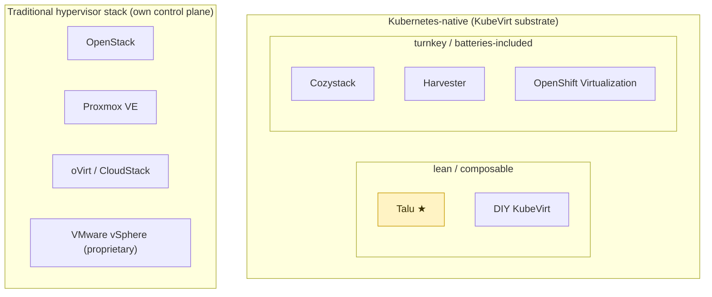

# Comparison — Talu vs alternatives

Talu is one point in a crowded landscape of "run VMs for tenants." This page places it honestly
against the main alternatives — what they share, where they diverge, and when you'd pick each. The
short version: **Talu is a lean, open-source, Kubernetes-native VM *substrate* that an external system
drives through the K8s API — not a portal, not an appliance, not a distro.** Several alternatives are
more complete products; that completeness is exactly the trade Talu makes.

## Where Talu sits

Two axes underlie this: **Kubernetes-native ↔ traditional hypervisor control plane**, and **lean/
composable ↔ turnkey/batteries-included**. Talu deliberately occupies "K8s-native + lean."

## The landscape at a glance

| Solution | Substrate | Control API | Multi-tenancy | Bundled portal/UI | GitOps-native | Footprint | Model / license |
|---|---|---|---|---|---|---|---|
| **Talu** | KubeVirt on Talos + Cilium + CephFS | **K8s API + Prometheus** (no proprietary API) | namespace + `HelmRelease` tenant, per-tenant Cilium policy | **none** (orchestrator-agnostic; optional kubevirt-manager) | **yes** (Flux) | **lean** | OSS clone-and-adjust (MIT) |
| **Cozystack** | KubeVirt on K8s | K8s **aggregation apiserver** (high-level kinds) + dashboard | `Tenant` CRD (nestable), HelmRelease-backed | yes (dashboard) | yes (Flux) | medium — full PaaS | OSS (Apache-2.0) |
| **Harvester** | KubeVirt on its own OS (RKE2) + Longhorn | K8s API + Harvester UI / Rancher | Rancher projects/namespaces | yes (built-in UI) | partial | turnkey **HCI appliance** (bare metal) | OSS (Apache-2.0) |
| **OpenShift Virtualization** | KubeVirt on OpenShift | OpenShift API + web console | OpenShift projects | yes (console) | via OpenShift GitOps (Argo) | large — enterprise distro | commercial (OKD community) |
| **OpenStack** | Nova/libvirt (KVM) | **OpenStack API** (Nova/Neutron/Cinder/Keystone) | projects/domains (Keystone) | Horizon | no (imperative) | very large | OSS |
| **Proxmox VE** | KVM + LXC | Proxmox API + web UI | pools/users (limited) | yes | no | small–medium appliance | OSS (AGPL) + paid support |
| **oVirt / CloudStack** | libvirt (KVM) | own API + UI | yes | yes | no | large | OSS |
| **DIY KubeVirt** | KubeVirt on your K8s | raw K8s API | roll your own | no | if you add Flux | minimal (no platform) | you build it |

## By category

### Kubernetes-native platforms — Cozystack, Harvester, OpenShift Virtualization
**Common with Talu:** the KubeVirt + Kubernetes substrate — VMs as `VirtualMachine` objects, CDI for
images, live migration, containerDisks/DataVolumes, and everything expressible as K8s API objects.
Cilium is usable across all of them.

**Differences:**
- **Cozystack** is the closest relative and the most instructive contrast. It goes *further* than
  Talu: an **aggregation apiserver** exposes high-level kinds (`kind: VirtualMachine`, `kind: Tenant`)
  with imperative subresources (console/start/resize), a **managed-app catalog** (Postgres, Kafka, …),
  a **dashboard**, and **nested tenants** — a batteries-included PaaS. Talu deliberately stops at the
  chart+HelmRelease core Cozystack is *built on* (see [`../../components/tenancy/`](../../components/tenancy/)),
  adds an access plane, and leaves the portal to whatever external system drives it. Talu is lighter
  and orchestrator-agnostic; Cozystack is a fuller product you adopt whole.
- **Harvester** is a **turnkey HCI appliance** — it ships its own installer/OS (RKE2-based) + Longhorn
  storage + a built-in UI, aimed at bare metal, with Rancher integration. Talu is not an appliance:
  it's values-overlays on **Talos** you assemble and own, with external CephFS. Harvester wins on
  "insert USB, get a cluster"; Talu wins on composability and a minimal, auditable substrate.
- **OpenShift Virtualization** is KubeVirt inside an enterprise distro — integrated console, support,
  compliance, coupled to OpenShift. Talu is vanilla-K8s-on-Talos, no distro lock-in, self-supported.

### Traditional VM clouds — OpenStack, Proxmox VE, oVirt/CloudStack, vSphere
**Common with Talu:** the *problem* — tenants, quotas, network isolation ("security groups"), storage,
VM lifecycle, images/templates, live migration. Talu's `securityGroups`/`ResourceQuota`/tenant model
maps directly onto concepts these platforms established.

**Differences:** they run their **own control plane and API** (not Kubernetes). OpenStack is a mature,
large-scale open-source IaaS with a vast ecosystem but heavy operations and an imperative API. Proxmox
is delightfully simple for on-prem (VMs + LXC, one UI) but single-cluster-scoped and not declarative.
vSphere is the proprietary incumbent these OSS options exist to replace. Talu's bet is that the
**Kubernetes declarative API is a better integration surface** than a bespoke cloud API — so an
external orchestrator writes objects and watches `.status` instead of calling Nova/Neutron.

### DIY KubeVirt
Just KubeVirt on your own cluster. **Talu *is* the platform layer** you would otherwise hand-build:
the tenant API (chart + HelmRelease), the access plane (Pomerium Native SSH + generic OIDC + per-tenant
Cilium policy), the image catalog, the golden-image discipline, and the validated operational gotchas.

## What Talu shares with the field
- **KubeVirt + Kubernetes** substrate (with the K8s-native camp): declarative VMs, CDI, live migration.
- **The tenancy problem** (with everyone): namespaces/projects, quotas, network security, storage, images.
- **Open source** (with all but vSphere): forkable, no vendor lock-in.

## What makes Talu different
1. **Orchestrator-agnostic — it is a substrate, not a portal.** Its whole surface is the K8s API +
   Prometheus, driven by *any* external billing/portal/automation system through a four-verb contract
   ([`../integrations/`](../integrations/)). Cozystack/Harvester/OpenShift each bring their own UI and
   assume it; Talu assumes none and runs standalone.
2. **Clone-and-adjust, not appliance/distro.** You fork `environments/`, track `components/` upstream
   with a clean `git merge` — you own your ground. No installer OS, no enterprise subscription.
3. **Lean, specific substrate.** Talos immutable OS, Cilium (kube-proxy-less), CephFS, Pomerium Native
   SSH, a *generic* OIDC IdP — no bundled app catalog, no aggregation apiserver, no bundled IdP.
4. **No proprietary API.** Tenants/VMs are `HelmRelease` + labelled objects; nothing to reverse-engineer.

## Where the alternatives are stronger (honestly)
- **Cozystack** — a more complete open PaaS: dashboard, managed databases, nested tenants, native kinds.
- **Harvester** — turnkey bare-metal HCI with hardware/console integration.
- **OpenShift Virtualization** — enterprise support, compliance, an integrated console.
- **OpenStack** — mature IaaS at large scale, and non-VM services (object store, DBaaS, …).
- **Proxmox VE** — the lowest-friction path to VMs + containers on a few on-prem nodes.

## Choosing
- **Talu** — you want a lean, open-source, **K8s-native VM substrate** an external system drives via the
  Kubernetes API, and you want to **fork and own** it end to end.
- **Cozystack** — you want a batteries-included open **PaaS** (with its own dashboard) out of the box.
- **Harvester** — you want **turnkey HCI** on bare metal.
- **OpenShift Virt** — you're on OpenShift and want **enterprise-supported** KubeVirt.
- **OpenStack** — you want a **mature large-scale IaaS** beyond just VMs.
- **Proxmox VE** — you want the **simplest on-prem** VM/container box.
