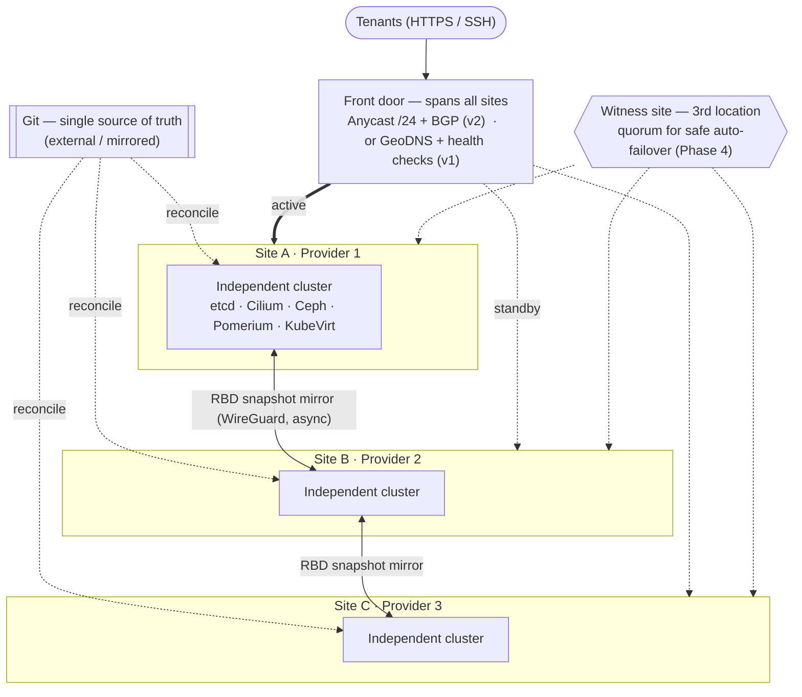
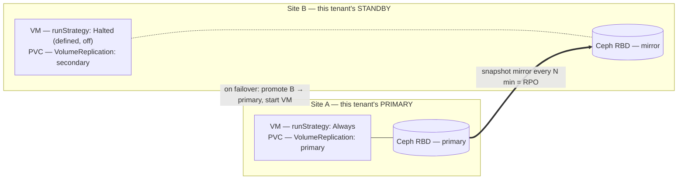

# Disaster Recovery & multi-site failover — design proposal

> **Status: DRAFT / proposal.** Not yet implemented. Real-hardware only (RBD mirroring, BGP,
> WireGuard) — the nested no-KVM lab cannot exercise this. Every external claim below was verified
> against current (2026-07) upstream docs; sources are listed at the end.

## 1. Goal & the honest envelope

**Goal:** an **"unkillable" fleet** — Talu spread across many independent clusters at different AZs,
providers, and companies, so that losing any one provider loses only that provider's capacity, never
the service. For **stateful tenant VMs** the concrete mechanism is **active/passive failover** to a
standby cluster, with an *honest*, measured RPO/RTO.

**Non-goal (physically impossible, don't promise it):** zero-RPO synchronous stateful failover
across providers. CAP + the speed of light forbid "consistent + available under partition + stateful"
over a high-latency inter-provider link. So we deliberately choose **AP / async replication** — the
only performant option across providers — and accept a bounded data-loss window.

**Fleet vs. pair — the key distinction:** the *platform* is **N independent sites** (§2, the fleet).
But the storage-replication *primitive* — Ceph RBD mirroring — is **single-peer**, so each **tenant's
VM DR is a primary + one-standby pair**. Different tenants are pinned to different site-pairs, so the
blast radius and load spread across the whole fleet even though any single VM only ever has one standby.

**The envelope this design delivers:**

| Property | Value | Set by |
|---|---|---|
| Topology | **N independent clusters (a fleet)** across providers/AZs; per-tenant DR = a **primary+standby pair** | §2 |
| Failover style | **Cold** — VM reboots on the standby (not live migration; impossible over WAN) | KubeVirt |
| **RPO** | = the **last *completed* mirror snapshot** (minutes; a partial delta rolls back) | Ceph RBD snapshot-mirror interval |
| **RTO** | fence + promote + boot + cutover ≈ **minutes** (+ DNS TTL, unless anycast) | runbook + front door |
| Failover trigger | **operator-gated** (human decides "dead vs partitioned"); safe *auto* needs a 3rd witness site | safety (§6) |
| Cost | **~2× infra** — the standby must roughly match the active or it lags and the RPO is unmeetable | war-story #4 |

This is "survives losing a provider," **not** "unkillable zero-loss." True zero-loss for a stateful
VM only comes from *tenant app-level HA* (two VMs, two clusters, app fails over) — which only the
tenant can build. We provide the platform for both.

## 2. Topology — federate, do not stretch

The platform is a **fleet of N fully independent clusters** (own etcd/Cilium/Ceph/Pomerium per site).
The **only** things that span sites are the async replication links, the GitOps source of truth, the
identity plane, and the front door. (Rationale — etcd/Ceph/Cilium are all latency-bound; stretching
one cluster across providers couples fate and makes the system *more* killable, the opposite of the goal.)

### 2.1 The fleet (N sites)



Hard rules: separate etcd, separate Cilium, **non-overlapping Pod & Service CIDRs**, separate Ceph
fsid per site. **Cilium ClusterMesh is NOT used** for DR — it's east-west only and just adds a
failure surface; sites are coupled solely by RBD-mirror + the front door.

### 2.2 One tenant's DR = a pair (RBD is single-peer)

Within the fleet, a given tenant's VM lives on a primary and mirrors to exactly **one** standby.
Failover flips the standby's storage to primary and boots the pre-staged, halted VM.



The tenant's **stable identity is a name** (the front door repoints it; the VM's cluster-local IP
changes) — or, only with the anycast /24, a **literal IP** that survives via BGP re-advertisement.

## 3. Layer-by-layer design

### 3.1 Storage (VM disks) — Rook Ceph RBD **snapshot** mirroring

- **`CephRBDMirror`** daemon on both clusters; pool mirroring in **`image` mode** (opt-in per VM
  disk). Peer via the bootstrap token from the pool status (`rbdMirrorBootstrapPeerSecretName`).
- **Snapshot-based**, not journal-based: snapshot mode has **no journal write penalty** (journal
  mode ~doubles write latency — unacceptable on NVMe VM disks). RPO = the `snapshotSchedules`
  interval (start at 15 min; tune down to your change-rate/bandwidth budget).
- **Promote/demote declaratively** with **csi-addons `VolumeReplication`** (`replicationState:
  primary|secondary|resync`); ceph-csi implements it. This is the K8s-native failover lever — no raw
  `rbd` commands in the hot path.

**Three constraints that shape the whole design (verified):**
1. **Single peer only** — Rook pool mirroring supports one peer. Per-tenant DR is a **pair**, not
   N-way fan-out (see §2 — the fleet is N-site, each tenant's mirror is one pair).
2. **Multi-disk VM crash-consistency is NOT solved upstream** — per-image snapshots can leave a
   multi-disk VM's disks at different points. **DR-protected VMs use a single root RBD disk** (or
   pilot `VolumeGroupReplication` and *validate failover consistency yourself* — treat as experimental).
3. **RPO = last *completed* snapshot** — a partially-applied delta is rolled back at failover; and
   **force-promote creates split-brain** requiring a full `resync` (re-baseline, not delta) on failback.
- Pin **Ceph ≥ 18.2.0** (fixes the enable/disable-race stale-image "split-brain detected" bug, #54344).

*Alternative considered:* **LINSTOR/DRBD (Piraeus)** gives synchronous **RPO=0** — but only in
**metro (<10 ms RTT)**, and its WAN-async component (**DRBD Proxy**) is **proprietary/paid**. Keep
Ceph for cross-provider async; revisit DRBD only if two sites are truly metro-close and RPO=0 is required.

### 3.2 Orchestration — DIY GitOps runbook (**not** RamenDR)

- Flux reconciles the **full** VM spec to *both* clusters in a pair — including **MAC address,
  `bootOrder`, firmware UUID/serial, and network-attachment names** (these do *not* travel
  automatically; a raw disk mirror without them boots a wrong-NIC / wrong-boot-disk guest — war-story #8).
- Standby holds VMs at **`runStrategy: Halted`** with the disk PVC in `VolumeReplication: secondary`.
- Failover = **fence → promote (VolumeReplication→primary) → flip `runStrategy` to Always → cut over
  the front door**. (Full ordered runbook in §5.)
- **RamenDR rejected** for now: it hard-requires an **OCM hub** (a third control-plane cluster), is
  self-declared **alpha** on vanilla K8s, and its known failure mode is **getting stuck on the second
  action** (failback leaves `PeerReady=false`, stale VRG/VR/PVC block redeploy — war-story #5).
  Disproportionate for a lean Flux platform. Revisit only if it ships stable or we already run OCM.
- **Velero + `kubevirt-velero-plugin`** stays as an **independent cold-DR safety net** (app-consistent
  via guest-agent freeze/thaw; RPO = backup interval). Never rely on a single replication method
  (war-story #14) — the mirror and the backup are two independent lines of defence.

### 3.3 Network — front door + replication link

**Front door (global steering), phased:**

| Phase | Mechanism | RTO | Note |
|---|---|---|---|
| **v1** | Managed **GeoDNS + health checks** | ~1–5 min (DNS TTL floor) | Simplest; RTO can't go much below ~60 s reliably |
| **v1-alt** | Managed anycast LB (e.g. Cloudflare LB) | seconds–~1 min | Best RTO/effort, **but a third party terminates TLS** — weigh vs "Pomerium sole ingress" |
| **v2** | **Own PI /24 + ASN, anycast BGP** | seconds–~2 min (BGP convergence) | Provider-independent, IP truly portable; heaviest lift |

**Provider reality for anycast (BGP/BYOIP) — this constrains site selection:**
- **Vultr** — self-serve BGP + BYOIP ✓ (needs ASN + LOA for AS20473 + **ROA**). Best budget anycast POP.
- **OVHcloud** — BGP Service exists but **alpha, IPv4-only, weeks of lead time**.
- **Hetzner (non-colo) & Scaleway — NO BGP/BYOIP.** They can only sit behind GeoDNS/managed-anycast.
  → **Tension with cost:** Scaleway was the €/GB winner but **cannot participate in your own anycast** —
  so an anycast design pairs Vultr (+OVH) as the BGP POPs, with Scaleway/Hetzner as GeoDNS-only sites.
- **RPKI ROA is the #1 anycast failure mode** — a wrong origin/maxLength makes valid routes *invalid*
  and dropped globally (war-story #11). `/24` is the minimum routable prefix. Pre-provision & test the ROA.

**Replication link:** a dedicated **WireGuard mesh** (not ClusterMesh) carrying rbd-mirror (peer
MONs `:3300`/`:6789`) and optionally GitOps. **MTU is the sharp edge** — the host path is already
1400 (gotcha #1); WireGuard costs **~80 B (budget 95)** → inner MTU **~1305–1320**. Use **native
routing** on the site link (avoid double encap), **clamp MSS**, do **not** trust PMTU across the
internet (ICMP filtered → silent blackhole), and mind the **IPv6 1280 B floor**.

**Stable tenant IP across failover:** LB-IPAM pools are **per-site, non-overlapping**. A tenant's
stable identity is a **name** (GeoDNS repoints it; the IP changes) — *or*, only with the anycast /24,
a **literal IP** that survives via **BGP re-advertisement** from the standby. Offer fixed-IP tenants
the anycast path; everyone else is addressed by name.

### 3.4 Access plane — Pomerium (the sole ingress **and** SSH CA)

Pomerium has **no supported cross-cluster session replication** — the design is: **independent
Pomerium per cluster, users re-authenticate on failover** (a silent OIDC redirect *if* the shared
secrets match). For that to preserve access, **these must be byte-identical across the fleet**
(deploy via **GitOps + SOPS**):

| Item | Why it must match |
|---|---|
| **`ssh_user_ca_key`** (SSH User CA private key) | **Most critical.** Certs any site issues must be trusted by the same `TrustedUserCAKeys` already on every VM; a different CA = every `sshd` rejects post-failover. |
| **`ssh_host_keys`** | Else the client sees a changed host key for the same name → `REMOTE HOST IDENTIFICATION HAS CHANGED`, blocking SSH until users clear `known_hosts`. |
| **`shared_secret`** | Inter-service auth; the signing key derives from it if unset. |
| **`cookie_secret`** (set explicitly) | Standby must decrypt existing session cookies or it forces re-login every failover. |
| **`signing_key`** (set explicitly) | Upstreams verify the per-user JWT via JWKS; must be stable across failover. |
| Routes / policy | Already same-Git in Talu ✓ (rendered from `talu.io/ssh-expose`). |
| TLS cert for the shared hostname | Use **DNS-01** (HTTP-01 collides across clusters + burns LE rate limits); replicate one cert or issue per-cluster. **Disable Pomerium `autocert`.** |

Databroker: **Postgres per cluster** (the docs say *don't* share one DB across instances). Sessions
start cold on the standby — accepted. The clustered-databroker (v0.31, Raft) is **intra-cluster only**,
not a DR answer.

### 3.5 Identity provider (IdP) — the open decision

The lab uses Dex; the production IdP is **undecided**. Every candidate reduces multi-site DR to
**"replicate one PostgreSQL across sites"** — which is itself async (RPO>0) ⇒ **active-passive**.

| IdP | Datastore | Cross-provider DR | Ops weight | Verdict |
|---|---|---|---|---|
| **Authentik** | **Postgres only** (Redis removed in 2025.10); stateless app | Active-passive on replicated Postgres; docs explicitly bless **different providers** | **Low** (app + one Postgres) | **★ Recommended** — best resilience-per-ops, one dependency |
| **ZITADEL** | Postgres (event-sourced) | Async Postgres replication → passive (active-active died with CockroachDB in v3) | Medium-high (≥3 nodes) | Runner-up if audit-grade history / strong multi-tenancy matter |
| **Dex** | Postgres/etcd/CRD (keys + tokens) | Stateless federator — but relocates the DR problem to an **upstream** IdP | Lowest *iff* an upstream exists | Only if delegating to external LDAP/OIDC |
| **Keycloak** | DB **+ external Infinispan**, both **synchronous**, low-latency link, tested 2-site | ✗ | Highest | **Disqualified for cross-provider DR** |

**Recommendation: Authentik, active-passive, on cross-site-replicated Postgres.** Leanest full IdP,
aligns with Talu's minimal-footprint ethos, and DR collapses to a well-understood Postgres
streaming-replication/Patroni exercise. **This decision should be settled first** — it dictates the
Postgres-replication build that the whole access plane depends on. Pomerium keeps the same issuer URL
via the front door across failover.

## 4. Why not a single stretched cluster (recap)

etcd (≤5–10 ms), Ceph stretch (≤10 ms for RPO=0), and Cilium all break or degrade across
inter-provider latency; a partition puts the etcd minority read-only. A stretched cluster trades
fault isolation for a shared failure domain — exactly backwards for DR. **Independent clusters +
async replication is the only correct shape** across providers.

## 5. The failover runbook (operational core)

**Fence-before-promote is a precondition, not cleanup** (war-story #12). Two sites cannot tell "dead"
from "partitioned" automatically, so the go/no-go stays a **human gate** until a 3rd witness site
provides quorum (§7, Phase 4).

```mermaid
sequenceDiagram
    actor Op as Operator (human gate)
    participant W as Witness / quorum
    participant A as Site A (old primary)
    participant B as Site B (standby)
    participant FD as Front door (DNS / anycast)

    Note over A: Site A lost or unreachable
    Op->>W: Confirm A is DEAD (not just partitioned)
    Op->>A: 1. FENCE — power-off / withdraw routes / block Ceph image
    Op->>B: 2. Promote storage (VolumeReplication -> primary)
    Op->>B: 3. Start VMs (runStrategy Halted -> Always)
    Op->>FD: 4. Cut over (GeoDNS repoint / BGP re-advertise /24)
    Note over B: Tenants re-authenticate at Pomerium; VMs cold-boot
    Note over A,B: Failback later = FULL resync of A (re-baseline, not a delta)
```

Automate the **fence** and the **force-delete of RWO terminating pods** (the ~6-min ownership gap on
RWO PVCs — war-story #6). The **decision** and the **failback resync** stay deliberate.

## 6. War-story-driven guardrails (baked into the design)

Concrete lessons → rules this design already encodes:

- **Alert on mirror-snapshot *freshness* per image (real timestamps) + pool fill — NOT on
  `entries_behind_master`** (it lies; a dropped schedule silently stops snapshots — a silent RPO breach).
- **The DR control plane, monitoring, DNS, secrets, and the failover runbook/kubeconfig must live
  OFF every data cluster** and be reachable with a site assumed *gone* (Roblox: observability on the
  thing it protected → 73 h blind).
- **Verify *restores*, not backups** — alert on backup **success/freshness**; assume any single
  replication method is broken until a real restore proves it (GitLab: 5 mechanisms, 0 worked).
- **Standby site must match active IOPS + have bandwidth ≥ steady write rate** — a cheap standby lags
  forever = an RPO you can't meet.
- **Never toggle per-image mirroring in tight loops** (GitOps reconcilers love to) — idempotent enable,
  Ceph ≥ 18.2.0.
- **Name-based indirection, never hardcoded IPs**; stage/canary any anycast withdrawal (Cloudflare
  1.1.1.1, 2025: one global control-plane mutation withdrew the prefix worldwide for 62 min).
- **GitOps renders the whole fleet from one source of truth** so standbys can't drift — then run
  **scheduled game-day failovers** that measure *real* RPO/RTO. The only DR that works is the one you exercise.

## 7. Tradeoffs

- **CAP is non-negotiable:** stateful VM DR is async (RPO>0) or tenant-app-HA (zero-loss, tenant-built).
  No middle option across providers.
- **~2× cost** — the standby must match the active to meet RPO; "passive" is not cheap.
- **A pair (2 sites) ⇒ manual failover** (can't distinguish dead vs partitioned safely). **Safe
  *automatic* failover needs a 3rd witness site** for quorum — the jump from "survives a provider" to
  "auto-heals." The fleet can hold many pairs; the witness is shared.
- **Complexity:** N× platform overhead + WireGuard + (optionally) BGP/anycast/ROA + Postgres
  replication + a tested runbook. This is a serious, ongoing operational commitment.

## 8. How it maps into the Talu repo

- **New component `components/platform/dr/`** (or extend `infrastructure/rook-ceph/`): `CephRBDMirror`,
  pool mirroring + `snapshotSchedules`, `VolumeReplicationClass`, the peer bootstrap secret (SOPS).
- **Tenant chart** gains `dr.{enabled,rpoMinutes,peerCluster}` values → renders the `VolumeReplication`
  CR, the **Halted** mirror VM (full spec incl. MAC/bootOrder/UUID), and the snapshot schedule. This
  fits "the chart's `values.schema.json` **is** the API" — **per-tenant DR becomes a premium tier**,
  and `peerCluster` is how tenants are sharded across fleet site-pairs.
- **Access plane:** the 5 Pomerium shared secrets (§3.4) managed via **SOPS**, deployed identically to
  every site overlay. New **`identity_authentik`** component + its Postgres-replication story.
- **GitOps:** the whole fleet reconciles the same Git; a per-cluster overlay carries the **active/passive
  role flag** that gates `runStrategy` and `VolumeReplication` state.
- **`dev/lab/`-style failover script** implementing §5 (fence → promote → flip → cutover) — but this is
  **real-hardware only** (RBD mirroring, WireGuard, BGP); the nested lab can't exercise it.

## 9. Phased rollout

- **Phase 0 — decide the IdP** (Authentik). Prerequisite; it dictates the Postgres-replication build.
- **Phase 1 — control/access/identity failover first, no storage mirror yet.** Two clusters from one
  Git; identical Pomerium secrets + SSH CA via SOPS; Authentik Postgres replication; **manual GeoDNS
  failover**; Velero cold-DR as the only data path. Proves the *access & identity* failover cleanly.
- **Phase 2 — storage DR.** RBD snapshot-mirroring + `VolumeReplication`; single-disk DR VMs; the
  failover runbook + freshness alerting; first **game-day**.
- **Phase 3 — sub-minute / stable-IP.** Own PI /24 + ASN, anycast BGP on Vultr(+OVH); ROA pre-provisioned.
- **Phase 4 — productize + auto + scale the fleet.** Per-tenant `dr.*` tier in the chart; add a **3rd
  witness site** for safe automatic failover; grow beyond the first pair to an N-site fleet.

## 10. Open decisions

1. **IdP:** Authentik (recommended) vs ZITADEL vs Dex-federation.
2. **Provider mix:** anycast needs Vultr/OVH; Scaleway/Hetzner are GeoDNS-only — reconcile with the
   €/GB cost picture (Scaleway was the cost winner but can't anycast).
3. **Multi-disk VM DR:** single-root-disk constraint now, vs piloting experimental group replication.
4. **Per-pair manual gate vs a shared 3rd witness site** for safe auto-failover across the fleet.
5. **Metro RPO=0 option** (LINSTOR/DRBD sync) only if two sites are <10 ms apart — DRBD Proxy is
   proprietary for WAN.

---

### Sources (verified 2026-07)

Ceph/Rook: rook.io RBD mirroring & CephBlockPool CRD · docs.ceph.com RBD mirroring (split-brain/force-promote)
· ceph tracker #54344 · csi-addons `kubernetes-csi-addons` v0.14.0 `volumereplication.md`/`volumegroupreplication.md`
· Piraeus/LINBIT DRBD Proxy. Orchestration: github.com/RamenDR/ramen (+ocm-ramen-samples), open-cluster-management.io
· kubevirt.io snapshot/run-strategies + backup-restore-integration · kubevirt-velero-plugin. Network: Vultr BGP/BYOIP docs
· labs.ovhcloud.com BGP Service · Hetzner colocation · Scaleway BYOIP feature-request · Cilium ClusterMesh/LB-IPAM/BGP/WireGuard docs
· Cloudflare 1.1.1.1 2025-07-14 postmortem · APNIC RPKI pitfalls. Pomerium: pomerium.com/docs architecture, data-storage,
databroker, native-ssh-access, shared-secret, cookies, signing-key. IdP: goauthentik.io HA + 2025.10 · zitadel.com architecture/production
· keycloak.org high-availability/multi-cluster · dexidp.io storage. Process: GitLab 2017-01-31 postmortem · Roblox 2021 outage · AWS DR-testing whitepaper.
