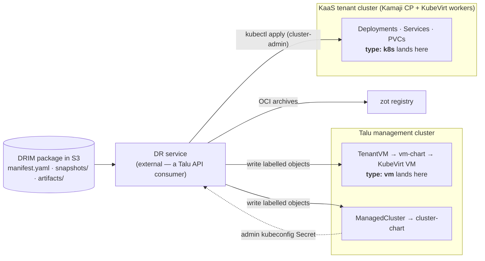
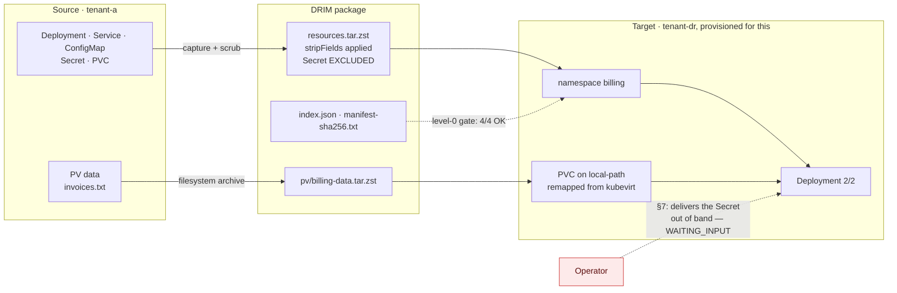
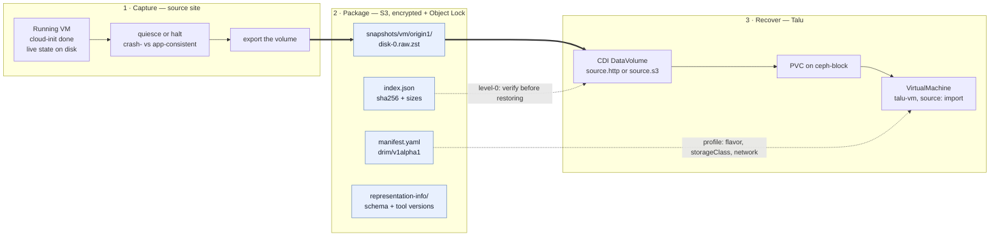
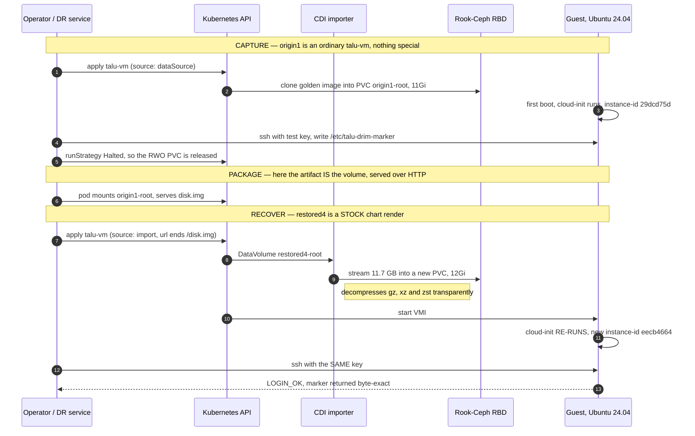
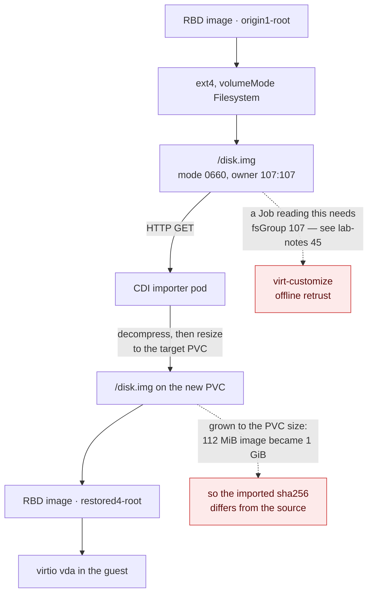

# Talu as a DRIM recovery target — gap analysis

> **Status: ANALYSIS + a validated restore path.** Assessed against **DRIM `drim/v1alpha1`**
> (Disaster Recovery Infosystem Manifest, draft 2026-07-17). The VM restore path (§4.1) is
> **implemented** in `talu-vm` 0.2.0 and **exercised end-to-end on the physical lab** (§10, §11);
> everything else remains analysis. Every Talu claim is anchored to a file in this repo, and
> measured claims say so explicitly.

## 1. The question and the answer

**Question:** can a DRIM package — a self-describing S3 archive of an infosystem (VM disk exports,
Kubernetes resource dumps, PV data, application artifacts) — be **recovered onto Talu**, with Talu
acting as a DRIM *target environment profile* (§10 of the spec)?

**Answer: yes for both halves, and both are now validated on hardware** (§10). Talu already had every
substrate primitive the format needs — KubeVirt + CDI, Ceph RBD, Cilium policy, Velero, an OCI
registry, and real per-tenant Kubernetes. What it lacked was a **restore-shaped surface**: the
consumer API only let a VM boot from the site's golden-image catalog, and "boot this VM from *my*
imported disk" is the entire DRIM VM story. That gap is closed in `talu-vm` 0.2.0 (§4.1). The
Kubernetes half needed **no product change at all** — a KaaS tenant cluster is already a valid
restore target (§10.3).

This document is scoped to Talu as a **recovery target**. Talu as a *package store* is assessed in
§7 (short version: not with Garage as shipped). Talu's own multi-site DR design —
[`disaster-recovery.md`](disaster-recovery.md) — is a different axis and is compared in §8.

## 2. Two landing zones, not one

DRIM component types split across Talu's two tenancy models. This split is the central architectural
finding: **a DRIM manifest mixing `type: vm` and `type: k8s` lands in two different places.**



| DRIM component | Lands in | Why |
|---|---|---|
| `type: k8s` | **KaaS tenant cluster** — ✅ validated §10.3 ([`kaas.md`](kaas.md), [`cluster-chart`](../../components/tenancy/cluster-chart/)) | The tenant is cluster-admin on their own hosted control plane, gets a real StorageClass (kubevirt-csi → infra `ceph-block`), optional in-tenant Velero, and Kamaji publishes `<name>-admin-kubeconfig` — precisely what the DRIM profile's `platform.k8s.kubeconfigRef` needs. |
| `type: k8s` | **NOT the management cluster** | Platform tenancy is `Tenant`/`TenantVM` plus a namespace-scoped Role ([`apiserver/pkg/apis/tenancy/v1alpha1/types.go`](../../apiserver/pkg/apis/tenancy/v1alpha1/types.go)). There is no tenant path to apply arbitrary Deployments/Ingresses. A `type: k8s` component can only land here with **operator** privilege. |
| `type: vm` | **Management cluster** ([`vm-chart`](../../components/tenancy/vm-chart/)) | Right place, wrong shape — §4. |
| `type: external` | Neutral | Pure profile lookup (`contract.endpointRef: profile`); Talu is not involved. |

**Consequence for the profile:** a Talu DRIM profile is not one endpoint. It is `platform.vm` pointing
at the management cluster and `platform.k8s` pointing at a KaaS cluster that may have to be
*provisioned first* — a `ManagedCluster` write, then wait for
`Cluster.status.phase == "Provisioned"`, then restore into it. That ordering belongs in the DR
service, expressed through DRIM `relationships` + `bootOrder`.

## 3. Construct-by-construct mapping

| DRIM construct | Talu primitive | Status |
|---|---|---|
| `restore.method: volume-import` | `vm-chart` **`source: import`** → CDI `DataVolume` with `source.http`/`s3` | ✅ **built** — §4.1 |
| `requirements: {cpu, memoryGiB}` → profile `flavorMapping` | `VirtualMachineClusterInstancetype talu-{small,medium,large}` ([`sizes/instancetypes.yaml`](../../components/tenancy/sizes/instancetypes.yaml)) | **Concept matches, catalog doesn't** — §4.2 |
| Multiple disks per VM (`root` + `data`) | `vm-chart` **`dataDisks[]`**, each imported or blank | ✅ **built** — §4.1 |
| `networks[].addresses.mode` | Masquerade pod binding, one NIC, guest always sees `10.0.2.2/24` ([`networking.md`](networking.md) §VM networking) | Only the `dhcp` equivalent is honourable — §4.4 |
| `guestAgent: qemu-ga` | Baked into the Talu golden images ([`images/centos-bootc/Containerfile`](../../images/centos-bootc/Containerfile)); KubeVirt exposes `AgentConnected` | ✅ for Talu-native guests; an imported disk brings its own |
| Level-1 `vm-running` / `k8s-workload-ready` | `TenantVM.status.phase`, `ManagedCluster.status`, `talu_kaas_*` / `talu:tenant_*` recording rules | ✅ — DRIM validation ≈ Talu's existing *watch `.status`* + *read Prometheus* verbs |
| Level-2 `tcp` checks | blackbox exporter (`probe_success{probe_type=…}`) already deployed | ✅ reusable |
| Level-3 `script` `runOn:` via guest agent | KubeVirt guest-agent exec | ✅ |
| `launchModes.validation.network.isolation: strict` | `Tenant.spec.networkBaseline` (default-deny) + security-group `CiliumNetworkPolicy` | ✅ good fit |
| `launchModes.validation.ttlSeconds` | Kyverno `cleanupController` is deployed ([`kyverno/values.yaml`](../../components/platform/kyverno/values.yaml)) | ✅ available, nothing wired |
| `artifacts/images/*.oci.tar` | zot in-cluster OCI registry ([`infrastructure/zot`](../../components/infrastructure/zot/)) | ✅ natural home |
| `artifacts/source/*.bundle`, `deps/`, `sbom/` | No consumer; nothing to restore *into* | Out of scope for a target — these are rebuild inputs for the tenant |
| §9 Waldur ↔ DR-service protocol | Talu is orchestrator-agnostic; four-verb contract; `talu.io/project-uuid` join key; Talu never calls back ([`../integrations/`](../integrations/)) | ✅ **zero Talu change** — §6 |

## 4. The blockers, ranked

### 4.1 No disk-import path through the API — **resolved**

*Originally the blocker: `TenantVMSpec` and the chart accepted only `source: dataSource |
containerDisk`, both cloning the site's golden-image `DataSource`, with no value meaning "populate
this disk from a URL." The substrate was capable (CDI already imports from a registry; `source.s3`
is the same controller on a different source) — it was an API gap, not a platform gap.*

**Now built** in [`vm-chart`](../../components/tenancy/vm-chart/) (0.2.0):

- **`source: import`** with `restore.root.{url,secretRef,certConfigMap}` renders a `DataVolume` whose
  source is `http:` or `s3:` — a presigned HTTPS URL is preferred, because an `s3://` source needs a
  credentials Secret in the *tenant's* namespace.
- **`dataDisks[]`** adds non-root volumes, imported or blank, each addressable in the guest as
  `/dev/disk/by-id/virtio-<name>`.
- **`restore.retrust`** is the §4.3 mitigation — see there.

Ownership: `restore.*` and the disks' URLs are `x-talu-owner: operator`, joining `source`/`image`/
`dataSource*` as catalog plumbing the site owns. That marker is a **contract, not an enforcement** —
`tenant-chart/values.schema.json` says so, and a consumer that sets an operator field still wins the
Helm merge. The enforcement is the typed API: `TenantVMSpec.DataDisks` carries `{name, size}` only,
so a `TenantVM` cannot express a URL and a consumer of that API cannot escape the golden-image
catalog. `TestDataDisksCannotCarryAnImportURL` guards it.

Two residual caveats, both documented in the chart README: an imported disk is **not**
signature-verified (the cosign policy matches registry sources only), and CDI verifies no checksum —
integrity stays the DR service's job, which is what DRIM level-0 already assigns it.

### 4.2 The instancetype catalog cannot express production sizes

Three sizes ship: `talu-small` (1 vCPU / 2 GiB), `talu-medium` (2/4), `talu-large` (4/8). The DRIM
spec's own worked example (§13) asks for **8 vCPU / 32 GiB** — unsatisfiable. Under DRIM's resolution
rule (profile → manifest default → mandatory ⇒ `WAITING_INPUT`) a faithful recovery of that manifest
**stalls waiting for a human**, which is correct behaviour and a bad experience.

Note this is a deliberate design choice, not an oversight: named sizes exist because raw cores/memory
in the consumer API let KubeVirt default every VM to 1 vCPU. The fix is to widen the catalog (and
have the DR service resolve "smallest size ≥ requirements"), not to reintroduce free-form sizing.

### 4.3 A restored VM cannot be logged into — the non-obvious one

Talu's access plane is **Pomerium Native SSH**: Pomerium is the SSH User CA, there is no public `:22`
and no static password (lab-notes #21). Every guest must trust the site's CA via
`/etc/ssh/talu_ca.pub` + `TrustedUserCAKeys`, delivered by one of `caTrust.package` (apt),
`caTrust.baked` (golden image), or the cloud-init fallback that hand-writes the file.

A DRIM disk imported from a **different** platform carries the wrong CA, or none — and
**cloud-init will not re-run on an already-provisioned disk** (its instance-id is already stamped), so
the chart's trust injection silently does nothing. The failure mode is quiet and expensive:

- the VM boots, `vm-running` passes;
- the guest agent connects, so a level-3 `script` check passes;
- **every human SSH attempt is rejected by the guest's `sshd`**, and the DR report is green.

**The premise was half wrong — measured on rocky-phys by a full round trip** (§10.2). Cloud-init
*does* re-run on a restored, already-provisioned guest: KubeVirt derives the NoCloud seed's
`instance-id` from the **new VM's firmware UUID**, so the restored guest sees an instance it has
never seen before, runs `modules:config` + `modules:final`, and applies the chart's cloud-init —
including the CA trust. The guest keeps *both* instance directories under `/var/lib/cloud/instances`,
which is the fingerprint of exactly that.

So for the common case — a guest that has cloud-init installed with **NoCloud in its
`datasource_list`** — the chart's normal trust injection reaches an imported disk unaided, and
`restore.retrust` is **not** needed.

**Where it is still needed:** a guest with no cloud-init at all, or whose `datasource_list` excludes
NoCloud (an OpenStack-only image is the obvious case) — cloud-init never reads the seed, and nothing
writes the CA. That is the residual case `restore.retrust` exists for.

The mechanism, when you do need it: KubeVirt exposes no generic guest-exec, so it is **offline** —
`restore.retrust.enabled: true` holds the VM at `runStrategy: Halted` and runs a Job that waits for
the import, then `virt-customize`s the disk to write `/etc/ssh/talu_ca.pub` + `TrustedUserCAKeys`.
Deliberately two-step: the Job does not start the VM, because Flux would reconcile `runStrategy`
straight back and fight it; Git stays the source of truth for whether a VM runs. Validated on
rocky-phys after fixing two undocumented mechanics that both fail with misleading errors — CDI writes
`disk.img` `107:107` while the image runs as uid 1001 (needs `fsGroup`), and the image leaves
`LIBGUESTFS_PATH` unset so the appliance it ships is unreachable (lab-notes #45). A pod gets no
`/dev/kvm`, so `forceTcg` is required even on KVM-capable hosts.

`restore.acknowledgeGuestTrust` stays mandatory regardless: the operator should decide which of the
two cases they are in, because getting it wrong is silent.

This generalises beyond Talu and is worth feeding back into the spec: **DRIM v1 has no notion of
"post-restore adaptation to the target's access plane."** Any target with a host-side trust anchor
(SSH CA, agent enrolment, a monitoring agent's endpoint) hits this.

### 4.4 Network modes: only one of three is honourable

DRIM offers `static-remap | dhcp | preserve`. Talu's tier-1 VM binding is masquerade over the pod
network: the guest always sees the same private `10.0.2.2/24`, the routable address is the
virt-launcher pod IP, and the *stable* address is a `LoadBalancer` Service IP from a per-tenant
`CiliumLoadBalancerIPPool`. So:

- `dhcp` → fine, and effectively what the guest gets regardless.
- `static-remap` → expressible only as "a stable Service LB IP," not as an address inside the guest.
- `preserve` → not possible; **no MAC preservation either**.

A tier-2 Multus/bridge binding would give a real L2 NIC with its own MAC, but it is documented as
not-on-the-lab and is not rendered by the chart.

**Related spec gap.** [`disaster-recovery.md`](disaster-recovery.md) §3.2 records the hard-won lesson
that **MAC address, `bootOrder`, and firmware UUID/serial "do not travel automatically; a raw disk
mirror without them boots a wrong-NIC / wrong-boot-disk guest"** (war-story #8). DRIM `v1alpha1`
declares none of the three. That is the same class of problem as the spec's own §11.6
`licenseRebindRequired` flag, and arguably belongs in the VM component's `restore` block.

### 4.5 Compression format — **resolved: zstd works**

*The first pass of this analysis assumed CDI could not decompress zstd and recommended standardising
packages on `.xz`. That was wrong.* Measured on rocky-phys: the same cirros disk imported three ways
(`.raw`, `.raw.gz`, `.raw.zst` over `source.http`) all reached `Succeeded` and produced
**byte-identical** `disk.img` (identical SHA-256). DRIM's native `disk-0.raw.zst` needs no
repackaging.

Worth keeping the method in mind: `Succeeded` alone proves nothing, because writing the compressed
bytes verbatim would also "succeed". The evidence is the hash comparison across formats, not the
phase. (lab-notes #46.)

### 4.6 No machine identity for a DR service

Every access path in Talu authenticates **humans** through Pomerium + OIDC — that is the design, and
Pomerium being sole ingress is load-bearing. A DR service writing `TenantVM`/`ManagedCluster` objects
needs a scoped ServiceAccount and a non-interactive route to the management API. Open design
question, not a hard blocker; the KaaS side is already solved (Kamaji hands out a client-cert admin
kubeconfig per tenant cluster).

## 5. What already exists that DRIM can reuse

[`components/platform/backup/restore-test.yaml`](../../components/platform/backup/restore-test.yaml)
is DRIM §8.2 (*automated backup verification while the system is live*) and
`backupPolicy.validateEvery` in miniature, already running weekly on the lab: it seeds a canary
namespace, backs it up, **restores into a fresh scratch namespace via `namespaceMapping`**, and then
asserts the sentinel data actually came back — because "a Completed restore that restored nothing
would still be a lie." It cleans up unconditionally, and it feeds `TaluRestoreTestStale` /
`TaluRestoreTestFailed`.

That is the exact skeleton of a DRIM validation-mode runner: clone into an isolated scratch
namespace, run checks, guaranteed cleanup, alert on staleness. Extend rather than rebuild.

Also directly reusable: the blackbox exporter for level-2 checks, `Tenant.spec.networkBaseline` for
`isolation: strict`, Kyverno's cleanup controller for `ttlSeconds`, and zot for `artifacts/images/`.

## 6. The Waldur protocol needs nothing from Talu

DRIM §9 puts an external DR service between Waldur and the infrastructure: it fetches commands over
Waldur REST, POSTs events back, and holds all process detail on its own side (§9.5's information
boundary). Talu's integration contract is the mirror image of that — **four verbs** (write labelled
objects · watch `.status` · read Prometheus · delegate identity), `talu.io/project-uuid` as the join
key, and **Talu never calls back to the consumer**. The DR service is simply another consumer.

Two alignments worth noting:

1. DRIM level-1/2 checks map onto Talu's *watch* and *read* verbs rather than onto raw KubeVirt
   poking — `TenantVM.status.phase`, `ManagedCluster.status`, `talu_kaas_workers_ready`,
   `probe_success`. A DR service written against Talu's contract stays on the supported surface.
2. §9.5 forbids DR internals reaching Waldur. Talu makes that easy by construction: it emits status,
   not process.

## 7. Talu is not a conformant DRIM *package store*

Distinct from the target question, and worth stating so it isn't assumed:
[`components/platform/backup/README.md`](../../components/platform/backup/README.md) is explicit that
**Garage implements no S3 Object Lock** — backups are not WORM-immutable, anyone with the credentials
can delete them. There is no SSE-KMS either. That fails DRIM §4 invariants **3** (encryption at rest
mandatory) and **4** (retention/immutability via Object Lock).

So: Talu **consuming** packages from an external, locked, encrypted S3 is fine and is the intended
shape. Talu **holding** DRIM packages needs a different target.

Talu did arrive independently at the spec's §4 instinct, though — the `garage-data` PVC deliberately
avoids the Ceph class, and the README warns *"a backup target must not depend on the storage it
protects… in production, run Garage outside the cluster it backs up."* That is DRIM §4's
cross-region/LOCKSS reasoning in miniature.

## 8. DRIM vs. Talu's own DR design — different axes

| | [`disaster-recovery.md`](disaster-recovery.md) | DRIM |
|---|---|---|
| Shape | Site-pair **RBD snapshot mirroring**, pre-staged Halted standby VM | Portable, self-describing **S3 archive** |
| RPO | Minutes (mirror interval) | Hours (backup schedule) |
| Target | A **specific** peer site, GitOps-identical | **Any** environment, original infra assumed destroyed |
| Failover | Cold boot of an already-defined VM + front-door cutover | Full reconstruct from bits |
| Optimises | RTO/RPO | Portability + longevity (OAIS/BagIt self-description) |

They are complementary, not competing, and should not be merged. Two findings cross over:

- **MAC / `bootOrder` / firmware UUID must travel with the disk** (§4.4) — learned there, missing in
  DRIM v1.
- **Multi-disk crash consistency is unsolved upstream** (that doc's §3.1 constraint 2) — which is
  exactly DRIM open question §14.1 (`consistency: crash | quiesced`). Talu already has a working
  answer on the Velero path: `kubevirt-velero-plugin` performs **guest-agent freeze/thaw** for
  application-consistent snapshots ([`../operations/backup-restore.md`](../operations/backup-restore.md)).
  DRIM could adopt that per-VM rather than leaving it open.

## 9. What would have to be built

Ordered by dependency, not by size:

1. ~~**`source: import` in `vm-chart`**~~ — **done** (0.2.0): `restore.*` + `dataDisks[]`, with
   `TenantVMSpec.DataDisks` plumbed as `{name,size}` only. *(§4.1)*
2. **Post-import guest re-trust** — **built, unvalidated**: `restore.retrust` renders the offline
   `virt-customize` Job. Needs a hardware run, and the cheaper cloud-init hypothesis tested first.
   *(§4.3)*
3. **Widen the instancetype catalog** + a "smallest size ≥ requirements" resolver in the DRIM
   profile's `flavorMapping`. *(§4.2)*
4. **A validation-mode scratch tenant** — ephemeral `Tenant` with `networkBaseline: true`, a Kyverno
   `CleanupPolicy` honouring `ttlSeconds`, modelled on `restore-test.yaml`. *(§5)*
5. **A machine identity** for the DR service — scoped ServiceAccount + RBAC, and a non-OIDC path to
   the management API. *(§4.6)*
6. **Settle the compression format** with a real CDI import test. *(§4.5)*

Items 1–2 were the minimum viable "Talu is a DRIM target"; 1 is done and 2 awaits a lab run. Items
3–6 are what makes it unattended.

## 10. Validated on rocky-phys (2026-08-11)

The restore path was exercised end to end on the physical lab — real KVM, Rook-Ceph RBD, CDI
v1.65.0, KubeVirt v1.8.4. Source images were served from the gateway on the pod overlay
(`172.18.0.1`), since pods have no direct egress.

| What | Result |
|---|---|
| `source: import` → `DataVolume` (`http`) → PVC on `ceph-block` | ✅ `Succeeded` in ~41 s |
| Guest boots the imported disk | ✅ cirros 0.6.3 to login prompt in 17 s; Ubuntu 24.04 with sshd up |
| `dataDisks[]` blank volume | ✅ provisioned, attached as a third virtio disk |
| Disk `serial` reaches the hypervisor | ✅ `<serial>data</serial>` on `vdc` in the libvirt domain XML |
| `.raw` / `.raw.gz` / `.raw.zst` | ✅ all three byte-identical (§4.5) |
| `restore.retrust` Job | ✅ `Complete` in 117 s on Ubuntu, after two fixes (lab-notes #45) |
| CA actually inside the disk | ✅ `virt-cat` returned the site's real Pomerium User CA, byte-exact, plus `TrustedUserCAKeys` |
| The Halted hold | ✅ VM stayed `Stopped` for the Job's whole life; flipping `enabled: false` booted it |

### 10.2 The full round trip — back up a real Talu VM, restore it, log in

The table above imports *foreign* images. The stronger test takes a **real, running, provisioned Talu
VM** through the whole cycle, which is what a DR package actually contains:

1. `origin1` — an ordinary chart-rendered VM on the site's `ubuntu` golden image (`source:
   dataSource`), booted so cloud-init genuinely ran. A test SSH public key was added to the rendered
   cloud-init so the round trip could be checked without the interactive OIDC flow.
2. **Logged in** (`LOGIN_OK`), wrote a runtime marker `/etc/talu-drim-marker` carrying a random stamp
   — something no cloud-init would ever recreate — and confirmed `/var/lib/cloud/instances/<id>`
   existed, i.e. the guest was provisioned.
3. Halted it and served its PVC's `disk.img` over HTTP: the DR artifact.
4. `restored4` — a **stock** chart render (no cloud-init edit), `source: import` from that artifact.
5. Logged in **with the same key**, and inspected the guest.

| Question | Answer |
|---|---|
| Does the same key still work after restore? | ✅ `LOGIN_OK as ubuntu@restored4` |
| Did runtime state survive? | ✅ marker returned **byte-exact** (`DRIM-ROUNDTRIP-…-9105`) |
| Did cloud-init re-run on the provisioned disk? | ✅ yes — new `instance-id`, and **both** instance dirs present |
| Did the re-run clobber `authorized_keys`? | ✅ no — the key survived, though `restored4`'s cloud-init declares none |
| Is the SSH CA trust there? | ✅ `/etc/ssh/talu_ca.pub` present |

This closes both gaps left by the first pass: the SSH handshake is proven (with a key rather than an
OIDC-issued certificate — the certificate path is separately proven on this lab), and §4.3's
cloud-init question is answered.

**Still not proven:** an `ssh <principal>@<vm>@ssh.<domain> -p 2222` login *through Pomerium*, which
needs the interactive OIDC flow and the provider's `:2222` forward. Note the login above had to run
from a pod in the `pomerium` namespace — the chart's `<vm>-ssh-pin` policy drops `:22` from anywhere
else, which is itself a live confirmation that the pin works.

**Not the no-KVM VM lab.** Storage there is CephFS-only because the nested node's `/dev` isolation
breaks rbd-nbd (lab-notes #14/#15), so a `volume-import` into an RBD-backed PVC has nowhere to land.
The chart change unit-tests with `make kbuild` + `helm template` anywhere; the round trip does not.

### 10.3 The `type: k8s` half — capture from one tenant cluster, restore into another

§10.1–10.2 validate `type: vm`. This validates the other landing zone from §2: a Kubernetes
component captured out of one KaaS tenant cluster and restored into a **different, freshly
provisioned** one. Scripts and the manifest it produced: [`examples/drim-k8s/`](../../examples/drim-k8s/).



| Check | Result |
|---|---|
| Level-0 package integrity | ✅ 4/4 artifacts matched `index.json` |
| Resources restored | ✅ Deployment, Service, ConfigMap, PVC |
| **StorageClass remap** `kubevirt` → `local-path` | ✅ via `profiles[].platform.k8s.storageClass`; PVC **Bound** on the target's own provisioner |
| PV data | ✅ **`md5 22795d2cf6e4f3b47bb96bef5ab0fb89`, identical to source** |
| Level-1 `k8s-workload-ready` | ✅ `readyReplicas=2` |
| Application check | ✅ the Service served the restored file |
| §7 secrets | ✅ the source secret value appears **nowhere** in the package; the workload waited for the operator to supply it |

**Two capture bugs the run found**, both of which produce silent failures and neither of which
DRIM's `stripFields` example covers — now [`examples/drim-k8s/`](../../examples/drim-k8s/) and
lab-notes #49:

- **`spec.volumeName` is not enough for a PVC.** The binding annotations
  (`pv.kubernetes.io/bind-completed`, `bound-by-controller`,
  `volume.kubernetes.io/storage-provisioner` + its `beta` alias, `selected-node`) survive capture,
  and the restored claim goes straight to **`Lost`** — pods `Pending`, nothing saying why. This bit
  the first restore attempt exactly as described.
- **A naive include-list captures `kube-root-ca.crt`**, which carries the *source* cluster's CA
  bundle into the target.

**And one platform bug, unrelated to DRIM but blocking:** provisioning the target cluster failed
because the **Kamaji operator was OOMKilled** at the chart's default 100Mi limit. Existing tenant
clusters were unaffected, so nothing looked broken — but new `TenantControlPlane`s never got a
Deployment, with no events and no operator error, because it died before logging. Raising the limit
made the stuck cluster go `Ready` in ~20 s. Fixed in `phys_kamaji`; lab-notes #48.

**Caveat on scope:** the target cluster used `local-path` rather than kubevirt-csi, which is what
made the StorageClass remap a real test — but it means kubevirt-csi-to-kubevirt-csi restore is still
unexercised. And `resourceCapture` covered the five common kinds, not Ingress/NetworkPolicy/RBAC.

## 11. Anatomy: backup → storage → recovery, and the same system as DRIM

The round trip in §10.2 was run with an HTTP artifact server standing in for S3. This section shows
the shape it would have as a real DRIM package, so the mapping between the format and the machinery
is concrete. **Measured values are marked; everything else is illustrative.**

### 11.1 The three phases



The DR service owns the dotted arrows. Talu owns the solid path — and everything Talu owns is now
exercised on hardware.

### 11.2 What actually ran on rocky-phys



Steps 4 and 12 are the ones that matter: the same key, and the same bytes.

### 11.3 Where the bytes actually live

A restored disk crosses four representations. Two of the crossings are where this bit me.



Two consequences worth stating out loud, because both look like bugs when you first meet them:

- **The imported `disk.img` will not hash-match the artifact.** CDI expands the image to fill the
  target volume, so a 112 MiB source produced a 1 GiB file. Integrity has to be checked on the
  **artifact** (DRIM level-0, against `index.json`), never on the landed volume.
- **Ownership is `107:107`,** which is why anything reading the volume out-of-band needs `fsGroup`.

### 11.4 The tested system, expressed as DRIM

```yaml
apiVersion: drim/v1alpha1
kind: Infosystem
metadata:
  name: drim-roundtrip
  id: "d21b0000-0000-4000-8000-0000000000a1"     # MEASURED: origin1's talu.io/project-uuid
  owner: "org:talu/project:drim-test"
  labels: { criticality: tier-3, rpo: "24h", rto: "1h" }
spec:
  components:
    - name: origin1
      type: vm
      requirements: { cpu: 2, memoryGiB: 4, architecture: x86_64 }   # MEASURED: = talu-medium
      disks:
        - { name: root, role: system, sizeGiB: 11 }                  # MEASURED
      networks:
        # Talu's tier-1 binding is masquerade over the pod network, so `dhcp` is the only
        # honourable mode — static-remap maps to a LoadBalancer Service IP, preserve cannot
        # be expressed at all, and no MAC survives. See §4.4.
        - { name: default, addresses: { mode: dhcp } }
      source:                       # informational; the spec illustrates OpenStack, this is Talu
        platform: talu
        region: rocky-phys
        namespace: drim-test
        vmName: origin1
        volumes:
          - { claim: origin1-root, storageClass: ceph-block, bootable: true }
      restore:
        method: volume-import       # MEASURED: renders `source: import` in talu-vm 0.2.0
        bootOrder: 10
        guestAgent: qemu-ga

  validation:
    levels:
      - name: package
        checks: [{ type: checksum }, { type: manifest-schema }]
      - name: infrastructure
        checks:
          - { type: vm-running, target: origin1 }
          - { type: guest-agent, target: origin1, timeoutSeconds: 300 }
      - name: application
        checks:
          # This is literally the assertion the round trip made by hand: runtime state,
          # written on the original, must come back from the restored guest.
          - type: script
            runOn: origin1
            script: 'test "$(cat /etc/talu-drim-marker)" = "DRIM-ROUNDTRIP-1786464585-9105"'
            timeoutSeconds: 60
    policy: { failFast: false, report: summary }

  launchModes:
    validation:
      network: { isolation: strict, addressing: ephemeral }   # Tenant.networkBaseline = default-deny
      ttlSeconds: 7200                                        # needs a Kyverno CleanupPolicy — §9 item 4
    recovery:
      network: { isolation: none, addressing: from-profile }
      scale: as-declared
      dnsCutover: { manual: true }

  profiles:
    - name: talu-rocky-phys
      platform:
        vm:
          provider: talu
          region: rocky-phys
          flavorMapping:
            # The whole catalog is small-1/2, medium-2/4, large-4/8 — anything larger is
            # unsatisfiable and stalls at WAITING_INPUT. See §4.2.
            - { match: { cpu: 2, memoryGiB: 4 }, flavor: talu-medium }
          storage:
            system: { volumeType: ceph-block }
        k8s:
          kubeconfigRef: kamaji          # a KaaS tenant cluster publishes its own admin kubeconfig
          storageClass: ceph-block
      networks:
        default: { subnet: "10.244.0.0/16" }

  backupPolicy:
    schedule: "0 3 * * *"
    retention: { daily: 14, weekly: 8 }
    validateEvery: 7d
    encryption: { mode: sse-kms, keyRef: "kms://dr-packages" }
    immutability: { objectLockDays: 14 }    # NOT satisfiable by Talu's own Garage — §7
```

### 11.5 The package, with the numbers this run produced

```
s3://dr-packages/d21b0000-…-0000000000a1/2026-08-11T16-09Z/
├── index.json
├── manifest.yaml                       # §11.4
├── snapshots/vm/origin1/
│   ├── disk-0.raw.zst                  # MEASURED source: 11 768 168 448 B raw
│   └── disk-0.meta.json                # driver: rook-ceph.rbd.csi.ceph.com, class: ceph-block
├── representation-info/
│   └── tool-versions.json              # MEASURED: CDI v1.65.0, KubeVirt v1.8.4, k8s v1.35.7
└── logs/backup.log.zst
```

`index.json` is what level-0 verifies. Digests below are **illustrative** — the run served the volume
over HTTP and did not produce a package — but the *sizes* are measured:

```json
{
  "packageFormatVersion": "1.0.0",
  "revision": "2026-08-11T16-09Z",
  "artifacts": {
    "snapshots/vm/origin1/disk-0.raw.zst": { "sizeBytes": 11768168448, "sha256": "…" },
    "manifest.yaml": { "sizeBytes": 2411, "sha256": "…" }
  }
}
```

**Compression is a free choice** — measured separately on the same lab, importing one cirros disk
three ways through `source.http`:

| Artifact | Size on the wire | Import | Landed `disk.img` sha256 |
|---|---|---|---|
| `cirros.raw` | 117 440 512 | Succeeded | `4a6c1d1c…e5d48a` |
| `cirros.raw.gz` | 21 202 602 | Succeeded | `4a6c1d1c…e5d48a` |
| `cirros.raw.zst` | 21 186 318 | Succeeded | `4a6c1d1c…e5d48a` |

Identical results from all three, so DRIM's native `.zst` needs no repackaging (§4.5). Note the
landed hash is *not* the source hash (`809dc3e0…`) — that is §11.3's resize, not corruption.

## 12. Open questions

1. **Does a DRIM `type: k8s` recovery always provision a fresh KaaS cluster**, or may it restore into
   an existing one? Fresh is cleaner and matches "original infrastructure destroyed," but costs a
   full CAPI provision inside the RTO budget.
2. **Which side owns adaptation to the target's access plane** (§4.3) — a DRIM `postRestore` hook in
   the spec, or a Talu-side admission/mutation step invisible to the format?
3. **Should Talu publish a DRIM profile as a first-class artifact** (a `profiles:` entry a site can
   hand to a DR service), and if so, does it live in `environments/<site>/`?
4. **Multi-disk VMs**: adopt the single-root-disk constraint from
   [`disaster-recovery.md`](disaster-recovery.md) §3.1, or support `dataDisks` and accept
   crash-consistency caveats per DRIM §14.1?
