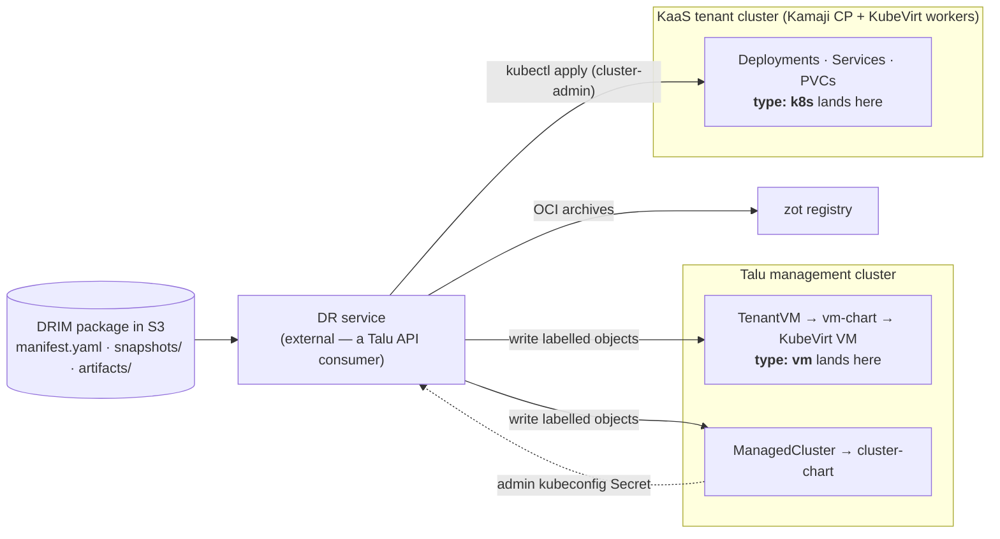
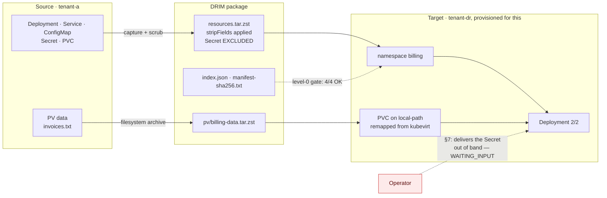
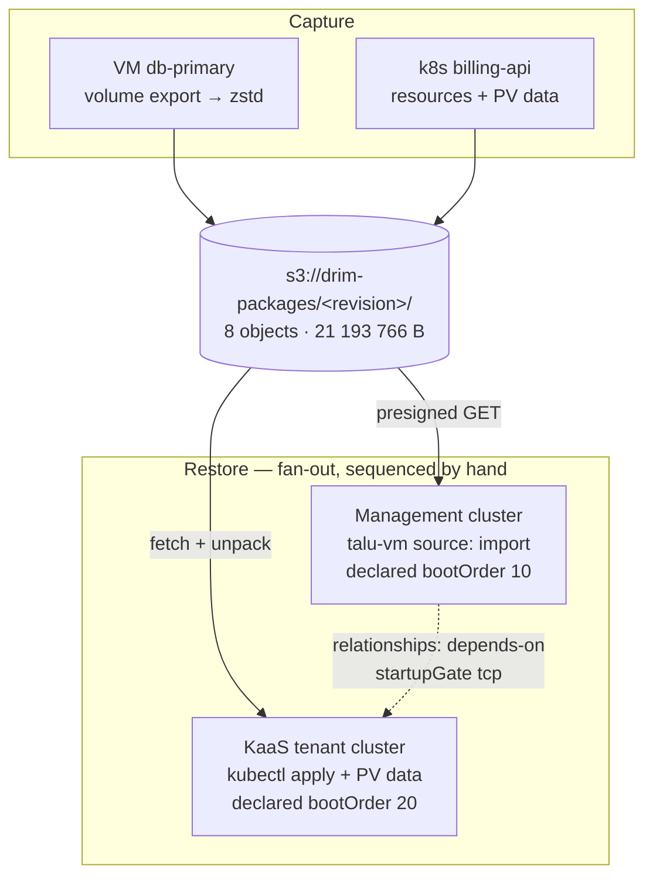
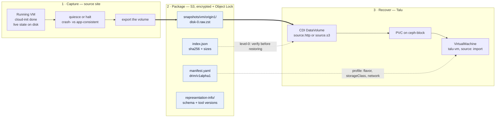
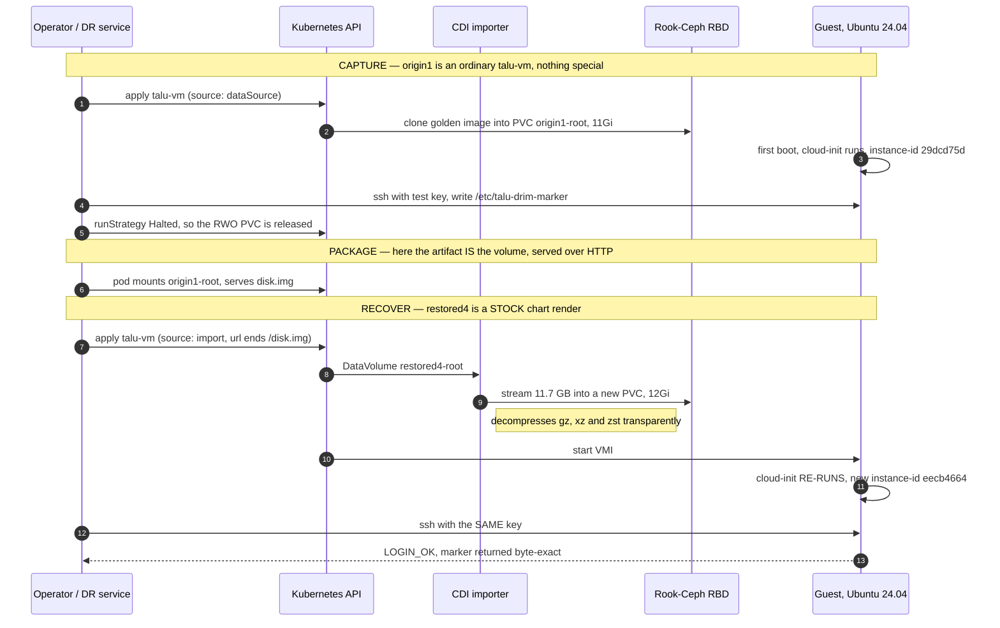
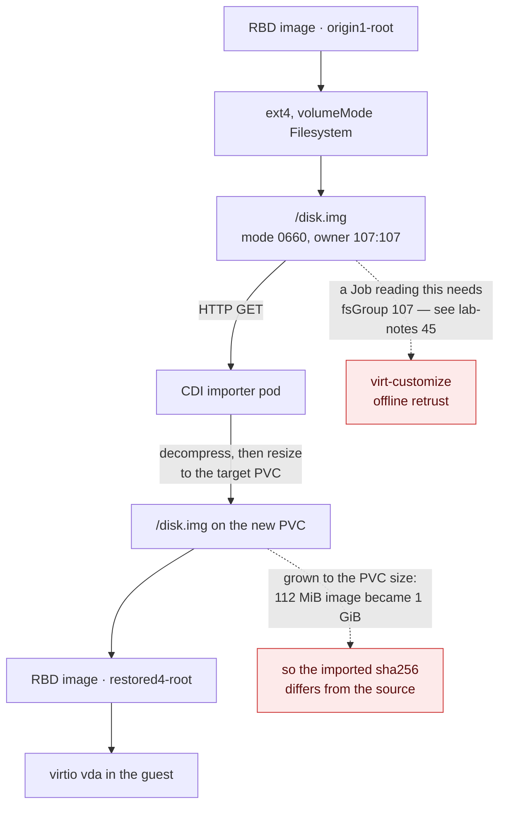

# Talu as a DRIM recovery target — gap analysis

> **Status: ANALYSIS + a validated restore path.** Assessed against **DRIM `drim/v1alpha1`**
> (Disaster Recovery Infosystem Manifest, draft 2026-07-17). The VM restore path (§4.1) is
> **implemented** in `talu-vm` 0.2.0 and **exercised end-to-end on the physical lab** (§10, §11);
> everything else remains analysis. Every Talu claim is anchored to a file in this repo, and
> measured claims say so explicitly.

## 1. The question and the answer

**Question:** can a DRIM package — a self-describing S3 archive of an infosystem (VM disk exports,
Kubernetes resource dumps, PV data, application artifacts) — be **recovered onto Talu**, with Talu
acting as a DRIM *target environment profile* (§10 of the spec)?

**Answer: yes for both halves, and both are now validated on hardware** (§10). Talu already had every
substrate primitive the format needs — KubeVirt + CDI, Ceph RBD, Cilium policy, Velero, an OCI
registry, and real per-tenant Kubernetes. What it lacked was a **restore-shaped surface**: the
consumer API only let a VM boot from the site's golden-image catalog, and "boot this VM from *my*
imported disk" is the entire DRIM VM story. That gap is closed in `talu-vm` 0.2.0 (§4.1). The
Kubernetes half needed **no product change at all** — a KaaS tenant cluster is already a valid
restore target (§10.3).

This document is scoped to Talu as a **recovery target**. Talu as a *package store* is assessed in
§7 (short version: not with Garage as shipped). Talu's own multi-site DR design —
[`disaster-recovery.md`](disaster-recovery.md) — is a different axis and is compared in §8.

## 2. Two landing zones, not one

DRIM component types split across Talu's two tenancy models. This split is the central architectural
finding: **a DRIM manifest mixing `type: vm` and `type: k8s` lands in two different places.**



| DRIM component | Lands in | Why |
|---|---|---|
| `type: k8s` | **KaaS tenant cluster** — ✅ validated §10.3 ([`kaas.md`](kaas.md), [`cluster-chart`](../../components/tenancy/cluster-chart/)) | The tenant is cluster-admin on their own hosted control plane, gets a real StorageClass (kubevirt-csi → infra `ceph-block`), optional in-tenant Velero, and Kamaji publishes `<name>-admin-kubeconfig` — precisely what the DRIM profile's `platform.k8s.kubeconfigRef` needs. |
| `type: k8s` | **NOT the management cluster** | Platform tenancy is `Tenant`/`TenantVM` plus a namespace-scoped Role ([`apiserver/pkg/apis/tenancy/v1alpha1/types.go`](../../apiserver/pkg/apis/tenancy/v1alpha1/types.go)). There is no tenant path to apply arbitrary Deployments/Ingresses. A `type: k8s` component can only land here with **operator** privilege. |
| `type: vm` | **Management cluster** ([`vm-chart`](../../components/tenancy/vm-chart/)) | Right place, wrong shape — §4. |
| `type: external` | Neutral | Pure profile lookup (`contract.endpointRef: profile`); Talu is not involved. |

**Consequence for the profile:** a Talu DRIM profile is not one endpoint. It is `platform.vm` pointing
at the management cluster and `platform.k8s` pointing at a KaaS cluster that may have to be
*provisioned first* — a `ManagedCluster` write, then wait for
`Cluster.status.phase == "Provisioned"`, then restore into it. That ordering belongs in the DR
service, expressed through DRIM `relationships` + `bootOrder`.

## 3. Construct-by-construct mapping

| DRIM construct | Talu primitive | Status |
|---|---|---|
| `restore.method: volume-import` | `vm-chart` **`source: import`** → CDI `DataVolume` with `source.http`/`s3` | ✅ **built** — §4.1 |
| `requirements: {cpu, memoryGiB}` → profile `flavorMapping` | `VirtualMachineClusterInstancetype talu-{small,medium,large}` ([`sizes/instancetypes.yaml`](../../components/tenancy/sizes/instancetypes.yaml)) | **Concept matches, catalog doesn't** — §4.2 |
| Multiple disks per VM (`root` + `data`) | `vm-chart` **`dataDisks[]`**, each imported or blank | ✅ **built** — §4.1 |
| `networks[].addresses.mode` | Masquerade pod binding, one NIC, guest always sees `10.0.2.2/24` ([`networking.md`](networking.md) §VM networking) | Only the `dhcp` equivalent is honourable — §4.4 |
| `guestAgent: qemu-ga` | Baked into the Talu golden images ([`images/centos-bootc/Containerfile`](../../images/centos-bootc/Containerfile)); KubeVirt exposes `AgentConnected` | ✅ for Talu-native guests; an imported disk brings its own |
| Level-1 `vm-running` / `k8s-workload-ready` | `TenantVM.status.phase`, `ManagedCluster.status`, `talu_kaas_*` / `talu:tenant_*` recording rules | ✅ — DRIM validation ≈ Talu's existing *watch `.status`* + *read Prometheus* verbs |
| Level-2 `tcp` checks | blackbox exporter (`probe_success{probe_type=…}`) already deployed | ✅ reusable |
| Level-3 `script` `runOn:` via guest agent | KubeVirt guest-agent exec | ✅ |
| `launchModes.validation.network.isolation: strict` | `Tenant.spec.networkBaseline` (default-deny) + security-group `CiliumNetworkPolicy` | ✅ good fit |
| `launchModes.validation.ttlSeconds` | Kyverno `cleanupController` is deployed ([`kyverno/values.yaml`](../../components/platform/kyverno/values.yaml)) | ✅ available, nothing wired |
| `artifacts/images/*.oci.tar` | zot in-cluster OCI registry ([`infrastructure/zot`](../../components/infrastructure/zot/)) | ✅ natural home |
| `artifacts/source/*.bundle`, `deps/`, `sbom/` | No consumer; nothing to restore *into* | Out of scope for a target — these are rebuild inputs for the tenant |
| §9 Waldur ↔ DR-service protocol | Talu is orchestrator-agnostic; four-verb contract; `talu.io/project-uuid` join key; Talu never calls back ([`../integrations/`](../integrations/)) | ✅ **zero Talu change** — §6 |

## 4. The blockers, ranked

### 4.1 No disk-import path through the API — **resolved**

*Originally the blocker: `TenantVMSpec` and the chart accepted only `source: dataSource |
containerDisk`, both cloning the site's golden-image `DataSource`, with no value meaning "populate
this disk from a URL." The substrate was capable (CDI already imports from a registry; `source.s3`
is the same controller on a different source) — it was an API gap, not a platform gap.*

**Now built** in [`vm-chart`](../../components/tenancy/vm-chart/) (0.2.0):

- **`source: import`** with `restore.root.{url,secretRef,certConfigMap}` renders a `DataVolume` whose
  source is `http:` or `s3:` — a presigned HTTPS URL is preferred, because an `s3://` source needs a
  credentials Secret in the *tenant's* namespace.
- **`dataDisks[]`** adds non-root volumes, imported or blank, each addressable in the guest as
  `/dev/disk/by-id/virtio-<name>`.
- **`restore.retrust`** is the §4.3 mitigation — see there.

Ownership: `restore.*` and the disks' URLs are `x-talu-owner: operator`, joining `source`/`image`/
`dataSource*` as catalog plumbing the site owns. That marker is a **contract, not an enforcement** —
`tenant-chart/values.schema.json` says so, and a consumer that sets an operator field still wins the
Helm merge. The enforcement is the typed API: `TenantVMSpec.DataDisks` carries `{name, size}` only,
so a `TenantVM` cannot express a URL and a consumer of that API cannot escape the golden-image
catalog. `TestDataDisksCannotCarryAnImportURL` guards it.

Two residual caveats, both documented in the chart README: an imported disk is **not**
signature-verified (the cosign policy matches registry sources only), and CDI verifies no checksum —
integrity stays the DR service's job, which is what DRIM level-0 already assigns it.

### 4.2 The instancetype catalog cannot express production sizes

Three sizes ship: `talu-small` (1 vCPU / 2 GiB), `talu-medium` (2/4), `talu-large` (4/8). The DRIM
spec's own worked example (§13) asks for **8 vCPU / 32 GiB** — unsatisfiable. Under DRIM's resolution
rule (profile → manifest default → mandatory ⇒ `WAITING_INPUT`) a faithful recovery of that manifest
**stalls waiting for a human**, which is correct behaviour and a bad experience.

Note this is a deliberate design choice, not an oversight: named sizes exist because raw cores/memory
in the consumer API let KubeVirt default every VM to 1 vCPU. The fix is to widen the catalog (and
have the DR service resolve "smallest size ≥ requirements"), not to reintroduce free-form sizing.

### 4.3 A restored VM cannot be logged into — the non-obvious one

Talu's access plane is **Pomerium Native SSH**: Pomerium is the SSH User CA, there is no public `:22`
and no static password (lab-notes #21). Every guest must trust the site's CA via
`/etc/ssh/talu_ca.pub` + `TrustedUserCAKeys`, delivered by one of `caTrust.package` (apt),
`caTrust.baked` (golden image), or the cloud-init fallback that hand-writes the file.

A DRIM disk imported from a **different** platform carries the wrong CA, or none — and
**cloud-init will not re-run on an already-provisioned disk** (its instance-id is already stamped), so
the chart's trust injection silently does nothing. The failure mode is quiet and expensive:

- the VM boots, `vm-running` passes;
- the guest agent connects, so a level-3 `script` check passes;
- **every human SSH attempt is rejected by the guest's `sshd`**, and the DR report is green.

**The premise was half wrong — measured on rocky-phys by a full round trip** (§10.2). Cloud-init
*does* re-run on a restored, already-provisioned guest: KubeVirt derives the NoCloud seed's
`instance-id` from the **new VM's firmware UUID**, so the restored guest sees an instance it has
never seen before, runs `modules:config` + `modules:final`, and applies the chart's cloud-init —
including the CA trust. The guest keeps *both* instance directories under `/var/lib/cloud/instances`,
which is the fingerprint of exactly that.

So for the common case — a guest that has cloud-init installed with **NoCloud in its
`datasource_list`** — the chart's normal trust injection reaches an imported disk unaided, and
`restore.retrust` is **not** needed.

**Where it is still needed:** a guest with no cloud-init at all, or whose `datasource_list` excludes
NoCloud (an OpenStack-only image is the obvious case) — cloud-init never reads the seed, and nothing
writes the CA. That is the residual case `restore.retrust` exists for.

The mechanism, when you do need it: KubeVirt exposes no generic guest-exec, so it is **offline** —
`restore.retrust.enabled: true` holds the VM at `runStrategy: Halted` and runs a Job that waits for
the import, then `virt-customize`s the disk to write `/etc/ssh/talu_ca.pub` + `TrustedUserCAKeys`.
Deliberately two-step: the Job does not start the VM, because Flux would reconcile `runStrategy`
straight back and fight it; Git stays the source of truth for whether a VM runs. Validated on
rocky-phys after fixing two undocumented mechanics that both fail with misleading errors — CDI writes
`disk.img` `107:107` while the image runs as uid 1001 (needs `fsGroup`), and the image leaves
`LIBGUESTFS_PATH` unset so the appliance it ships is unreachable (lab-notes #45). A pod gets no
`/dev/kvm`, so `forceTcg` is required even on KVM-capable hosts.

`restore.acknowledgeGuestTrust` stays mandatory regardless: the operator should decide which of the
two cases they are in, because getting it wrong is silent.

This generalises beyond Talu and is worth feeding back into the spec: **DRIM v1 has no notion of
"post-restore adaptation to the target's access plane."** Any target with a host-side trust anchor
(SSH CA, agent enrolment, a monitoring agent's endpoint) hits this.

### 4.4 Network modes: only one of three is honourable

DRIM offers `static-remap | dhcp | preserve`. Talu's tier-1 VM binding is masquerade over the pod
network: the guest always sees the same private `10.0.2.2/24`, the routable address is the
virt-launcher pod IP, and the *stable* address is a `LoadBalancer` Service IP from a per-tenant
`CiliumLoadBalancerIPPool`. So:

- `dhcp` → fine, and effectively what the guest gets regardless.
- `static-remap` → expressible only as "a stable Service LB IP," not as an address inside the guest.
- `preserve` → not possible; **no MAC preservation either**.

A tier-2 Multus/bridge binding would give a real L2 NIC with its own MAC, but it is documented as
not-on-the-lab and is not rendered by the chart.

**Related spec gap.** [`disaster-recovery.md`](disaster-recovery.md) §3.2 records the hard-won lesson
that **MAC address, `bootOrder`, and firmware UUID/serial "do not travel automatically; a raw disk
mirror without them boots a wrong-NIC / wrong-boot-disk guest"** (war-story #8). DRIM `v1alpha1`
declares none of the three. That is the same class of problem as the spec's own §11.6
`licenseRebindRequired` flag, and arguably belongs in the VM component's `restore` block.

### 4.5 Compression format — **resolved: zstd works**

*The first pass of this analysis assumed CDI could not decompress zstd and recommended standardising
packages on `.xz`. That was wrong.* Measured on rocky-phys: the same cirros disk imported three ways
(`.raw`, `.raw.gz`, `.raw.zst` over `source.http`) all reached `Succeeded` and produced
**byte-identical** `disk.img` (identical SHA-256). DRIM's native `disk-0.raw.zst` needs no
repackaging.

Worth keeping the method in mind: `Succeeded` alone proves nothing, because writing the compressed
bytes verbatim would also "succeed". The evidence is the hash comparison across formats, not the
phase. (lab-notes #46.)

### 4.6 No machine identity for a DR service

Every access path in Talu authenticates **humans** through Pomerium + OIDC — that is the design, and
Pomerium being sole ingress is load-bearing. A DR service writing `TenantVM`/`ManagedCluster` objects
needs a scoped ServiceAccount and a non-interactive route to the management API. Open design
question, not a hard blocker; the KaaS side is already solved (Kamaji hands out a client-cert admin
kubeconfig per tenant cluster).

## 5. What already exists that DRIM can reuse

[`components/platform/backup/restore-test.yaml`](../../components/platform/backup/restore-test.yaml)
is DRIM §8.2 (*automated backup verification while the system is live*) and
`backupPolicy.validateEvery` in miniature, already running weekly on the lab: it seeds a canary
namespace, backs it up, **restores into a fresh scratch namespace via `namespaceMapping`**, and then
asserts the sentinel data actually came back — because "a Completed restore that restored nothing
would still be a lie." It cleans up unconditionally, and it feeds `TaluRestoreTestStale` /
`TaluRestoreTestFailed`.

That is the exact skeleton of a DRIM validation-mode runner: clone into an isolated scratch
namespace, run checks, guaranteed cleanup, alert on staleness. Extend rather than rebuild.

Also directly reusable: the blackbox exporter for level-2 checks, `Tenant.spec.networkBaseline` for
`isolation: strict`, Kyverno's cleanup controller for `ttlSeconds`, and zot for `artifacts/images/`.

## 6. The Waldur protocol needs nothing from Talu

DRIM §9 puts an external DR service between Waldur and the infrastructure: it fetches commands over
Waldur REST, POSTs events back, and holds all process detail on its own side (§9.5's information
boundary). Talu's integration contract is the mirror image of that — **four verbs** (write labelled
objects · watch `.status` · read Prometheus · delegate identity), `talu.io/project-uuid` as the join
key, and **Talu never calls back to the consumer**. The DR service is simply another consumer.

Two alignments worth noting:

1. DRIM level-1/2 checks map onto Talu's *watch* and *read* verbs rather than onto raw KubeVirt
   poking — `TenantVM.status.phase`, `ManagedCluster.status`, `talu_kaas_workers_ready`,
   `probe_success`. A DR service written against Talu's contract stays on the supported surface.
2. §9.5 forbids DR internals reaching Waldur. Talu makes that easy by construction: it emits status,
   not process.

## 7. Talu is not a conformant DRIM *package store*

Distinct from the target question, and worth stating so it isn't assumed:
[`components/platform/backup/README.md`](../../components/platform/backup/README.md) is explicit that
**Garage implements no S3 Object Lock** — backups are not WORM-immutable, anyone with the credentials
can delete them. There is no SSE-KMS either. That fails DRIM §4 invariants **3** (encryption at rest
mandatory) and **4** (retention/immutability via Object Lock).

So: Talu **consuming** packages from an external, locked, encrypted S3 is fine and is the intended
shape. Talu **holding** DRIM packages needs a different target.

Talu did arrive independently at the spec's §4 instinct, though — the `garage-data` PVC deliberately
avoids the Ceph class, and the README warns *"a backup target must not depend on the storage it
protects… in production, run Garage outside the cluster it backs up."* That is DRIM §4's
cross-region/LOCKSS reasoning in miniature.

## 8. DRIM vs. Talu's own DR design — different axes

| | [`disaster-recovery.md`](disaster-recovery.md) | DRIM |
|---|---|---|
| Shape | Site-pair **RBD snapshot mirroring**, pre-staged Halted standby VM | Portable, self-describing **S3 archive** |
| RPO | Minutes (mirror interval) | Hours (backup schedule) |
| Target | A **specific** peer site, GitOps-identical | **Any** environment, original infra assumed destroyed |
| Failover | Cold boot of an already-defined VM + front-door cutover | Full reconstruct from bits |
| Optimises | RTO/RPO | Portability + longevity (OAIS/BagIt self-description) |

They are complementary, not competing, and should not be merged. Two findings cross over:

- **MAC / `bootOrder` / firmware UUID must travel with the disk** (§4.4) — learned there, missing in
  DRIM v1.
- **Multi-disk crash consistency is unsolved upstream** (that doc's §3.1 constraint 2) — which is
  exactly DRIM open question §14.1 (`consistency: crash | quiesced`). Talu already has a working
  answer on the Velero path: `kubevirt-velero-plugin` performs **guest-agent freeze/thaw** for
  application-consistent snapshots ([`../operations/backup-restore.md`](../operations/backup-restore.md)).
  DRIM could adopt that per-VM rather than leaving it open.

## 9. What would have to be built

Ordered by dependency, not by size:

1. ~~**`source: import` in `vm-chart`**~~ — **done** (0.2.0): `restore.*` + `dataDisks[]`, with
   `TenantVMSpec.DataDisks` plumbed as `{name,size}` only. *(§4.1)*
2. **Post-import guest re-trust** — **built, unvalidated**: `restore.retrust` renders the offline
   `virt-customize` Job. Needs a hardware run, and the cheaper cloud-init hypothesis tested first.
   *(§4.3)*
3. **Widen the instancetype catalog** + a "smallest size ≥ requirements" resolver in the DRIM
   profile's `flavorMapping`. *(§4.2)*
4. **A validation-mode scratch tenant** — ephemeral `Tenant` with `networkBaseline: true`, a Kyverno
   `CleanupPolicy` honouring `ttlSeconds`, modelled on `restore-test.yaml`. *(§5)*
5. **A machine identity** for the DR service — scoped ServiceAccount + RBAC, and a non-OIDC path to
   the management API. *(§4.6)*
6. **Settle the compression format** with a real CDI import test. *(§4.5)*

Items 1–2 were the minimum viable "Talu is a DRIM target"; 1 is done and 2 awaits a lab run. Items
3–6 are what makes it unattended.

## 10. Validated on rocky-phys (2026-08-11)

The restore path was exercised end to end on the physical lab — real KVM, Rook-Ceph RBD, CDI
v1.65.0, KubeVirt v1.8.4. Source images were served from the gateway on the pod overlay
(`172.18.0.1`), since pods have no direct egress.

| What | Result |
|---|---|
| `source: import` → `DataVolume` (`http`) → PVC on `ceph-block` | ✅ `Succeeded` in ~41 s |
| Guest boots the imported disk | ✅ cirros 0.6.3 to login prompt in 17 s; Ubuntu 24.04 with sshd up |
| `dataDisks[]` blank volume | ✅ provisioned, attached as a third virtio disk |
| Disk `serial` reaches the hypervisor | ✅ `<serial>data</serial>` on `vdc` in the libvirt domain XML |
| `.raw` / `.raw.gz` / `.raw.zst` | ✅ all three byte-identical (§4.5) |
| `restore.retrust` Job | ✅ `Complete` in 117 s on Ubuntu, after two fixes (lab-notes #45) |
| CA actually inside the disk | ✅ `virt-cat` returned the site's real Pomerium User CA, byte-exact, plus `TrustedUserCAKeys` |
| The Halted hold | ✅ VM stayed `Stopped` for the Job's whole life; flipping `enabled: false` booted it |

### 10.2 The full round trip — back up a real Talu VM, restore it, log in

The table above imports *foreign* images. The stronger test takes a **real, running, provisioned Talu
VM** through the whole cycle, which is what a DR package actually contains:

1. `origin1` — an ordinary chart-rendered VM on the site's `ubuntu` golden image (`source:
   dataSource`), booted so cloud-init genuinely ran. A test SSH public key was added to the rendered
   cloud-init so the round trip could be checked without the interactive OIDC flow.
2. **Logged in** (`LOGIN_OK`), wrote a runtime marker `/etc/talu-drim-marker` carrying a random stamp
   — something no cloud-init would ever recreate — and confirmed `/var/lib/cloud/instances/<id>`
   existed, i.e. the guest was provisioned.
3. Halted it and served its PVC's `disk.img` over HTTP: the DR artifact.
4. `restored4` — a **stock** chart render (no cloud-init edit), `source: import` from that artifact.
5. Logged in **with the same key**, and inspected the guest.

| Question | Answer |
|---|---|
| Does the same key still work after restore? | ✅ `LOGIN_OK as ubuntu@restored4` |
| Did runtime state survive? | ✅ marker returned **byte-exact** (`DRIM-ROUNDTRIP-…-9105`) |
| Did cloud-init re-run on the provisioned disk? | ✅ yes — new `instance-id`, and **both** instance dirs present |
| Did the re-run clobber `authorized_keys`? | ✅ no — the key survived, though `restored4`'s cloud-init declares none |
| Is the SSH CA trust there? | ✅ `/etc/ssh/talu_ca.pub` present |

This closes both gaps left by the first pass: the SSH handshake is proven (with a key rather than an
OIDC-issued certificate — the certificate path is separately proven on this lab), and §4.3's
cloud-init question is answered.

**Still not proven:** an `ssh <principal>@<vm>@ssh.<domain> -p 2222` login *through Pomerium*, which
needs the interactive OIDC flow and the provider's `:2222` forward. Note the login above had to run
from a pod in the `pomerium` namespace — the chart's `<vm>-ssh-pin` policy drops `:22` from anywhere
else, which is itself a live confirmation that the pin works.

**Not the no-KVM VM lab.** Storage there is CephFS-only because the nested node's `/dev` isolation
breaks rbd-nbd (lab-notes #14/#15), so a `volume-import` into an RBD-backed PVC has nowhere to land.
The chart change unit-tests with `make kbuild` + `helm template` anywhere; the round trip does not.

### 10.3 The `type: k8s` half — capture from one tenant cluster, restore into another

§10.1–10.2 validate `type: vm`. This validates the other landing zone from §2: a Kubernetes
component captured out of one KaaS tenant cluster and restored into a **different, freshly
provisioned** one. Scripts and the manifest it produced: [`examples/drim/`](../../examples/drim/).



| Check | Result |
|---|---|
| Level-0 package integrity | ✅ 4/4 artifacts matched `index.json` |
| Resources restored | ✅ Deployment, Service, ConfigMap, PVC |
| **StorageClass remap** `kubevirt` → `local-path` | ✅ via `profiles[].platform.k8s.storageClass`; PVC **Bound** on the target's own provisioner |
| PV data | ✅ **`md5 22795d2cf6e4f3b47bb96bef5ab0fb89`, identical to source** |
| Level-1 `k8s-workload-ready` | ✅ `readyReplicas=2` |
| Application check | ✅ the Service served the restored file |
| §7 secrets | ✅ the source secret value appears **nowhere** in the package; the workload waited for the operator to supply it |

**Two capture bugs the run found**, both of which produce silent failures and neither of which
DRIM's `stripFields` example covers — now [`examples/drim/`](../../examples/drim/) and
lab-notes #49:

- **`spec.volumeName` is not enough for a PVC.** The binding annotations
  (`pv.kubernetes.io/bind-completed`, `bound-by-controller`,
  `volume.kubernetes.io/storage-provisioner` + its `beta` alias, `selected-node`) survive capture,
  and the restored claim goes straight to **`Lost`** — pods `Pending`, nothing saying why. This bit
  the first restore attempt exactly as described.
- **A naive include-list captures `kube-root-ca.crt`**, which carries the *source* cluster's CA
  bundle into the target.

**And one platform bug, unrelated to DRIM but blocking:** provisioning the target cluster failed
because the **Kamaji operator was OOMKilled** at the chart's default 100Mi limit. Existing tenant
clusters were unaffected, so nothing looked broken — but new `TenantControlPlane`s never got a
Deployment, with no events and no operator error, because it died before logging. Raising the limit
made the stuck cluster go `Ready` in ~20 s. Fixed in `phys_kamaji`; lab-notes #48.

**Caveat on scope:** the target cluster used `local-path` rather than kubevirt-csi, which is what
made the StorageClass remap a real test — but it means kubevirt-csi-to-kubevirt-csi restore is still
unexercised. And `resourceCapture` covered the five common kinds, not Ingress/NetworkPolicy/RBAC.

### 10.4 One package, both landing zones, shared through S3

§10.2 and §10.3 each validated one component type with the artifact served over plain HTTP. This run
does the thing the format is actually for: **a single hybrid package** — DRIM's §13 shape, one `vm`
and one `k8s` component with a `relationships` DAG — **published to and retrieved from S3**, then
restored into the *two different landing zones* §2 predicts.



**The package as stored** (`aws s3 ls`-equivalent listing; sizes are bytes, exact):

```
      1079  index.json
       599  manifest-sha256.txt                                  # BagIt (§4.2)
      3766  manifest.yaml                                        # both components + relationships
       386  representation-info/tool-versions.json
       186  snapshots/k8s/pv/billing-data.tar.zst                # PV data
      1136  snapshots/k8s/resources.tar.zst                      # 4 stripped objects
       296  snapshots/vm/db-primary/disk-0.meta.json
  21186318  snapshots/vm/db-primary/disk-0.raw.zst               # full volume export
  ---- 8 objects, 21 193 766 bytes total ----
```

Contents of the two archives, for the avoidance of doubt:

```
resources.tar.zst   -> resources.json (3625 B): Deployment, Service, ConfigMap, PVC — no Secret
billing-data.tar.zst -> ./  ./lost+found/  ./invoices.txt (63 B)
disk-0.meta.json    -> {"role":"system","virtualSizeBytes":117440512,"compression":"zstd",
                        "uncompressedSha256":"809dc3e0…","resolvedBackend":{
                          "driver":"rook-ceph.rbd.csi.ceph.com","storageClass":"ceph-block",
                          "volumeMode":"Filesystem"}}
```

**Results:**

| Step | Result |
|---|---|
| Upload to S3 (Garage) | ✅ 8 objects, 21 193 766 B — byte-identical total to the local package |
| Download to a **clean** directory | ✅ all 8 retrieved |
| Level-0 on the **downloaded** copy | ✅ **6/6 artifacts matched `index.json`** |
| VM restore (sequenced first **by hand**) | ✅ CDI imported the **`.zst` straight from a presigned S3 URL**; DataVolume `Succeeded` in ~56 s; guest booted to a login prompt |
| k8s restore (sequenced second **by hand**) | ✅ PVC Bound, Deployment up, Service created |
| Application check | ✅ **`md5 b3cdcf6cbdca95b03abaf6ac51e2ba72`, identical to source** |

**Presigned URLs are the right delivery mechanism, and now demonstrated.** The DR service signs a
GET against the *in-cluster* endpoint (`http://garage.garage.svc:3900`) and hands the chart a plain
URL; CDI fetches it with no credential anywhere near the tenant namespace. This is what §4.1
recommends, and it is what the run used. Note the signature covers the `Host` header, so the URL must
be signed for the endpoint the *importer* will use, not the one the operator can reach.

**Two more findings**, both about `stripFields`:

- **`metadata.namespace` survives capture** and pins every object to the source namespace, so
  `kubectl apply -n <other>` is rejected outright. Any namespace remap is impossible without
  stripping it — and DRIM's own validation mode (§8.2, "a temporary namespace") *requires* one.
- The three-line `stripFields` example in the spec is, in practice, a trap; the working set is
  materially larger (§12.1).

**Scope, stated precisely.** The k8s half restored into a second namespace of the same tenant cluster
— the cross-cluster case is §10.3. The new claims are the hybrid package and the S3 transport.
**`bootOrder` was declared in the manifest but not enforced by anything**: the two components were
restored in that sequence by hand. Nothing computed a DAG from `relationships`, no `startupGate` ran,
and no level-2 connectivity check was executed. Those axes are covered in §10.8.

### 10.5 A non-Talu source: multi-disk VM from OpenStack (RHOSP 17)

Every run above had Talu on both ends, which left the format's central premise untested — DRIM exists
to move an infosystem off a platform that is *gone*, and its `source` block is explicitly
OpenStack-shaped. This run captures a **multi-disk VM from a real RHOSP 17 cloud** (Cinder on
`hostgroup@tripleo_ceph`) and restores it onto Talu, exercising **`dataDisks[].url` with populated
disks** — shipped in 0.2.0, but until now only ever tested with a *blank* data disk.

**Source VM.** `1vcpu-2gb`, Rocky 9, boot volume 10 GiB + two 1 GiB data volumes. The guest layout
avoids LVM deliberately — a captured VM is someone else's, and needing guest packages is not an
option (`lvm2` is absent from the image). Instead the disks carry a **cross-disk write invariant**:

```
vdb ├─ vdb1  200 MiB ext4 "rawprobe"  mounted from /etc/fstab by DEVICE PATH  ← the probe
    └─ vdb2  822 MiB ext4 "drimA"     mounted by UUID   → payloads  /srv/a/rec/<i>.dat
vdc          1 GiB   ext4 "drimB"     mounted by UUID   → checksums /srv/b/idx/<i>.sha
```

A writer appends payload → `fsync` → checksum → `fsync`, so a consistent pair satisfies
`maxA >= maxB >= maxA-1`; a pair captured at two different instants shows up as skew or as an index
entry whose payload is missing or mis-hashed.

**Capture, two ways** — set A: two `--force` snapshots of the live volumes, issued across a ~7 s
window while the writer ran (console showed seq 450 → 750), no quiesce. Set B: clean shutdown, then
snapshot. Export used the API-only path a DR service would use against *any* OpenStack — snapshot →
temp volume → `cinder upload-to-image` → `image save` → `qemu-img -S 4k` → zstd.

**Timings** (the point of measuring: RTO):

| stage | time |
|---|---|
| build the source VM (net, router, keypair, 3 volumes, VM, FIP) | 79 s |
| set A live snapshots (2 volumes) | 23 s |
| clean shutdown + set B snapshots (3 volumes) | 17 s + 33 s |
| export 10 GiB root — vol-from-snap 14 s · upload-to-image 165 s · **glance download 358 s** · sparsify 9 s · zstd 14 s | 560 s |
| export each 1 GiB data volume | ~81 s |
| **total export — 5 artifacts, 10.7 GB raw → 1.04 GB compressed** | **1016 s** |
| OpenStack director → Talu gateway (`scp`, direct) | **18 s (~57 MB/s)** |
| upload to Garage S3 | 16 s |
| **import 6 disks + boot 2 VMs on Talu** | **76 s / 101 s** |

**The Glance download is 60 % of export wall-clock and scales with *provisioned* size, not used
size** — a 10 GiB volume holding 2 GiB costs the full 10 GiB. That single fact dominates RTO for this
path, and it is the argument for a backend-native export (`rbd export`) when the DR service can reach
the storage layer, per §6.1's layering rule.

**Result 1 — device identity does not survive, exactly as predicted.** On OpenStack the data disks
were `vdb`/`vdc`. On Talu they arrive as **`vdc`/`vdd`**, because Talu inserts the cloud-init `cidata`
disk at `vdb`:

| mount | mechanism | after restore |
|---|---|---|
| `/srv/a`, `/srv/b` | `UUID=…` in fstab | ✅ **mounted** |
| `/srv/rawprobe` | `/dev/vdb1` in fstab | ❌ **not mounted** |

`/dev/vdb1` now addresses the cloud-init disk. `nofail` let the guest boot, and the mount silently did
not happen — the worst shape of failure. **A guest that references disks by device path does not
survive a DRIM restore.** Talu's `serial` (`/dev/disk/by-id/virtio-<name>`) is what makes the disks
re-identifiable at all; see §12.11.

**Result 2 — no tearing detected in the live capture.** A negative result, reported as such:

| | set B (powered off) | set A (live, no quiesce) |
|---|---|---|
| cross-disk blob (payload on A, checksum on B) | MATCH | MATCH |
| `maxA` / `maxB` | 838 / 838 — **skew 0** | 1311 / 1311 — **skew 0** |
| records checksum-verified against the other disk | 838, **0 bad** | 1311, **0 bad** |
| guest boots, both UUID filesystems mount | ✅ | ✅ |

Two independent per-volume snapshots ~7 s apart, against a writer doing ~12 fsync'd records/s, did
**not** produce a detectable inconsistency on Ceph-backed Cinder. This does not show tearing cannot
happen — only that this probe did not provoke it. **Caveat that limits the claim:** the writer restarts
its counter at 1 when the service restarts, so the absolute sequence numbers are a high-water mark,
not a clean RPO delta. The invariant check (every index entry has a matching, correctly-hashed
payload) is sound; the arithmetic on `maxA`/`maxB` is not.

**What was not run:** the third arm. OpenStack *does* have a consistent multi-volume primitive —
**generic volume groups** (`group-create` + `group-snapshot-create`), which superseded the deprecated
consistency groups — and it needs a group type carrying `consistent_group_snapshot_enabled='<is>
True'`. On this cloud only `default_cgsnapshot_type` (the migration placeholder) existed; a `drim-cg`
group type was created successfully and both volumes joined a group, so **the capability is present
but unconfigured by default** — meaning the naive per-volume path measured above is what an operator
gets unless they opt in. The group snapshot itself needs `--os-volume-api-version 3.14`; the run used
3.13 and the arm failed. Settling whether the group primitive removes the skew is the obvious
follow-up.

**Why the export was slow, and the alternative: `rbd export`.** The Cinder/Glance path above is
portable — it needs nothing but the OpenStack APIs — but `image save` transfers the volume's
*provisioned* size and cost 358 s of a 560 s export. Cinder here is `hostgroup@tripleo_ceph`, and its
config names the backend outright: `volume_driver=cinder.volume.drivers.rbd.RBDDriver`,
`rbd_pool=volumes`, `rbd_user=openstack`. `cephadm` is present on the controllers. So the
backend-native path is available:

```sh
# resolve, per DRIM §6.1: Cinder volume UUID -> volumes/volume-<uuid>[@snapshot-<snap-uuid>]
sudo cephadm shell -- rbd -p volumes --id openstack   export volume-<uuid>@snapshot-<snap-uuid> - | zstd -q -o disk-0.raw.zst
```

What it buys, and what it costs:

- **It removes the Glance round trip entirely** — no `upload-to-image`, no `image save`, no temp
  volume, i.e. ~523 s of the measured 560 s. `rbd export` streams to stdout, so it pipes straight into
  compression and onward with no staging on the director's disk.
- **It is the DRIM §6.1 layering rule working as designed.** The manifest keeps platform-level
  identity (Nova server, Cinder volume UUIDs); the pool and image name are *resolved at capture time*
  and recorded in `disk-N.meta.json` as captured truth — exactly what this run wrote by hand.
- **It was expected to unlock an atomic multi-disk snapshot** — the assumption being that Cinder's
  consistent group snapshot on the RBD driver is `rbd group snap create` underneath. **§10.6 measured
  that and it is false**; the correction is there.
- **The cost is blast radius.** `rbd export` on the `volumes` pool reads *every tenant's* data, and
  needs the Ceph public network plus a keyring — a far larger grant than a Cinder API credential
  scoped to one project. A DR service holding it is a much more attractive target. `rbd export-diff`
  would also enable incremental capture, which DRIM §4.3 deliberately forgoes in favour of standalone
  revisions.

The honest framing for the spec: the API path is the portable default, and the backend path is a
per-site optimisation whose *value grows with volume size* — at 10 GiB it is a 10× saving on the
dominant stage; at DRIM's §13 example of a 500 GiB data disk it is the difference between a feasible
and an infeasible RTO.

**Two OpenStack-side traps** (lab-notes #52): `openstack image create --volume` fails on this release
with *"Uploading data and using container are not allowed at the same time"* regardless of flags — use
`cinder upload-to-image`. And a failed run that leaves two volumes with the same name makes every
subsequent name-based lookup ambiguous, which silently breaks automation; address volumes by ID.

### 10.6 `rbd export`, and what "consistent group snapshot" actually does

§10.5 left two threads: the export was slow for a structural reason, and the consistency question was
never settled. Both are settled here, and **one earlier claim of mine turned out to be wrong**.

Same source shape as §10.5 (multi-disk VM, cross-disk write invariant: payload → `fsync` on disk A,
then its checksum → `fsync` on disk B, so a consistent pair satisfies `maxA >= maxB >= maxA-1`). This
time both capture arms ran **against the same running writer**, minutes apart at most:

- **arm A** — two independent `volume snapshot create --force`, the default an operator gets.
- **arm C** — `cinder --os-volume-api-version 3.14 group-snapshot-create` on a group whose type
  carries `consistent_group_snapshot_enabled='<is> True'`.

Export used the backend directly, from the cinder-volume container that already holds the keyring:

```sh
ssh tripleo-admin@<ctrl-with-cinder-volume> \
  "sudo podman exec openstack-cinder-volume-podman-0 \
     rbd -p volumes --id openstack export volume-<vol-uuid>@snapshot-<snap-uuid> -" \
| gzip -1 > <name>.raw.gz
```

The RBD naming is exactly what DRIM §6.1 predicts — Cinder volume UUID → `volumes/volume-<uuid>`,
Cinder snapshot UUID → `@snapshot-<uuid>` — resolved at capture time, recorded as captured truth.

#### Result 1 — `rbd export` is 4.6–5.9× faster, and byte-identical

| | Cinder/Glance path (§10.5) | `rbd export` \| gzip | speed-up |
|---|---|---|---|
| 10 GiB root volume | 560 s | **121 s** | **4.6×** |
| one 1 GiB data volume (same run, same snapshot) | 77 s | **16 s** | **4.8×** |
| all five artifacts | 1016 s | **173 s** | **5.9×** |

**Correctness gate first:** the same snapshot exported both ways produced the **identical** SHA-256
(`bb9e5d64…`), so the speed-up is not bought with different bytes. It comes from deleting the Glance
round trip — no temp volume, no `upload-to-image`, no `image save`, and `rbd export` streams to stdout
so nothing is staged on disk. Onward: 1.16 GB to the Talu gateway in 19 s (~61 MB/s), S3 upload 13 s,
then **six gzip artifacts imported in 50 s** with both VMs running at 76 s.

That last number matters on its own: every artifact here was **gzip**, following #62's finding that
CDI's zstd path is flaky and undocumented. Six for six, no retries — the guidance holds.

#### Result 2 — the naive path really does tear, and the "consistent" one is not atomic

| | arm C (group snapshot) | arm A (independent) |
|---|---|---|
| `maxA` / `maxB` | 640 / 640 — **skew 0** | 2943 / 2990 — **skew +47** |
| records checked / bad | 641 / **0** | 2990 / 1 |
| cross-disk blob | MATCH | MATCH |

**Arm A is torn.** `maxB > maxA` means disk B holds 47 index entries whose payloads do not exist on
disk A — the invariant is violated, and 47 records ≈ 4 s of writing at ~12 records/s. §10.5's negative
result ("no tearing detected") was simply an unlucky probe, not evidence of safety.

**But arm C is not clean because it is atomic.** `rbd group list` on the pool returns **empty**
(exit 0, no groups), and the two member snapshots are ordinary per-volume RBD snapshots taken **1 s
apart** (13:50:42 and 13:50:43) — while arm A's were **4 s apart** (13:54:19 and 13:54:23). Cinder's
"consistent group snapshot" on this RBD driver is a *loop of individual snapshots*, not
`rbd group snap create`.

The reason arm C survived is subtler and more useful than atomicity:

> Arm C happened to snapshot **B before A** (index first, then payload). Since the writer always
> writes A then B, an older B can only *lag* A — which satisfies `maxA >= maxB`. Arm A snapshotted
> **A before B**, so B kept advancing for 4 more seconds and ended up ahead. **Consistency here is a
> function of snapshot order versus application write order, not of any atomicity guarantee.**

That is a much sharper finding than "use consistency groups", and it corrects the claim in this
document's own §10.5 bullet, which asserted the `rbd group snap create` mechanism from reasoning
rather than measurement.

**One number I cannot fully reconcile:** arm A reports skew +47 but only **1** checksum mismatch,
where ~47 would be expected if all 47 surplus index entries lacked payloads. The skew figure and the
mismatch are both invariant violations, so the conclusion stands, but the arithmetic between them does
not, and I would want a cleaner probe (fixed-width sequence, no `ls | sort` max) before quoting a
precise tear width.

### 10.7 Incremental capture — measured on both platforms, and it needs almost no spec change

DRIM §4.3 forbids incremental outright: *"each revision is a complete backup with no references to any
other revision… no base/delta chains, no cross-revision reference counting, and prune logic is a plain
prefix delete."* Three invariants ride on that — any revision restores alone, prunes alone, and a
corrupt object can only kill one revision. The question is whether they have to be given up to get
incremental. **They do not.**

#### The pattern: synthetic full

Split *how you read* from *what you publish*. Capture only changed blocks; merge them into a copy the
DR service already holds; publish a **complete, standalone** artifact anyway. The merge happens on the
DR side — production never re-reads the whole volume, and the restore target never sees a chain.

```
rev-0   full capture ──────────────► publish rev-0 (FULL, standalone)
rev-1   export-diff s0→s1 ──┐
                            └─ apply to held copy ─► publish rev-1 (FULL, standalone)
rev-2   export-diff s1→s2 ──┘ …                     publish rev-2 (FULL, standalone)
```

#### Measured, identically on both platforms

| | **Talu** (Rook-Ceph, 1 GiB image, +30 MiB) | **OpenStack** (Cinder/Ceph, 10 GiB Rocky volume, +40 MiB) |
|---|---|---|
| full `export` | 1 073 741 824 B — 1 s | 10 737 418 240 B — 92 s |
| **base** `export-diff` from zero | 314 574 104 B — **29.3 %** | 1 627 411 784 B — **15.2 %** |
| **increment** | 33 554 604 B — **3.13 % (32×)** | 54 526 244 B — **0.51 % (197×)** |
| materialise base+increment | 3 s | 28 s |
| **synthetic full == true full?** | **byte-identical SHA-256** | **byte-identical SHA-256** |

The correctness gate is the point: a materialised synthetic full is not merely *equivalent* to a true
full export, it is the same bytes. So a published package built this way is indistinguishable from one
captured the expensive way, and every §4.3 invariant survives.

#### A free win that needs no incremental at all

`export-diff` from zero is **sparse-aware**; `export` is not. On the OpenStack volume the base was
**1.63 GB against 10.7 GB** — 6.6× smaller and 24 s instead of 92 s — for the *same* full,
self-contained content. Stacked against the original Cinder/Glance path for that volume:

| producing one FULL artifact for a 10 GiB volume | time | bytes |
|---|---|---|
| Cinder → Glance → `image save` (§10.5) | 560 s | 10.7 GB |
| `rbd export` (§10.6) | 121 s | 10.7 GB |
| **`rbd export-diff` from zero** | **24 s** | **1.63 GB** |

That is a 23× time reduction over the API path with **no change to DRIM whatsoever** — the artifact is
still one standalone object. It directly answers the "transfers provisioned size, not used size"
problem from §10.5.

#### The portability wall — why chains, not synthetic fulls, are the wrong bet

An `rbd export-diff` stream can only be consumed by `rbd import-diff`, i.e. onto Ceph. That collides
with §1.1's *"restoration on a different environment"*. Checking the actual restore target rather than
assuming: CDI **does** have staged-import machinery — `DataVolumeSpec.Checkpoints[]` with
`previous`/`current` and `finalCheckpoint` — but it exists for **VDDK (VMware CBT)** and **imageio
(oVirt)** sources. For `http`/`s3`, the DRIM transport, **there is no delta application at all**. And
KubeVirt's own CBT is not available here: this cluster's feature gates are `["Snapshot",
"HotplugVolumes"]` only.

So a chained package delivered over S3 cannot be restored by the target this document validates.
Synthetic full sidesteps that entirely — the delta never leaves the DR service.

#### What the spec would actually need

For **synthetic full**: essentially nothing. §4.3's invariants hold unchanged. Two additions make the
*policy* expressible rather than accidental:

- `backupPolicy.chain: {mode: full | synthetic-full, fullEvery: 7d, maxChainLength: N}` — `fullEvery`
  matters because a synthetic full inherits any drift in the held copy, and each one still *looks*
  like a valid standalone package.
- Per-artifact `encoding` in `index.json` (already argued in §12.5) so a producer can publish a
  sparse-aware `export-diff`-from-zero base and a consumer knows what it is holding.

§4.3 should also say explicitly that it constrains the **published package**, not the capture method.
As written it reads as forbidding incremental anywhere, which discourages the one variant that costs
nothing.

For **true delta chains**, the surface is much larger — `index.json` parent refs, chain-wide level-0
validation, reference-counted prune, Object Lock spanning dependents, and a declared consumer
requirement — and it buys storage savings DRIM already mitigates with S3 lifecycle tiering. Not worth
it until a target can apply a delta.

#### Availability and encryption requirements this introduces

Synthetic full is cheap on the wire but it is **not free on dependencies**. Full-always has a very
simple posture — read the source, write S3, never read back. Incremental changes that on both sides.

**Availability — source side.** `export-diff --from-snap` needs the **anchor snapshot to still exist
on production**. That is a retention requirement on the *protected* system, not the archive: one
anchor per protected volume must survive until the next capture succeeds, and its deletion must be
transactional with that success or the next run silently degrades to a full and may blow the backup
window. The space cost is roughly one increment's worth of pinned extents (measured: 33 MB on the
1 GiB Talu image, 54 MB on the 10 GiB OpenStack volume) — cheap for one anchor, not cheap for many, so
the policy should be *exactly one*.

**Availability — DR service side.** This is the sharp one. To materialise revision N+1 the service
needs revision N's bytes, so **the backup path now depends on being able to READ the archive**, where
before it only had to write. An S3 outage stops backups, not just restores. Two mitigations, and they
trade against each other:

- Keep a local working copy → backups survive an S3 outage, but the service is genuinely stateful and
  §9.4's *"state lives in Waldur and S3"* stops being true.
- Treat the previous published package as the base → state is only a cache, §9.4 holds, but S3 read
  availability becomes a hard dependency of the backup window.

Either way, the fallback must be explicit: **if the base cannot be obtained, take a full.** Silent
failure here is what produces an archive of revisions that cannot be materialised.

**Availability — target side.** Unchanged, and that is the whole point: published packages stay
standalone, so restore and validation have exactly today's requirements.

**Encryption — ordering is a hard constraint.** You cannot delta ciphertext: a small plaintext change
rewrites the entire encrypted stream, so an `export-diff` of encrypted data is worthless. The pipeline
must be **capture → delta → materialise → compress → encrypt**, with encryption strictly outermost and
applied to the materialised full. Any design that encrypts before differencing silently loses the
entire benefit.

**Encryption — the backup path now needs decrypt.** §4 invariant 3 mandates encryption at rest with
keys *"versioned separately from the data and delivered outside the package"*. If packages are
**client-side encrypted** and the previous package is the materialisation base, the DR service must
**decrypt revision N to produce revision N+1** — so it needs the *previous* revision's key on every
run, and key rotation must guarantee the prior key stays available for at least one more cycle. That
is a materially larger key-handling posture than full-always, which only ever encrypts.

With **SSE-KMS** the problem largely dissolves: S3 decrypts transparently for an authorised reader, so
the service needs read authorisation on the KMS key rather than key material. **If you adopt synthetic
full, SSE-KMS is the better of the two options §4 offers** — or keep the base as the service's own
working copy under its own key, so published packages keep per-revision client-side keys and the
backup path never decrypts the archive.

**Validation.** Two additions over today:

1. **Validate the materialisation, not just the restore.** A synthetic full inherits any drift in the
   held copy and still *looks* like a valid standalone package — checksums match its own `index.json`
   because the index was computed from the drifted bytes. The only real check is the one this run
   performed: compare the materialised artifact against what a true full export produces. Do it on
   `fullEvery`, and treat a periodic genuine full as the reset.
2. **The validation environment must be able to decrypt.** §8.2 runs clones in an isolated, ephemeral
   environment; that environment needs the package key. §7 defers secret delivery to v2, so today this
   is an operator step — and it is one more place where "the key must reach a throwaway environment"
   has to be answered before validation can be automated.

#### One operational finding

Materialise **where the data is**. Streaming a 1 GiB image through `kubectl exec` failed with
`i/o timeout` against the API server; running the same pipeline inside the Rook toolbox pod took 3 s.
A DR service should merge next to the storage, not pull bytes through a control plane.

### 10.8 Network topology and firewall rules — what actually survives a restore

Prompted by a simple question: was the network validated? It had not been. Everything up to §10.7
tested the *data* path. This tests network identity and firewall state, and the answer is
"partially, and the partial failures are silent".

**Source** (RHOSP): one VM pinned to a **fixed IP `10.90.0.150`** on `10.90.0.0/24`
(gateway `.1`, DNS `8.8.8.8`, pool `.100–.200`), MAC `fa:16:3e:1c:1a:0f`, port security on, behind a
security group with four authored rules — tcp/22 and tcp/80 from `0.0.0.0/0`, tcp/5432 from
`10.90.0.0/24`, and icmp — plus the two default egress-allow rules.

**Captured** into a topology block DRIM has no field for: CIDR, gateway, DNS, allocation pools, MAC,
fixed IPs, port security, and all six rules with direction/ethertype/protocol/port-range/remote.

**Recovered** on Talu by giving the tenant a `CiliumLoadBalancerIPPool` carrying the *original* CIDR
and a Service requesting the *original* address, with the security group translated to a
`CiliumNetworkPolicy`.

| Probe against the recovered `10.90.0.150` | Expected from the source SG | Actual |
|---|---|---|
| tcp/22 | allow | ✅ **reachable** |
| tcp/80 | allow | ✅ **reachable** |
| tcp/5432 | allow from `10.90.0.0/24` | ⚠️ **blocked** |
| tcp/3306 | deny — not in the SG | ✅ **blocked** |
| icmp | allow | ❌ **blocked** |

#### What is recoverable

**The addressable identity, exactly.** LB-IPAM granted the requested `10.90.0.150` and the VM answers
on it. Anything connecting *to* the machine by its original address keeps working — which for most
consumers is what "recover the IP" means.

**Port-based allow/deny.** 22 and 80 reachable, 3306 correctly refused. Note the 3306 row is the
*non-reachability* assertion §8.2 argues for: a restore that silently opened it would have passed
every other check in this document.

#### What is not — and each failure is quiet

**The guest's own address is not preserved.** The Service holds `10.90.0.150`; the endpoint is a pod
IP (`10.244.4.5`) and the guest sees `10.0.2.2`. So anything depending on the machine's *self* view
breaks: in-guest static configuration, certificates with IP SANs, applications binding a specific
address, and — importantly — **peer firewall rules keyed on this machine's source IP**, because its
egress appears to come from the pod address, not from `10.90.0.150`.

**CIDR-scoped rules survive syntactically and become unsatisfiable.** tcp/5432 was allowed from
`10.90.0.0/24`. That rule restored cleanly and is enforced — but on the target `10.90.0.0/24` is now
only the LB VIP range; no workload lives there, so **the rule can never match anyone**. The probe from
`10.244.1.192` was blocked, which is *correct* enforcement of a rule that no longer means what it
meant. Nothing reports this. A database that was reachable from its subnet is now reachable from
nobody, and every status field is green.

**Protocol rules outside TCP/UDP ports cannot be expressed at all.** ICMP was allowed at source and is
blocked after restore — not by policy, but because a Service VIP only forwards the ports enumerated on
it. There is no port to enumerate for ICMP.

**Egress was never captured.** The source's default allow-all egress has no representation, so an
infosystem whose security depended on egress restriction would be restored without it.

#### Consequence for the format

DRIM models network *attachment* — a logical name and an addressing mode — and nothing else. It has no
concept of a security group, a firewall rule, a subnet as captured state, a router, or a floating IP.
A faithful restore of the system above therefore produces a VM with the target's default security
posture: unreachable or wide open, depending on the target, with nothing in the manifest or the
validation levels to notice. That gap is addressed in the revised spec, not here.

**Still untested** after this run: `bootOrder` / `relationships` DAG enforcement, `startupGate`,
level-2 `tcp` checks between components, and the whole of `launchModes.validation` (isolation, stubs,
TTL, cleanup).
## 11. Anatomy: backup → storage → recovery, and the same system as DRIM

The round trip in §10.2 was run with an HTTP artifact server standing in for S3. This section shows
the shape it would have as a real DRIM package, so the mapping between the format and the machinery
is concrete. **Measured values are marked; everything else is illustrative.**

### 11.1 The three phases



The DR service owns the dotted arrows. Talu owns the solid path — and everything Talu owns is now
exercised on hardware.

### 11.2 What actually ran on rocky-phys



Steps 4 and 12 are the ones that matter: the same key, and the same bytes.

### 11.3 Where the bytes actually live

A restored disk crosses four representations. Two of the crossings are where this bit me.



Two consequences worth stating out loud, because both look like bugs when you first meet them:

- **The imported `disk.img` will not hash-match the artifact.** CDI expands the image to fill the
  target volume, so a 112 MiB source produced a 1 GiB file. Integrity has to be checked on the
  **artifact** (DRIM level-0, against `index.json`), never on the landed volume.
- **Ownership is `107:107`,** which is why anything reading the volume out-of-band needs `fsGroup`.

### 11.4 The tested system, expressed as DRIM

```yaml
apiVersion: drim/v1alpha1
kind: Infosystem
metadata:
  name: drim-roundtrip
  id: "d21b0000-0000-4000-8000-0000000000a1"     # MEASURED: origin1's talu.io/project-uuid
  owner: "org:talu/project:drim-test"
  labels: { criticality: tier-3, rpo: "24h", rto: "1h" }
spec:
  components:
    - name: origin1
      type: vm
      requirements: { cpu: 2, memoryGiB: 4, architecture: x86_64 }   # MEASURED: = talu-medium
      disks:
        - { name: root, role: system, sizeGiB: 11 }                  # MEASURED
      networks:
        # Talu's tier-1 binding is masquerade over the pod network, so `dhcp` is the only
        # honourable mode — static-remap maps to a LoadBalancer Service IP, preserve cannot
        # be expressed at all, and no MAC survives. See §4.4.
        - { name: default, addresses: { mode: dhcp } }
      source:                       # informational; the spec illustrates OpenStack, this is Talu
        platform: talu
        region: rocky-phys
        namespace: drim-test
        vmName: origin1
        volumes:
          - { claim: origin1-root, storageClass: ceph-block, bootable: true }
      restore:
        method: volume-import       # MEASURED: renders `source: import` in talu-vm 0.2.0
        bootOrder: 10
        guestAgent: qemu-ga

  validation:
    levels:
      - name: package
        checks: [{ type: checksum }, { type: manifest-schema }]
      - name: infrastructure
        checks:
          - { type: vm-running, target: origin1 }
          - { type: guest-agent, target: origin1, timeoutSeconds: 300 }
      - name: application
        checks:
          # This is literally the assertion the round trip made by hand: runtime state,
          # written on the original, must come back from the restored guest.
          - type: script
            runOn: origin1
            script: 'test "$(cat /etc/talu-drim-marker)" = "DRIM-ROUNDTRIP-1786464585-9105"'
            timeoutSeconds: 60
    policy: { failFast: false, report: summary }

  launchModes:
    validation:
      network: { isolation: strict, addressing: ephemeral }   # Tenant.networkBaseline = default-deny
      ttlSeconds: 7200                                        # needs a Kyverno CleanupPolicy — §9 item 4
    recovery:
      network: { isolation: none, addressing: from-profile }
      scale: as-declared
      dnsCutover: { manual: true }

  profiles:
    - name: talu-rocky-phys
      platform:
        vm:
          provider: talu
          region: rocky-phys
          flavorMapping:
            # The whole catalog is small-1/2, medium-2/4, large-4/8 — anything larger is
            # unsatisfiable and stalls at WAITING_INPUT. See §4.2.
            - { match: { cpu: 2, memoryGiB: 4 }, flavor: talu-medium }
          storage:
            system: { volumeType: ceph-block }
        k8s:
          kubeconfigRef: kamaji          # a KaaS tenant cluster publishes its own admin kubeconfig
          storageClass: ceph-block
      networks:
        default: { subnet: "10.244.0.0/16" }

  backupPolicy:
    schedule: "0 3 * * *"
    retention: { daily: 14, weekly: 8 }
    validateEvery: 7d
    encryption: { mode: sse-kms, keyRef: "kms://dr-packages" }
    immutability: { objectLockDays: 14 }    # NOT satisfiable by Talu's own Garage — §7
```

### 11.5 The package, with the numbers this run produced

```
s3://dr-packages/d21b0000-…-0000000000a1/2026-08-11T16-09Z/
├── index.json
├── manifest.yaml                       # §11.4
├── snapshots/vm/origin1/
│   ├── disk-0.raw.zst                  # MEASURED source: 11 768 168 448 B raw
│   └── disk-0.meta.json                # driver: rook-ceph.rbd.csi.ceph.com, class: ceph-block
├── representation-info/
│   └── tool-versions.json              # MEASURED: CDI v1.65.0, KubeVirt v1.8.4, k8s v1.35.7
└── logs/backup.log.zst
```

`index.json` is what level-0 verifies. Digests below are **illustrative** — the run served the volume
over HTTP and did not produce a package — but the *sizes* are measured:

```json
{
  "packageFormatVersion": "1.0.0",
  "revision": "2026-08-11T16-09Z",
  "artifacts": {
    "snapshots/vm/origin1/disk-0.raw.zst": { "sizeBytes": 11768168448, "sha256": "…" },
    "manifest.yaml": { "sizeBytes": 2411, "sha256": "…" }
  }
}
```

**Compression is a free choice** — measured separately on the same lab, importing one cirros disk
three ways through `source.http`:

| Artifact | Size on the wire | Import | Landed `disk.img` sha256 |
|---|---|---|---|
| `cirros.raw` | 117 440 512 | Succeeded | `4a6c1d1c…e5d48a` |
| `cirros.raw.gz` | 21 202 602 | Succeeded | `4a6c1d1c…e5d48a` |
| `cirros.raw.zst` | 21 186 318 | Succeeded | `4a6c1d1c…e5d48a` |

Identical results from all three, so DRIM's native `.zst` needs no repackaging (§4.5). Note the
landed hash is *not* the source hash (`809dc3e0…`) — that is §11.3's resize, not corruption.

## 12. Suggested changes to the DRIM spec

Everything below comes from implementing the format against a real target, not from reading it. The
ordering is by how much pain each one causes an implementer. Where a source other than Talu changes
the picture — **OpenStack** for VMs, **RKE2** for Kubernetes — that is called out, because a format
whose only proven producer is one platform will grow platform assumptions silently.

### 12.1 `stripFields`: make the minimum set normative, per kind

The three-line example (`metadata.uid`, `metadata.resourceVersion`, `status`, `spec.clusterIP`) reads
like the answer. It is not, and every field missing from it produced a **silent** failure:

| Must also be stripped | What happens if you don't |
|---|---|
| `metadata.namespace` | `kubectl apply -n <other>` is rejected; **no namespace remap is possible**, which validation mode requires |
| `pv.kubernetes.io/bind-completed`, `…/bound-by-controller` | PVC restores as **`Lost`**; pods `Pending` forever with no explanation |
| `volume.kubernetes.io/storage-provisioner` (+ `beta` alias) | Names the **source** CSI driver, contradicting a remapped StorageClass |
| `volume.kubernetes.io/selected-node` | Names a node that does not exist in the target |
| `metadata.ownerReferences` | Dangling UID references; garbage-collected immediately after restore |
| `metadata.finalizers` | Deletion of a failed restore hangs |
| `spec.volumeName` | Binds to a PV that isn't there |

Suggestion: publish a **normative baseline `stripFields` per `kind`** that implementations apply
*before* the manifest's own list, and make the manifest's list additive. Implementers should not have
to rediscover the PVC binding annotations by watching a restore hang.

Also make **exclusion** normative for auto-generated objects. A naive namespace include-list captures
`kube-root-ca.crt` — the **source cluster's CA bundle**. On RKE2 the same class of object is larger:
`default-token-*`/projected SA tokens, and RKE2's own `rke2-*` addon ConfigMaps in `kube-system`.

### 12.2 `resourceCapture` is namespace-scoped only — real apps are not

`include`/`exclude` name namespaced kinds. Anything non-trivial also needs **cluster-scoped** state:
CRDs, ClusterRole/ClusterRoleBinding, StorageClasses, IngressClasses, ValidatingWebhookConfigurations.
An operator-backed application restored without its CRDs simply fails to reconcile, and the manifest
has nowhere to say so.

This is the single biggest gap for a **non-Talu source**. An RKE2 cluster typically carries
cert-manager, an ingress controller and several operators, all cluster-scoped. Suggestion: add
`resourceCapture.clusterScoped: {include, exclude}` with an explicit warning that cluster-scoped
restore is *merge* semantics, not create — the target may already have a different version of the
same CRD, which is a conflict the format should let you declare a policy for
(`onConflict: fail | skip | overwrite`).

### 12.3 A component does not say where it lands

§13's hybrid example has a `vm` and a `k8s` component and one profile with `platform.vm` and
`platform.k8s`. The binding is implicit: type → platform key. That works only while there is exactly
one target per type. It breaks as soon as there are two — which is the normal case for us (a VM lands
on the management cluster, a Kubernetes component lands in a *tenant* cluster, and a second Kubernetes
component might belong in a different tenant cluster entirely).

Suggestion: `components[].targetRef` naming a key under the profile's `platform`, defaulting to the
type. Cheap, backward-compatible, and it makes the fan-out explicit instead of inferred. §10.4 had to
hard-code the fan-out because the manifest could not express it.

### 12.4 Say what a checksum is *of*

`index.json` holds SHA-256 per artifact, which is right. What the spec never says is that this is the
**only** thing you can verify. CDI expands an imported image to fill the target volume, so the landed
`disk.img` legitimately does not match the artifact hash (112 MiB in, 1 GiB out — §11.3). An
implementer who checks the restored volume concludes the package is corrupt.

Suggestion: state explicitly that integrity is verified **on the artifact before restore**, and add an
optional `uncompressedSha256` per disk (we added one to `disk-0.meta.json` on our own initiative) so a
target *can* verify post-decompression but pre-resize.

### 12.5 Declare artifact format in `index.json`, not in the filename

`disk-0.raw.zst` encodes format and compression positionally. A consumer has to parse filenames to
know whether it can ingest the thing. We measured that CDI v1.65.0 handles `.gz`, `.xz` **and `.zst`**
transparently — but a different target might not, and it can only find out by trying.

**The layout hard-codes the codec, and that is the root of the problem.** §4's package tree spells out
`disk-0.raw.zst`, `resources.tar.zst`, `pv/<pvc>.tar.zst` — every artifact is zstd by construction. So
a producer following the spec ships the *one* codec CDI neither documents nor handles reliably, while
the two it does advertise (`gz`, `xz`) worked on every attempt, including six-for-six in §10.6.

Suggestion, in order: (1) **drop the codec from the layout** — name artifacts `disk-0.raw` and let the
extension follow the actual encoding; (2) put per-artifact `format` and `compression` in `index.json`
so a DR service can transcode ahead of time instead of failing at restore. For an **OpenStack** source this matters more: a Cinder
export may be raw, qcow2, or a Ceph `rbd export-diff` stream, and only the first two are portable.

**This stopped being hypothetical in §10.5, and the investigation overturned the first diagnosis.**
Two zstd artifacts failed to import while others succeeded. The original write-up called this
"content-specific, not root-caused". A controlled reproducer says otherwise:

| artifact (all decompress to exactly 1 GiB) | codec | result |
|---|---|---|
| 200 MiB incompressible + zeros | zstd | ✅ Succeeded |
| **same bytes** | gzip | ✅ Succeeded |
| all zeros (33 KB compressed) | zstd | ❌ Failed |

That is the **opposite** of the §10.5 pattern, where the 210 MB incompressible artifact failed and the
307 KB compressible one succeeded. Neither size, compression ratio, nor content explains it. What does:

- **It is non-deterministic.** Which artifact fails changes between runs of the *same* inputs.
- **Three different errors from the same file**: `reserved block type encountered`, `window size
  exceeded`, and `unexpected EOF` — all decoder-side symptoms of reading a stream that ended early or
  arrived misaligned.
- **The artifacts are valid.** `zstd -t` passes on every one; all are single-frame with a 2 MiB window,
  well inside klauspost's `1<<29` default maximum — so "window size exceeded" cannot be the declared
  window, only a garbage header read at the wrong offset.
- **The transport is innocent.** Fetching the same two artifacts from the same server three times each,
  from a pod, returned byte-exact SHA-256 matches every time (6/6).
- **Only zstd is affected.** The identical bytes as `gzip`, and as uncompressed `raw`, always imported.

So the fault is inside CDI's zstd read path, not the artifact, the content, or the wire.
[`pkg/importer/format-readers.go`](https://github.com/kubevirt/containerized-data-importer/blob/v1.65.0/pkg/importer/format-readers.go)
constructs it as `zstd.NewReader(fr.TopReader())` — **with no options**, so it runs with klauspost's
default concurrency (one goroutine per CPU) reading through CDI's chained reader, whereas the `gzip`
and `xz` readers it sits beside are strictly sequential. That asymmetry matches the evidence exactly,
and it is the leading hypothesis; confirming it needs a change inside CDI, so it is stated as a
hypothesis rather than a conclusion.

Worth noting separately: **the KubeVirt docs say CDI supports `gz` and `xz` only** — zstd is
implemented but undocumented, i.e. unsupported in practice. A DRIM package shipping `disk-0.raw.zst`
is relying on a code path its target does not advertise.

Two consequences for the spec, both reinforcing this section:

1. Declaring `compression` per artifact lets a DR service **transcode to a format the target
   advertises** rather than discovering the gap as a crash-looping importer.
2. **Level-0 checksums must be verified after landing, not only on the artifact.** A truncated *raw*
   import has no integrity check at all — zstd failed loudly here precisely because it validates; the
   same truncation on `raw` would have produced a silently corrupt disk.

### 12.6 Secrets: v1 should still name them

§7's posture (never capture values) is right. But the manifest also does not record *which* secrets
exist, so the operator at `WAITING_INPUT` is told to act with no list. In §10.3 the restored
Deployment simply would not start, and the only way to learn why was to read the pod's
`CreateContainerConfigError`.

Suggestion — no v2 needed, because **names are not secret**: `secretsRequired: [{name, kind,
consumedBy, description}]`, values forbidden. It turns a dead end into a checklist, and it is exactly
what the runbook has to contain anyway.

### 12.7 Network modes are aspirational; say which are best-effort

`static-remap | dhcp | preserve` reads as three equal options. On Talu's tier-1 binding only `dhcp` is
honourable (§4.4). On **OpenStack** `preserve` is usually impossible too — floating IPs and Neutron
port bindings do not travel to another cloud, and MAC preservation depends on the target allowing it.

Suggestion: mark the modes as *requests*, require a `fallback`, and make the DR service report which
mode was actually achieved in the `validation-summary`. Silently downgrading `preserve` to `dhcp` and
declaring success is worse than saying so.

### 12.8 Cross-zone `startupGate` may be unverifiable

`startupGate: {check: tcp, target: "db-primary:5432"}` assumes the checker can reach the target. In a
hybrid package the two components land in **different clusters** with no guaranteed path — in §10.4
nothing in the tenant cluster could open a TCP connection to a VM on the management cluster's pod
network. The gate is then either skipped or fails for the wrong reason.

Suggestion: allow `startupGate.from: <component|dr-service>` so it is clear who probes, and permit
`check: none` with a plain delay — an honest "we cannot verify this ordering" beats a check that
silently never ran.

### 12.9 Smaller things

- **`source` should be a discriminated union.** It is OpenStack-shaped (`serverId`, Cinder `volumes`).
  We had to invent `platform: talu` / `talu-kaas` with `cluster`/`namespace`/`claim` fields. Define
  `platform` as the discriminator and let each platform contribute its own identity block.
- **`guestAgent: qemu-ga` should be optional and verifiable.** An imported OpenStack image may not
  have it; level-1's `guest-agent` check then fails for a healthy VM.
- **`kubernetesVersion: ">=1.28"` needs an upper bound in practice.** Our KaaS tenant version is
  capped by the newest CAPK image, not by the management cluster, so `>=` alone cannot be satisfied
  safely.
- **Package-level provenance.** `representation-info/` records tool versions; it should also record
  *which* implementation produced the package, since capture correctness varies by producer.

### 12.10 `consistency: crash | quiesced` is not enough — the platform may not offer atomicity at all

DRIM §14.1 proposes a per-component `consistency: crash | quiesced` flag. §10.6 shows the flag would
be *unfalsifiable* as specified, because the platform underneath may not provide what the operator
believes they asked for:

- Two independent per-volume snapshots **tear** — measured, a 47-record skew across a 4-second gap.
- Cinder's **`consistent_group_snapshot_enabled` group snapshot did not tear** — but `rbd group list`
  is empty, so it is *not* an atomic RBD group snapshot; it is a loop of ordinary per-volume
  snapshots, 1 s apart instead of 4 s.
- Arm C survived only because it happened to snapshot the disks in the **favourable order** relative
  to the application's write ordering.

So a DR service that sets `consistency: quiesced` because the platform advertises consistency groups
would be recording a guarantee it does not have. Suggestions:

1. **Make the flag record what was *done*, not what was wanted** — e.g. `consistency: {requested,
   achieved, method}` where `method` names the actual primitive (`fs-freeze`, `group-snapshot`,
   `independent-snapshots`) and lands in the package as captured truth.
2. **Require quiesce at the guest** for any real guarantee. The only mechanism that does not depend on
   snapshot ordering is stopping the writes — `fsfreeze` via guest agent, or a clean shutdown, which
   was the one arm that was clean by construction in §10.5.
3. **Validation should test the invariant, not the phase.** A restored multi-disk VM that boots proves
   nothing; §10.6's tear was invisible until an application-level cross-disk check ran.

### 12.11 Disk identity is not preserved — say so, and require UUID/LABEL

DRIM models disks as an ordered list with a `name` and a `role`. Nothing in the format claims device
order or device *names* survive, and §10.5 measured that they do not: disks captured from OpenStack as
`vdb`/`vdc` arrive on Talu as `vdc`/`vdd`, because the target inserts its own cloud-init disk first.

The consequence is silent. A guest with `/dev/vdb1` in `/etc/fstab` boots (with `nofail`) and simply
does not mount that filesystem; without `nofail` it drops to emergency mode. Filesystems referenced by
`UUID=` mounted correctly in the same boot.

Suggestions, in order of value:

1. **State the non-guarantee normatively** — "device paths are not preserved across restore" belongs
   next to the disk model, not in an implementer's notebook.
2. **Add a pre-flight check.** The DR service can read `/etc/fstab` (and bootloader config) at *capture*
   time and warn when a guest references block devices by path. This is cheap and catches the failure
   while the source still exists to fix it.
3. **Let a disk carry its expected in-guest identity** — `disks[].guestIdentity: {uuid, label, serial}`
   — so a target that *can* honour it (Talu sets a virtio `serial`, giving
   `/dev/disk/by-id/virtio-<name>`) does, and a target that cannot says so in the validation summary.

For a **non-Talu source** this is sharper still: an OpenStack guest may pin devices by
`/dev/vdX`, and an RKE2 node's storage may be addressed through yet another naming scheme. The format
should push producers toward stable identifiers rather than hope.

### 12.12 What the format already gets right

Worth stating, because the list above is all criticism: **`index.json` + BagIt** made the S3 round
trip verifiable with ten lines of code; **full standalone revisions** (§4.3) meant restore never had
to resolve a chain; **the secrets posture** produced exactly the intended stop-and-ask behaviour; and
**`bootOrder` + `relationships`** were sufficient to drive a two-zone fan-out once we knew where each
component belonged. The bones are right — the gaps above are all "the spec assumed a detail the
implementer must not have to rediscover".

## 13. Open questions

1. **Does a DRIM `type: k8s` recovery always provision a fresh KaaS cluster**, or may it restore into
   an existing one? Fresh is cleaner and matches "original infrastructure destroyed," but costs a
   full CAPI provision inside the RTO budget.
2. **Which side owns adaptation to the target's access plane** (§4.3) — a DRIM `postRestore` hook in
   the spec, or a Talu-side admission/mutation step invisible to the format?
3. **Should Talu publish a DRIM profile as a first-class artifact** (a `profiles:` entry a site can
   hand to a DR service), and if so, does it live in `environments/<site>/`?
4. **Multi-disk VMs**: adopt the single-root-disk constraint from
   [`disaster-recovery.md`](disaster-recovery.md) §3.1, or support `dataDisks` and accept
   crash-consistency caveats per DRIM §14.1?
