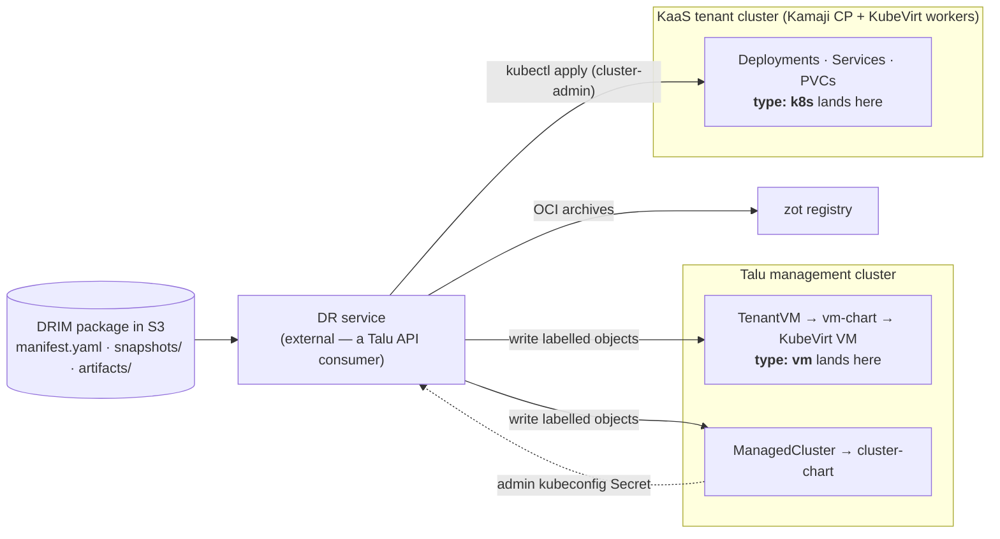

# Talu as a DRIM recovery target — gap analysis

> **Status: ANALYSIS.** Nothing here is implemented. Assessed against **DRIM `drim/v1alpha1`**
> (Disaster Recovery Infosystem Manifest, draft 2026-07-17). Every Talu claim below is anchored to a
> file in this repo; unverified external claims are marked **(unverified)**.

## 1. The question and the answer

**Question:** can a DRIM package — a self-describing S3 archive of an infosystem (VM disk exports,
Kubernetes resource dumps, PV data, application artifacts) — be **recovered onto Talu**, with Talu
acting as a DRIM *target environment profile* (§10 of the spec)?

**Answer: yes for the Kubernetes half today, yes for the VM half after one small chart change and one
non-obvious guest fix-up.** Talu already has every substrate primitive the format needs — KubeVirt +
CDI, Ceph RBD, Cilium policy, Velero, an OCI registry, and real per-tenant Kubernetes. What it lacks is
a **restore-shaped surface**: the consumer API only lets a VM boot from the site's golden-image
catalog, and "boot this VM from *my* imported disk" is the entire DRIM VM story.

This document is scoped to Talu as a **recovery target**. Talu as a *package store* is assessed in
§7 (short version: not with Garage as shipped). Talu's own multi-site DR design —
[`disaster-recovery.md`](disaster-recovery.md) — is a different axis and is compared in §8.

## 2. Two landing zones, not one

DRIM component types split across Talu's two tenancy models. This split is the central architectural
finding: **a DRIM manifest mixing `type: vm` and `type: k8s` lands in two different places.**

| DRIM component | Lands in | Why |
|---|---|---|
| `type: k8s` | **KaaS tenant cluster** ([`kaas.md`](kaas.md), [`cluster-chart`](../../components/tenancy/cluster-chart/)) | The tenant is cluster-admin on their own hosted control plane, gets a real StorageClass (kubevirt-csi → infra `ceph-block`), optional in-tenant Velero, and Kamaji publishes `<name>-admin-kubeconfig` — precisely what the DRIM profile's `platform.k8s.kubeconfigRef` needs. |
| `type: k8s` | **NOT the management cluster** | Platform tenancy is `Tenant`/`TenantVM` plus a namespace-scoped Role ([`apiserver/pkg/apis/tenancy/v1alpha1/types.go`](../../apiserver/pkg/apis/tenancy/v1alpha1/types.go)). There is no tenant path to apply arbitrary Deployments/Ingresses. A `type: k8s` component can only land here with **operator** privilege. |
| `type: vm` | **Management cluster** ([`vm-chart`](../../components/tenancy/vm-chart/)) | Right place, wrong shape — §4. |
| `type: external` | Neutral | Pure profile lookup (`contract.endpointRef: profile`); Talu is not involved. |

**Consequence for the profile:** a Talu DRIM profile is not one endpoint. It is `platform.vm` pointing
at the management cluster and `platform.k8s` pointing at a KaaS cluster that may have to be
*provisioned first* — a `ManagedCluster` write, then wait for
`Cluster.status.phase == "Provisioned"`, then restore into it. That ordering belongs in the DR
service, expressed through DRIM `relationships` + `bootOrder`.

## 3. Construct-by-construct mapping

| DRIM construct | Talu primitive | Status |
|---|---|---|
| `restore.method: volume-import` | `vm-chart` **`source: import`** → CDI `DataVolume` with `source.http`/`s3` | ✅ **built** — §4.1 |
| `requirements: {cpu, memoryGiB}` → profile `flavorMapping` | `VirtualMachineClusterInstancetype talu-{small,medium,large}` ([`sizes/instancetypes.yaml`](../../components/tenancy/sizes/instancetypes.yaml)) | **Concept matches, catalog doesn't** — §4.2 |
| Multiple disks per VM (`root` + `data`) | `vm-chart` **`dataDisks[]`**, each imported or blank | ✅ **built** — §4.1 |
| `networks[].addresses.mode` | Masquerade pod binding, one NIC, guest always sees `10.0.2.2/24` ([`networking.md`](networking.md) §VM networking) | Only the `dhcp` equivalent is honourable — §4.4 |
| `guestAgent: qemu-ga` | Baked into the Talu golden images ([`images/centos-bootc/Containerfile`](../../images/centos-bootc/Containerfile)); KubeVirt exposes `AgentConnected` | ✅ for Talu-native guests; an imported disk brings its own |
| Level-1 `vm-running` / `k8s-workload-ready` | `TenantVM.status.phase`, `ManagedCluster.status`, `talu_kaas_*` / `talu:tenant_*` recording rules | ✅ — DRIM validation ≈ Talu's existing *watch `.status`* + *read Prometheus* verbs |
| Level-2 `tcp` checks | blackbox exporter (`probe_success{probe_type=…}`) already deployed | ✅ reusable |
| Level-3 `script` `runOn:` via guest agent | KubeVirt guest-agent exec | ✅ |
| `launchModes.validation.network.isolation: strict` | `Tenant.spec.networkBaseline` (default-deny) + security-group `CiliumNetworkPolicy` | ✅ good fit |
| `launchModes.validation.ttlSeconds` | Kyverno `cleanupController` is deployed ([`kyverno/values.yaml`](../../components/platform/kyverno/values.yaml)) | ✅ available, nothing wired |
| `artifacts/images/*.oci.tar` | zot in-cluster OCI registry ([`infrastructure/zot`](../../components/infrastructure/zot/)) | ✅ natural home |
| `artifacts/source/*.bundle`, `deps/`, `sbom/` | No consumer; nothing to restore *into* | Out of scope for a target — these are rebuild inputs for the tenant |
| §9 Waldur ↔ DR-service protocol | Talu is orchestrator-agnostic; four-verb contract; `talu.io/project-uuid` join key; Talu never calls back ([`../integrations/`](../integrations/)) | ✅ **zero Talu change** — §6 |

## 4. The blockers, ranked

### 4.1 No disk-import path through the API — **resolved**

*Originally the blocker: `TenantVMSpec` and the chart accepted only `source: dataSource |
containerDisk`, both cloning the site's golden-image `DataSource`, with no value meaning "populate
this disk from a URL." The substrate was capable (CDI already imports from a registry; `source.s3`
is the same controller on a different source) — it was an API gap, not a platform gap.*

**Now built** in [`vm-chart`](../../components/tenancy/vm-chart/) (0.2.0):

- **`source: import`** with `restore.root.{url,secretRef,certConfigMap}` renders a `DataVolume` whose
  source is `http:` or `s3:` — a presigned HTTPS URL is preferred, because an `s3://` source needs a
  credentials Secret in the *tenant's* namespace.
- **`dataDisks[]`** adds non-root volumes, imported or blank, each addressable in the guest as
  `/dev/disk/by-id/virtio-<name>`.
- **`restore.retrust`** is the §4.3 mitigation — see there.

Ownership: `restore.*` and the disks' URLs are `x-talu-owner: operator`, joining `source`/`image`/
`dataSource*` as catalog plumbing the site owns. That marker is a **contract, not an enforcement** —
`tenant-chart/values.schema.json` says so, and a consumer that sets an operator field still wins the
Helm merge. The enforcement is the typed API: `TenantVMSpec.DataDisks` carries `{name, size}` only,
so a `TenantVM` cannot express a URL and a consumer of that API cannot escape the golden-image
catalog. `TestDataDisksCannotCarryAnImportURL` guards it.

Two residual caveats, both documented in the chart README: an imported disk is **not**
signature-verified (the cosign policy matches registry sources only), and CDI verifies no checksum —
integrity stays the DR service's job, which is what DRIM level-0 already assigns it.

### 4.2 The instancetype catalog cannot express production sizes

Three sizes ship: `talu-small` (1 vCPU / 2 GiB), `talu-medium` (2/4), `talu-large` (4/8). The DRIM
spec's own worked example (§13) asks for **8 vCPU / 32 GiB** — unsatisfiable. Under DRIM's resolution
rule (profile → manifest default → mandatory ⇒ `WAITING_INPUT`) a faithful recovery of that manifest
**stalls waiting for a human**, which is correct behaviour and a bad experience.

Note this is a deliberate design choice, not an oversight: named sizes exist because raw cores/memory
in the consumer API let KubeVirt default every VM to 1 vCPU. The fix is to widen the catalog (and
have the DR service resolve "smallest size ≥ requirements"), not to reintroduce free-form sizing.

### 4.3 A restored VM cannot be logged into — the non-obvious one

Talu's access plane is **Pomerium Native SSH**: Pomerium is the SSH User CA, there is no public `:22`
and no static password (lab-notes #21). Every guest must trust the site's CA via
`/etc/ssh/talu_ca.pub` + `TrustedUserCAKeys`, delivered by one of `caTrust.package` (apt),
`caTrust.baked` (golden image), or the cloud-init fallback that hand-writes the file.

A DRIM disk imported from a **different** platform carries the wrong CA, or none — and
**cloud-init will not re-run on an already-provisioned disk** (its instance-id is already stamped), so
the chart's trust injection silently does nothing. The failure mode is quiet and expensive:

- the VM boots, `vm-running` passes;
- the guest agent connects, so a level-3 `script` check passes;
- **every human SSH attempt is rejected by the guest's `sshd`**, and the DR report is green.

A recovery path must therefore include a **post-import re-trust step**. KubeVirt exposes no generic
guest-exec, so it has to be **offline**: `restore.retrust.enabled: true` in the chart holds the VM at
`runStrategy: Halted` and runs a Job that waits for the import, then `virt-customize`s the disk to
write `/etc/ssh/talu_ca.pub` + `TrustedUserCAKeys` (optionally clearing the cached cloud-init state).
It is deliberately two-step — the Job does not start the VM, because Flux would reconcile
`runStrategy` straight back and fight it; Git stays the source of truth for whether a VM runs.

**Unvalidated on hardware.** Open risks: libguestfs' appliance VM under Talos PSA, and whether
clearing the instance-id suffices for a guest whose `datasource_list` excludes NoCloud. Worth testing
the cheap hypothesis first: a guest whose cached instance-id differs from the NoCloud one may simply
re-run cloud-init and pick up the CA for free, making most of the Job unnecessary.

This generalises beyond Talu and is worth feeding back into the spec: **DRIM v1 has no notion of
"post-restore adaptation to the target's access plane."** Any target with a host-side trust anchor
(SSH CA, agent enrolment, a monitoring agent's endpoint) hits this.

### 4.4 Network modes: only one of three is honourable

DRIM offers `static-remap | dhcp | preserve`. Talu's tier-1 VM binding is masquerade over the pod
network: the guest always sees the same private `10.0.2.2/24`, the routable address is the
virt-launcher pod IP, and the *stable* address is a `LoadBalancer` Service IP from a per-tenant
`CiliumLoadBalancerIPPool`. So:

- `dhcp` → fine, and effectively what the guest gets regardless.
- `static-remap` → expressible only as "a stable Service LB IP," not as an address inside the guest.
- `preserve` → not possible; **no MAC preservation either**.

A tier-2 Multus/bridge binding would give a real L2 NIC with its own MAC, but it is documented as
not-on-the-lab and is not rendered by the chart.

**Related spec gap.** [`disaster-recovery.md`](disaster-recovery.md) §3.2 records the hard-won lesson
that **MAC address, `bootOrder`, and firmware UUID/serial "do not travel automatically; a raw disk
mirror without them boots a wrong-NIC / wrong-boot-disk guest"** (war-story #8). DRIM `v1alpha1`
declares none of the three. That is the same class of problem as the spec's own §11.6
`licenseRebindRequired` flag, and arguably belongs in the VM component's `restore` block.

### 4.5 Compression format (unverified)

Packages ship `disk-0.raw.zst`. CDI's import path handles `.gz`, `.xz`, `.tar`, and qcow2; **zstd
support was not confirmed** and should be treated as absent until tested. Either standardise the
package on `.xz`, or have the DR service decompress and serve/stage the raw image itself.

### 4.6 No machine identity for a DR service

Every access path in Talu authenticates **humans** through Pomerium + OIDC — that is the design, and
Pomerium being sole ingress is load-bearing. A DR service writing `TenantVM`/`ManagedCluster` objects
needs a scoped ServiceAccount and a non-interactive route to the management API. Open design
question, not a hard blocker; the KaaS side is already solved (Kamaji hands out a client-cert admin
kubeconfig per tenant cluster).

## 5. What already exists that DRIM can reuse

[`components/platform/backup/restore-test.yaml`](../../components/platform/backup/restore-test.yaml)
is DRIM §8.2 (*automated backup verification while the system is live*) and
`backupPolicy.validateEvery` in miniature, already running weekly on the lab: it seeds a canary
namespace, backs it up, **restores into a fresh scratch namespace via `namespaceMapping`**, and then
asserts the sentinel data actually came back — because "a Completed restore that restored nothing
would still be a lie." It cleans up unconditionally, and it feeds `TaluRestoreTestStale` /
`TaluRestoreTestFailed`.

That is the exact skeleton of a DRIM validation-mode runner: clone into an isolated scratch
namespace, run checks, guaranteed cleanup, alert on staleness. Extend rather than rebuild.

Also directly reusable: the blackbox exporter for level-2 checks, `Tenant.spec.networkBaseline` for
`isolation: strict`, Kyverno's cleanup controller for `ttlSeconds`, and zot for `artifacts/images/`.

## 6. The Waldur protocol needs nothing from Talu

DRIM §9 puts an external DR service between Waldur and the infrastructure: it fetches commands over
Waldur REST, POSTs events back, and holds all process detail on its own side (§9.5's information
boundary). Talu's integration contract is the mirror image of that — **four verbs** (write labelled
objects · watch `.status` · read Prometheus · delegate identity), `talu.io/project-uuid` as the join
key, and **Talu never calls back to the consumer**. The DR service is simply another consumer.

Two alignments worth noting:

1. DRIM level-1/2 checks map onto Talu's *watch* and *read* verbs rather than onto raw KubeVirt
   poking — `TenantVM.status.phase`, `ManagedCluster.status`, `talu_kaas_workers_ready`,
   `probe_success`. A DR service written against Talu's contract stays on the supported surface.
2. §9.5 forbids DR internals reaching Waldur. Talu makes that easy by construction: it emits status,
   not process.

## 7. Talu is not a conformant DRIM *package store*

Distinct from the target question, and worth stating so it isn't assumed:
[`components/platform/backup/README.md`](../../components/platform/backup/README.md) is explicit that
**Garage implements no S3 Object Lock** — backups are not WORM-immutable, anyone with the credentials
can delete them. There is no SSE-KMS either. That fails DRIM §4 invariants **3** (encryption at rest
mandatory) and **4** (retention/immutability via Object Lock).

So: Talu **consuming** packages from an external, locked, encrypted S3 is fine and is the intended
shape. Talu **holding** DRIM packages needs a different target.

Talu did arrive independently at the spec's §4 instinct, though — the `garage-data` PVC deliberately
avoids the Ceph class, and the README warns *"a backup target must not depend on the storage it
protects… in production, run Garage outside the cluster it backs up."* That is DRIM §4's
cross-region/LOCKSS reasoning in miniature.

## 8. DRIM vs. Talu's own DR design — different axes

| | [`disaster-recovery.md`](disaster-recovery.md) | DRIM |
|---|---|---|
| Shape | Site-pair **RBD snapshot mirroring**, pre-staged Halted standby VM | Portable, self-describing **S3 archive** |
| RPO | Minutes (mirror interval) | Hours (backup schedule) |
| Target | A **specific** peer site, GitOps-identical | **Any** environment, original infra assumed destroyed |
| Failover | Cold boot of an already-defined VM + front-door cutover | Full reconstruct from bits |
| Optimises | RTO/RPO | Portability + longevity (OAIS/BagIt self-description) |

They are complementary, not competing, and should not be merged. Two findings cross over:

- **MAC / `bootOrder` / firmware UUID must travel with the disk** (§4.4) — learned there, missing in
  DRIM v1.
- **Multi-disk crash consistency is unsolved upstream** (that doc's §3.1 constraint 2) — which is
  exactly DRIM open question §14.1 (`consistency: crash | quiesced`). Talu already has a working
  answer on the Velero path: `kubevirt-velero-plugin` performs **guest-agent freeze/thaw** for
  application-consistent snapshots ([`../operations/backup-restore.md`](../operations/backup-restore.md)).
  DRIM could adopt that per-VM rather than leaving it open.

## 9. What would have to be built

Ordered by dependency, not by size:

1. ~~**`source: import` in `vm-chart`**~~ — **done** (0.2.0): `restore.*` + `dataDisks[]`, with
   `TenantVMSpec.DataDisks` plumbed as `{name,size}` only. *(§4.1)*
2. **Post-import guest re-trust** — **built, unvalidated**: `restore.retrust` renders the offline
   `virt-customize` Job. Needs a hardware run, and the cheaper cloud-init hypothesis tested first.
   *(§4.3)*
3. **Widen the instancetype catalog** + a "smallest size ≥ requirements" resolver in the DRIM
   profile's `flavorMapping`. *(§4.2)*
4. **A validation-mode scratch tenant** — ephemeral `Tenant` with `networkBaseline: true`, a Kyverno
   `CleanupPolicy` honouring `ttlSeconds`, modelled on `restore-test.yaml`. *(§5)*
5. **A machine identity** for the DR service — scoped ServiceAccount + RBAC, and a non-OIDC path to
   the management API. *(§4.6)*
6. **Settle the compression format** with a real CDI import test. *(§4.5)*

Items 1–2 were the minimum viable "Talu is a DRIM target"; 1 is done and 2 awaits a lab run. Items
3–6 are what makes it unattended.

## 10. Where this can be validated

**The physical lab** (`environments/rocky-phys`) — real KVM, real Rook-Ceph **RBD**, KubeVirt and
KaaS both validated there.

**Not the no-KVM VM lab.** Storage there is CephFS-only because the nested node's `/dev` isolation
breaks rbd-nbd (lab-notes #14/#15), so a `volume-import` into an RBD-backed PVC has nowhere to land.
The chart change can be unit-tested with `make kbuild` + `helm template` anywhere; the round trip
cannot.

## 11. Open questions

1. **Does a DRIM `type: k8s` recovery always provision a fresh KaaS cluster**, or may it restore into
   an existing one? Fresh is cleaner and matches "original infrastructure destroyed," but costs a
   full CAPI provision inside the RTO budget.
2. **Which side owns adaptation to the target's access plane** (§4.3) — a DRIM `postRestore` hook in
   the spec, or a Talu-side admission/mutation step invisible to the format?
3. **Should Talu publish a DRIM profile as a first-class artifact** (a `profiles:` entry a site can
   hand to a DR service), and if so, does it live in `environments/<site>/`?
4. **Multi-disk VMs**: adopt the single-root-disk constraint from
   [`disaster-recovery.md`](disaster-recovery.md) §3.1, or support `dataDisks` and accept
   crash-consistency caveats per DRIM §14.1?
