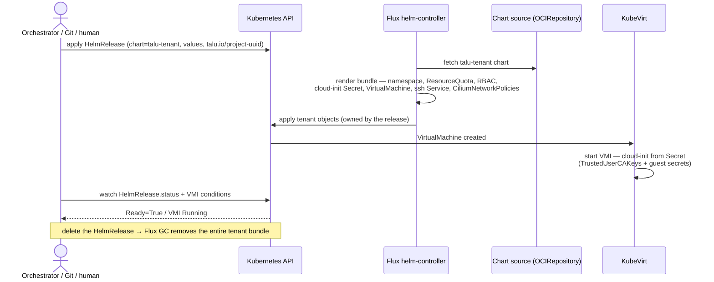
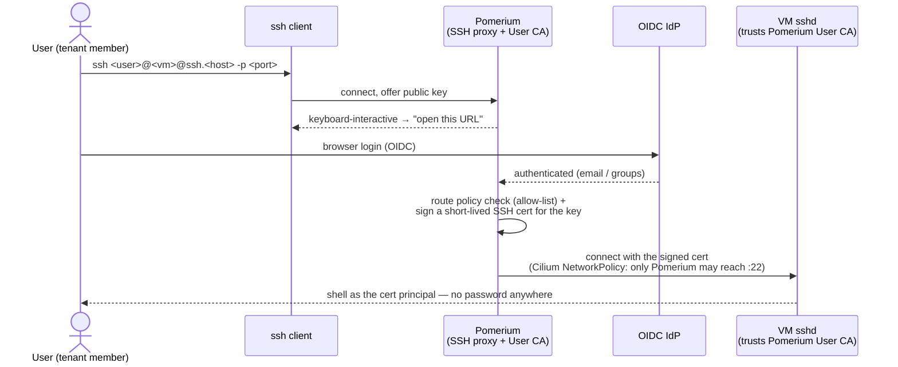
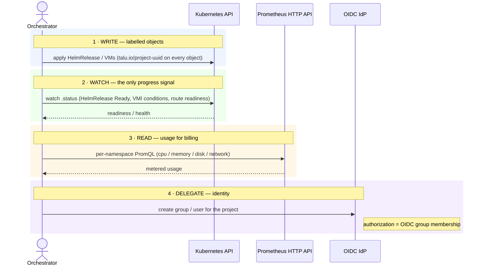

# Runtime flows

Sequence diagrams for the flows that matter. All are **declarative**: a client writes Kubernetes
objects and watches status; Talu never calls out to an external system. See
[`README.md`](README.md) for the component architecture.

## Tenant / VM provisioning

A tenant is one `HelmRelease` applied **directly to the Kubernetes API** (by an orchestrator, a CI
job, or a human — or committed to Git and reconciled). Flux's helm-controller renders the
`talu-tenant` chart into the per-tenant bundle. `HelmRelease.status` is the single object to watch;
deleting it garbage-collects the whole tenant.

## SSH access (Pomerium Native SSH)

There is no public `:22` and no static VM password. Pomerium is the SSH proxy **and** the SSH User
CA; the VM trusts that CA (injected via cloud-init). The user runs a stock `ssh` client; Pomerium
authenticates them via OIDC in the browser, issues a short-lived certificate, and connects. Cilium
pins the VM's `:22` so only Pomerium can reach it.

## The integration contract

An external orchestrator participates through exactly **four verbs**. Talu exposes no proprietary
API and never initiates calls to the orchestrator — the object labels and `.status` are the whole
interface. Examples of orchestrators that consume this contract: a billing/portal platform such as
**Waldur**, an internal self-service portal, or a CI/CD pipeline.

**What a consumer must not assume:** no imperative side channels (declarative objects only); labels
are truth, names are handles (`talu.io/project-uuid` is the join key); and Talu may run with **no
orchestrator at all** — never design objects that require one to exist.
