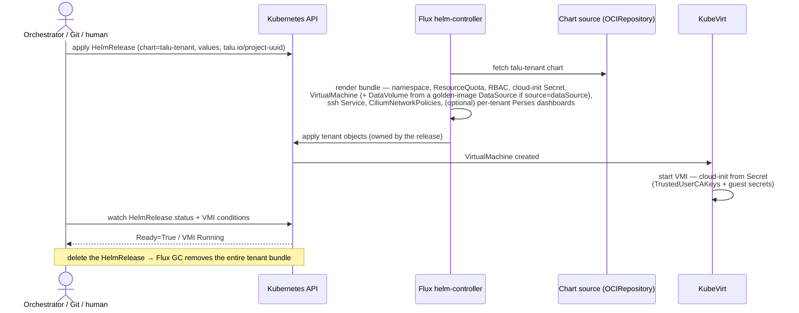
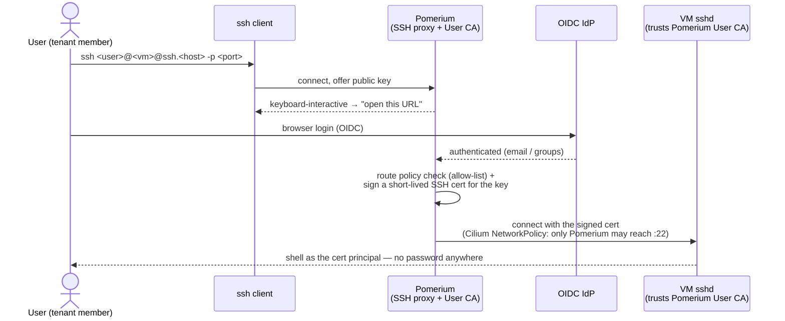
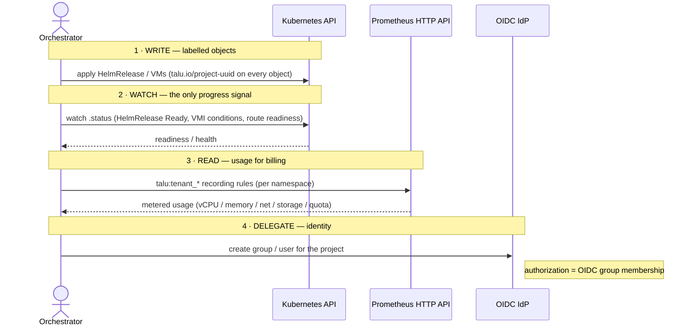

# Runtime flows

Sequence diagrams for the flows that matter. All are **declarative**: a client writes Kubernetes
objects and watches status; Talu never calls out to an external system. See
[`README.md`](README.md) for the component architecture.

## Tenant / VM provisioning

A tenant is one [`HelmRelease`](https://fluxcd.io/flux/components/helm/helmreleases/) applied
**directly to the Kubernetes API** (by an orchestrator, a CI job, or a human — or committed to Git and
reconciled). Flux's helm-controller renders the `talu-tenant` chart (pulled from an
[`OCIRepository`](https://fluxcd.io/flux/components/source/ocirepositories/)) into the per-tenant
bundle; guest secrets ride in via KubeVirt
[cloud-init `secretRef`](https://kubevirt.io/user-guide/user_workloads/startup_scripts/).
`HelmRelease.status` is the single object to watch; deleting it garbage-collects the whole tenant.



## SSH access (Pomerium Native SSH)

There is no public `:22` and no static VM password.
[Pomerium Native SSH](https://www.pomerium.com/docs/capabilities/native-ssh-access) is the SSH proxy
**and** the SSH User CA; the VM trusts that CA (injected via cloud-init). The user runs a stock `ssh` client; Pomerium
authenticates them via OIDC in the browser, issues a short-lived certificate, and connects. Cilium
pins the VM's `:22` so only Pomerium can reach it.



## The integration contract

An external orchestrator participates through exactly **four verbs**. Talu exposes no proprietary
API and never initiates calls to the orchestrator — the object labels and `.status` are the whole
interface. Examples of orchestrators that consume this contract: a billing/portal platform such as
**Waldur**, an internal self-service portal, or a CI/CD pipeline.



**What a consumer must not assume:** no imperative side channels (declarative objects only); labels
are truth, names are handles (`talu.io/project-uuid` is the join key); and Talu may run with **no
orchestrator at all** — never design objects that require one to exist.

## Golden-image lifecycle & patching

How an OS image is built, catalogued, and delivered — to **new** VMs and to **already-running** ones.
The design goal is *patching as automatic as possible*; the lever that makes it work is **bootc
(image mode)**: the OS *is* an OCI container, so **one signed artifact serves both** new-VM
provisioning *and* running-VM self-update. Design/decision detail and phasing live in
[`../../image-automation-plan.md`](../../image-automation-plan.md); the components are
[`images/`](../../images/), [`components/infrastructure/zot`](../../components/infrastructure/zot/) and
[`components/infrastructure/cdi`](../../components/infrastructure/cdi/).

```mermaid
sequenceDiagram
    actor Op as Operator / CI trigger
    participant B as Build<br/>(CI runner or in-cluster CronJob)
    participant Z as zot<br/>(in-cluster OCI registry)
    participant DIC as CDI DataImportCron
    participant DS as DataSource<br/>(managed pointer)
    participant KV as KubeVirt
    participant VM as Running VM<br/>(bootc guest)
    participant P as Prometheus

    Note over Op,B: 1 · BUILD — on schedule / base-digest change / CVE
    Op->>B: trigger
    B->>B: bootc-image-builder → qcow2 → containerDisk<br/>(privileged + loopback, NO /dev/kvm)
    B->>B: Trivy scan · cosign sign — gates, togglable
    B->>Z: push signed containerDisk (:testing → promote :stable)

    Note over Z,DS: 2 · CATALOG — poll & roll (no VM involved)
    DIC->>Z: poll channel tag on schedule
    Z-->>DIC: new digest
    DIC->>DIC: import into golden-image PVC<br/>(importsToKeep: N — keeps rollback targets)
    DIC->>DS: point managedDataSource at the newest

    Note over DS,KV: 3a · NEW VM — always the latest, zero spec change
    KV->>DS: dataVolumeTemplate sourceRef → DataSource
    DS-->>KV: clone latest patched disk → VM boots

    Note over Z,VM: 3b · RUNNING VM — bootc self-update (pets)
    VM->>Z: bootc: pull channel tag (schedule / maintenance window)
    Z-->>VM: new image layers
    VM->>VM: stage → (soft-)reboot → activate<br/>(atomic; one-command rollback)

    Note over DIC,P: 4 · FRESHNESS
    DIC-->>P: kubevirt_cdi_dataimportcron_outdated<br/>→ talu:image_outdated (operator dashboard + alert)
```

### The two delivery paths (and why they're separate)

Patching splits by workload type, and Talu supports both from the *same* registry tag:

- **New VMs — CDI `DataImportCron` + `sourceRef`.** The cron polls the channel tag, imports each new
  digest, and rolls a stable-named **`DataSource`**. A tenant VM with `source: dataSource`
  ([tenant chart](../../components/tenancy/tenant-chart/)) declares
  `dataVolumeTemplate → sourceRef → DataSource`, so **every newly-created VM clones the latest patched
  image with no spec change**. The set of DataSources *is* the Talu image catalog.
- **Running VMs — bootc self-update.** Long-lived / stateful VMs (pets) track the registry channel and
  apply updates **in place**: pull the new tag → stage → soft-reboot → activate, atomically, with a
  one-command rollback to the prior image. This is the half that a build-an-image tool alone can't do,
  and it's why the root disk defaults to a **persistent** `DataVolume` — an ephemeral `containerDisk`
  would drop the self-update on reboot. Stateless "cattle" VMs can instead be re-rolled from the new
  `DataSource` (recreate rather than patch-in-place).

### Why bootc — the concrete benefits

bootc (image mode, CNCF Sandbox) is the load-bearing choice. What it buys over the alternatives:

| | Packer / classic golden image | In-guest `unattended-upgrades` | **bootc (image mode)** |
|---|---|---|---|
| Build | provision VM → snapshot → publish | n/a (patch at runtime) | `docker build` the OS → `bootc-image-builder` |
| Patch **running** VMs | re-roll only (recreate) | in place, but **drifts** | **in place, atomic, rollback** |
| Consistency | image is a black box | config drift accumulates | running system == the image, always |
| Supply chain | image, signed separately | none for the OS | OS is an OCI artifact → **same cosign/Trivy/registry** as any container |
| New + running VMs | two different mechanisms | two different mechanisms | **one signed artifact serves both** |

Concretely, for Talu:

- **One artifact, two consumers.** The same signed containerDisk feeds the `DataImportCron` (new VMs)
  and bootc self-update (running VMs). There is no separate "image" and "updater" to keep in sync.
- **Atomic, rollback-able, no drift.** A running VM's state is exactly the image it booted; `bootc
  status` shows what's deployed, and a bad update rolls back in one command — properties in-guest
  package updates cannot offer.
- **The registry tag is the single control point.** Promote `:testing` → `:stable` once, and both
  delivery paths follow — no per-VM action.
- **Bake capabilities, inject identity — unchanged.** bootc bakes software (qemu-guest-agent,
  cloud-init, OpenSSH, the `TrustedUserCAKeys` directive); cloud-init still injects per-tenant identity
  and secrets at boot. Golden images stay generic and reusable.
- **The OS supply chain is the container supply chain.** cosign signing, Trivy scanning, channel
  promotion, and `CDIDataImportCronOutdated` freshness alerting apply to the OS exactly as they do to
  any other image — nothing new-in-kind to operate.
- **No KVM to build.** `bootc-image-builder` needs only `--privileged` + loopback, not `/dev/kvm` —
  validated on the no-KVM lab (built `centos-bootc` on the host, booted it under KubeVirt TCG).

Upstream: [bootc](https://bootc-dev.github.io/bootc/) ·
[bootc-image-builder](https://github.com/osbuild/bootc-image-builder) ·
[CDI DataImportCron](https://github.com/kubevirt/containerized-data-importer/blob/main/doc/os-image-poll-and-update.md).
