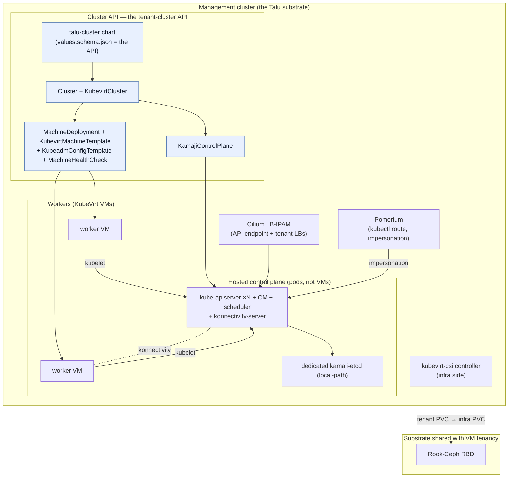

# Kubernetes-as-a-Service (managed tenant clusters)

Talu's substrate is Kubernetes + KubeVirt, so it can offer tenants their **own managed Kubernetes
clusters** on the same ground it runs VMs on — without a second control plane or a bespoke API. This
is the **KaaS layer**: a tenant cluster is a set of **Cluster API** objects rendered from a values
file, exactly as a VM tenant is a `talu-tenant` values file. The management surface stays the
Kubernetes declarative API; nothing here is a proprietary control plane.

Built and validated end-to-end on the physical lab (see
[`../development/kaas-test-results.md`](../development/kaas-test-results.md)).

## The shape

## Why this design

The KaaS landscape splits into unmanaged (tenant installs k3s on their VMs), **CP-in-VMs** (three
control-plane VMs per tenant), and **hosted control planes** (CP as pods on the management cluster).
Talu takes the hosted-control-plane path — the same one **Cozystack** uses on the same Talos+KubeVirt
substrate (see [`comparison.md`](comparison.md)) — because it fits Talu's two commitments:

- **Cluster API is the contract, Kamaji is a swappable backend.** A tenant cluster is ordinary CRs the
  orchestrator writes, watches via `.status`, and garbage-collects on delete — the same four verbs as
  VM tenancy, with no aggregation apiserver. Kamaji is *just* the CAPI control-plane provider; it can
  be swapped for CP-in-VMs (CABPT) later without changing the tenant-facing contract.
- **Density and accounting.** A hosted control plane is a few pods, not 3 multi-GiB VMs per tenant.
  Every object carries `talu.io/project-uuid`, so the existing `talu:tenant_*` accounting meters
  tenant clusters like anything else.

## The stack (management-cluster prerequisites)

`clusterctl init --bootstrap kubeadm --control-plane kamaji --infrastructure kubevirt --addon helm`
installs four providers (validated: CAPI v1.13.4, Kamaji CP provider v0.20.0, CAPK v0.11.2,
CAAPH v0.6.4). On top of that, per tenant cluster:

| Concern | How | Notes |
|---|---|---|
| Control plane | **Kamaji** `KamajiControlPlane` → apiserver/CM/scheduler + konnectivity **pods** | replicas spread across nodes; survives a management-node loss |
| Datastore | **dedicated `kamaji-etcd` on local-path** (default) | etcd is fsync-bound — see below |
| Workers | **CAPK** `MachineDeployment` → KubeVirt VMs (ubuntu-2404 containerDisk) | masquerade networking; **not** live-migratable (ephemeral disk) |
| CNI (in tenant) | **Cilium** via CAAPH `HelmChartProxy` | auto-installs on the `cni: cilium` cluster label |
| Storage (in tenant) | **kubevirt-csi** → infra `ceph-block` | tenant PVC maps to an infra PVC; tenant never holds Ceph creds |
| LoadBalancer (in tenant) | **cloud-provider-kubevirt** → Cilium LB-IPAM | tenant `type: LoadBalancer` Services get an infra LB IP |
| kubectl access | **Pomerium** route (impersonation) | `pomerium-cli k8s exec-credential`; same IdP as SSH/HTTP |
| Crash recovery | **MachineHealthCheck** | auto machine-replace on a stuck node (see resilience) |

## Per-tenant etcd on local-path (the datastore decision)

etcd is **fsync-latency-bound**. The shared `kamaji-etcd` default lands on Ceph RBD, where measured
WAL fsync p99 was **75–227 ms**; a dedicated `kamaji-etcd` on **local-path** (node NVMe/SATA) measured
**2.6–3.6 ms — ~50× better**. So Talu defaults each tenant to a **dedicated etcd on local-path**
(three members, topology-spread), the same choice Cozystack makes.

This isn't just latency — it's blast radius. Test **KT-24** scaled the *shared* etcd to quorum loss:
the tenant on the shared datastore lost its API (writes → `connection refused`), while a tenant on its
**dedicated** etcd was completely unaffected (100% of `/readyz` probes succeeded through the outage).
A dedicated datastore removes the shared-etcd noisy-neighbour coupling entirely.

## How the substrate carries it

- **Networking** — workers use the tier-1 **masquerade binding**, so CP→kubelet traffic would break
  behind NAT; **konnectivity** (a Kamaji sidecar + tenant-side agents that *dial out*) fixes that, so
  workers need no special networking. The tenant API endpoint and tenant `LoadBalancer` Services both
  come from **Cilium LB-IPAM** (per-tenant pools scoped by `talu.io/project-uuid`). One platform fix
  was required: `socketLB.hostNamespaceOnly` — with kube-proxy-replacement, full-coverage socket LB
  blackholes every ClusterIP from a KubeVirt guest (VM traffic never traverses a node socket); this
  affected all tenant VMs, not just KaaS. See [`networking.md`](networking.md).
- **Storage** — **kubevirt-csi** runs its controller on the infra side (in the tenant's namespace) and
  a node plugin inside the tenant, so a tenant PVC becomes an infra `ceph-block` PVC hotplugged into
  the worker VM — the tenant never holds Ceph credentials. (CDI import is forced Filesystem/RWO: Block
  mode is broken on Talos.)
- **Access** — the tenant API server is TLS with its own authn, so it doesn't traverse Pomerium's HTTP
  IAP; instead a Pomerium **kubectl route** authenticates the user against the same OIDC IdP and
  forwards with `Impersonate-User` headers, so tenant-cluster RBAC sees the real identity. The
  Pomerium ServiceAccount token alone is powerless (403); authority comes only via the impersonation
  headers Pomerium sets from the authenticated session.

## Resilience (validated)

Full run in [`../development/kaas-test-results.md`](../development/kaas-test-results.md) — 24/26 PASS.
Highlights:

- **Management-node reboot (KT-25):** both tenant control-plane APIs stayed **100% available** through
  a full node reboot, because CP replicas are spread. This is the core hosted-control-plane promise.
- **Datastore isolation (KT-24):** dedicated-etcd tenant untouched by a shared-etcd quorum loss (above).
- **Worker crash → MachineHealthCheck (KT-15/16):** a hard worker-VMI crash does **not** self-heal on
  ephemeral-containerDisk workers — the restarted disk re-runs `kubeadm join` with an expired bootstrap
  token. The MHC detects the stuck node and triggers CAPI **machine-replace** (fresh token) — a stuck
  worker becomes a self-heal, not an operator page.
- **Control-plane / network faults:** CP-pod kills recover in ≤20 s; LB failover, Cilium agent
  restart, and a full Cilium DaemonSet rollout each cause **0 s** of tenant-API interruption.

## Productization status

- **Product form:** the [`talu-cluster` chart](../../components/tenancy/cluster-chart/) renders the
  declarative CAPI objects (Cluster / KamajiControlPlane / MachineDeployment / MHC / Cilium proxy) from
  a values file — its `values.schema.json` *is* the tenant-cluster API, mirroring `talu-tenant`.
- **Cross-cluster wiring** (per-tenant etcd, kubevirt-csi credentials, cloud-provider-kubevirt, the
  Pomerium route) needs the tenant's generated kubeconfig/CA, which only exist after the CP is up — so
  it's a **post-provision reconcile step**, encoded today as the `phys_kaas_tenant` ansible role
  (`ansible/roles/phys_kaas_tenant/`) and validated on the physical lab. Graduating that wiring into a
  small operator (or Flux post-build hook) is the next step; the declarative half is already a chart.
- **Observability:** the **Talu — KaaS** Perses dashboard + alert rules ship in
  [`../../components/platform/monitoring/`](../../components/platform/monitoring/) (`dashboard-kaas.yaml`,
  `kaas-rules.yaml`, `kaas-scrape.yaml`). The dashboard opens with a **live inventory of deployed tenant
  clusters** (name, k8s version, control-plane status, API endpoint, etcd datastore, workers
  ready/desired) and a **"How to connect"** panel with the `pomerium-cli` kubectl recipe — backed by a
  kube-state-metrics CustomResourceState over the CAPI/Kamaji CRs (`ksm-crs.yaml`; this closes gap G6).
  Remaining top follow-up: a blackbox tenant-API probe (G1) — see the test plan's gap list.
- **Console:** **Headlamp** at `clusters.<domain>` (the KaaS analog of kubevirt-manager's
  `vms.<domain>`), admin-only behind Pomerium. It replaced the Kamaji Console, which only had static
  credentials (a second login on top of SSO). It runs **multi-cluster over the tenant clusters** — not
  the Talu management substrate (`inCluster: false`): it loads each tenant's admin kubeconfig, so you
  see the **provisioned tenant clusters** and drill into any one to browse its workloads. A single
  Pomerium/Dex SSO gates access; the tenant kubeconfigs carry client-cert creds, so there is no second
  login and no need to make the management apiserver trust Dex (a fragile hairpin on this lab).
  Newly-provisioned clusters appear automatically: a **cluster-sync reconciler** (a CronJob, the same
  pattern as `route-sync`) merges the per-tenant `<tenant>-admin-kubeconfig` Secrets Kamaji creates
  into Headlamp's kubeconfig every ~2 min (renaming per tenant to avoid the shared `kubernetes-admin`
  user colliding), so provisioning a tenant makes it show up and deleting one drops it off — no manual
  step. Role: `phys_headlamp`.

## See also

- Test plan & results: [`../development/kaas-test-plan.md`](../development/kaas-test-plan.md),
  [`../development/kaas-test-results.md`](../development/kaas-test-results.md).
- How Talu compares (Cozystack, the closest relative): [`comparison.md`](comparison.md).
- The chart: [`../../components/tenancy/cluster-chart/`](../../components/tenancy/cluster-chart/).
- The validated reference manifest + roles: `ansible/roles/phys_kamaji/files/capi-tenant-reference.yaml`,
  `ansible/roles/{phys_capi,phys_kaas_tenant}/`.
