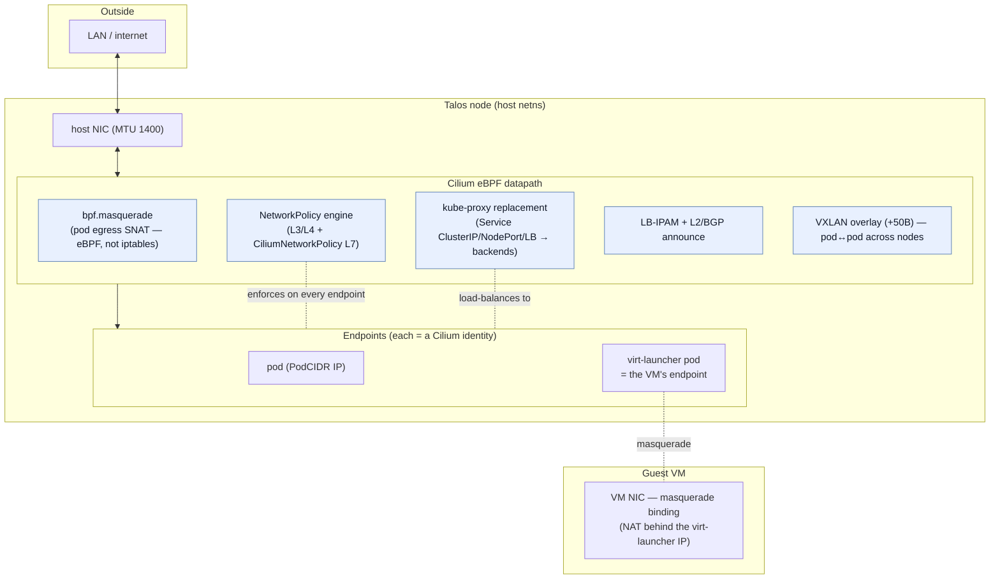
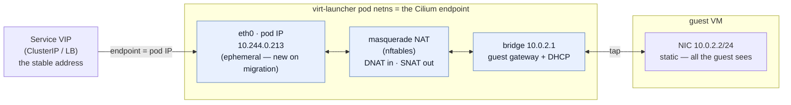
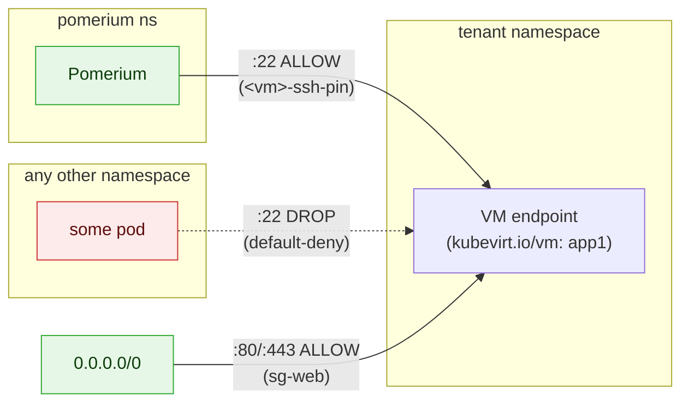

# Networking

Talu's network is **Cilium end to end** — one eBPF dataplane that replaces kube-proxy, enforces
policy, and hands out service/load-balancer IPs. There is no separate CNI, no MetalLB, no iptables
kube-proxy. This page covers the dataplane, what Cilium owns, how VM network security is expressed,
and the L2/L3, IPv4/IPv6, IPAM, and load-balancer stories. Component values live in
`components/infrastructure/cilium/` (base) and `environments/<env>/cilium-values.yaml` (overrides).

## The dataplane



## What Cilium is responsible for

| Concern | Cilium mechanism | Config |
|---|---|---|
| **Pod/VM connectivity (CNI)** | eBPF datapath; every pod/VM endpoint gets a Cilium *identity* | `cni.name: none` (Talos) → Cilium owns it |
| **Service load-balancing** | **kube-proxy replacement** in eBPF (ClusterIP, NodePort, LoadBalancer) — no iptables/IPVS | `kubeProxyReplacement: true`, `k8sServiceHost: localhost:7445` (KubePrism) |
| **Pod egress (SNAT)** | **`bpf.masquerade`** — eBPF masquerade (the host is nftables-only, so iptables masquerade silently no-ops → pods would get zero egress) | `bpf.masquerade: true` |
| **Network policy** | `NetworkPolicy` (L3/L4) **and `CiliumNetworkPolicy`** (identity-based L3/L4, CIDR, FQDN, L7) | per-namespace CNPs |
| **LoadBalancer IPs** | **LB-IPAM** — assigns IPs from a `CiliumLoadBalancerIPPool` (no MetalLB) | `l2announcements: true`, `externalIPs: true` |
| **Advertising those IPs** | **L2 announcements** (ARP/NDP on the local segment) or **BGP** (v2 API) | L2 for flat LANs; BGP for routed fabrics |
| **Cross-node pod traffic** | **VXLAN overlay** (tunnel mode) — or native routing where the fabric can route PodCIDRs | `routingMode: tunnel` (lab); MTU 1300 leaves room for the +50B encap under the host's 1400 |
| **Observability** | **Hubble** — the flow-level allow/deny record (the security-acceptance narrative) | `hubble.{relay,ui}.enabled` |
| **Node-to-node encryption** | WireGuard (transparent) | off on the single-node lab; on in `example` |

## VM networking — the key subtlety

A KubeVirt VM does **not** get its own Cilium endpoint directly. With the default [**masquerade
binding**](https://kubevirt.io/user-guide/network/interfaces_and_networks/) (`interfaces: [{ masquerade: {} }]`,
`networks: [{ pod: {} }]`), the guest NIC is NAT'd behind its **virt-launcher pod**, and *that pod*
is the Cilium endpoint.

**How the pod IP maps to the VM** — a 1:1 NAT *inside the virt-launcher pod's network namespace*; the
guest never holds the pod IP. The pod's `eth0` carries the routable **pod IP** (the Cilium endpoint,
e.g. `10.244.0.213`). KubeVirt builds a small link-local subnet inside the pod: a bridge at `10.0.2.1`
(the guest's gateway) leases the guest **`10.0.2.2/24`** over an in-pod DHCP server (which also pushes
the pod's MTU and DNS, so the guest matches the pod network). nftables rules bridge the two —
**inbound** traffic to the pod IP is **DNAT'd** to `10.0.2.2` (so "reach the pod IP" *is* "reach the
VM"); **outbound** traffic from `10.0.2.2` is **SNAT'd** (masqueraded) to the pod IP, so it carries the
pod's Cilium identity and policy. By default all ports forward; a `ports:` list narrows it.



Consequences:

- The VM inherits the pod's PodCIDR IP, identity, egress, and MTU. Pod-network policy applies to the VM.
- A VM's stable label is `kubevirt.io/vm: <name>` **on the virt-launcher pod** — so every Service
  selector and every `CiliumNetworkPolicy.endpointSelector` targets the VM by matching that label.
- **Inside the guest the IP is static.** Masquerade always presents the VM the same private NIC
  address (KubeVirt's default `10.0.2.2/24`); it never changes — not on reboot, not on migration.
  What is routable in the cluster is the **virt-launcher pod IP** (the Cilium endpoint, e.g.
  `10.244.0.213`), a separate thing the guest never sees.
- **Live migration changes the pod IP — so address a VM via a Service, never the pod.** Migration
  doesn't relocate a pod; it spawns a *new* target virt-launcher pod on the destination node, copies
  the running guest's RAM into it, then tears down the old pod (and its IP). The new pod draws a fresh
  pod IP from Cilium IPAM. A `LoadBalancer`/ClusterIP Service selecting `kubevirt.io/vm: <name>` is
  repointed to the new pod automatically, so the **Service/LB IP is the stable address that survives
  the move** — the guest keeps running throughout; only connections pinned to the *old pod IP* reset
  at the brief cutover. This is why tenant "stable IPs" are a `LoadBalancer` Service (below), not the
  pod address.

(Tier-2 flavor, not on the lab: a **Multus secondary NIC** / bridge binding gives a VM a real L2
interface on a provider network — for workloads that need their own MAC/IP. The masquerade binding
is the tier-1 default.)

## VM network security — pinning + security groups

Two layers, both `CiliumNetworkPolicy`, both rendered per-VM by the tenant chart (see
[`../../components/tenancy/tenant-chart/`](../../components/tenancy/tenant-chart/)):



1. **Pinning (`<vm>-ssh-pin`)** — ingress to the VM's `:22` is allowed **only from the Pomerium
   namespace**. Since Cilium is default-deny once any ingress policy selects an endpoint, a pod in
   another namespace reaching the VM's `:22` is **DROPPED** (verified in Hubble). This is what makes
   "SSH only through Pomerium" non-bypassable — even a co-tenant workload can't reach the sshd directly.
2. **Security groups (`sg-<name>`)** — cloud-style allow-rules the tenant sets as values
   (`securityGroups: { web: { ingress: [...], egress: [...] } }`), rendered to `CiliumNetworkPolicy`
   with `fromCIDR`/`toCIDR`/`fromEndpoints` + port lists. This is how a VM opens `:80/:443` to the
   world, or restricts egress — managed declaratively through the tenant API, not by hand.

**Tenant isolation** falls out of the same model: distinct namespaces, distinct
`talu.io/project-uuid`, and the pinning policy means one tenant's pod cannot reach another tenant's
VM port (validated: a pod in tenant-B is DROPPED from tenant-A's VM `:22`).

## L2 vs L3 / routing modes

- **Pod-to-pod** uses **VXLAN tunnel mode** on the lab (encapsulate over the node network — works on
  any L3 substrate, at the cost of +50B MTU). On a fabric that can route PodCIDRs, Cilium **native
  routing** drops the encap (and the MTU tax).
- **LoadBalancer reachability** is where L2/L3 matters:
  - **L2 announcements** (`l2announcements: true`) — Cilium answers ARP/NDP for the LB IP on the
    node's local segment. Good for a flat LAN; the LB IP must be in the node's L2.
  - **BGP** (Cilium's BGP v2) — Cilium peers with the ToR/router and advertises LB IPs (and, if
    wanted, PodCIDRs) into a routed L3 fabric. This is the production path for the tier-1 stable IPs.
- **Lab caveat:** the no-KVM sandbox is a single NAT'd OpenStack VM with one NIC — there is **no L2
  segment or BGP peer to announce into**, so LB IPs are assigned but reachable only on-node. External
  access on the lab therefore uses **host `socat` → NodePort → Cilium**, and the public entry point is
  the **Pomerium routes** (see [`flows.md`](flows.md)). On real nodes, L2/BGP makes LB IPs first-class.

## IPv4 / IPv6

Cilium supports **single-stack v4, single-stack v6, or dual-stack** (`ipv4.enabled` / `ipv6.enabled`
+ dual-stack Services). The validated lab runs **IPv4-only** (the OpenStack tenancy is v4). Dual-stack
is a values change: enable both families, give pods/Services v4+v6, and Cilium's LB-IPAM/L2/BGP all
carry v6 (1.19 added IPv6 L2 neighbor-discovery announcements). No structural change — an environment
overlay decision, pinned at bootstrap (the IPAM/stack mode is immutable on a live cluster).

## IPAM

Two independent IP planes:

1. **Pod/VM IPAM** — where endpoint IPs come from. The lab uses **`ipam.mode: kubernetes`** (each node
   gets a PodCIDR from the cluster, Cilium allocates within it). For per-tenant address control,
   Cilium **multi-pool IPAM** (GA in 1.19) lets different namespaces draw from different pod pools —
   the substrate for stronger tenant IP separation. **Pick the IPAM mode at bootstrap; it is immutable
   on a live cluster.**
2. **LoadBalancer IPAM (LB-IPAM)** — where **Service** external IPs come from: a
   **`CiliumLoadBalancerIPPool`** hands addresses to `type: LoadBalancer` Services. Pools are scoped
   by a `serviceSelector` (e.g. per-tenant on `talu.io/project-uuid`) so a tenant's Services draw only
   from that tenant's range.

### Tier-1 stable internal IPs (per tenant)

The tenant chart's `internalIpPool` value renders a per-tenant `CiliumLoadBalancerIPPool` selected by
`talu.io/project-uuid`. A VM's Service requests a specific address with `lbipam.cilium.io/ips`, and
**the IP belongs to the Service, so it survives live migration** (the pod IP changes; the LB IP does
not). Internal, non-announced range by default — routable reach needs L2/BGP (real nodes).

## Load balancing

- **East-west** (ClusterIP) and **NodePort**: served by the **kube-proxy replacement** in eBPF — no
  iptables chains, lower latency, and the datapath the whole cluster already runs on.
- **North-south** (`type: LoadBalancer`): **LB-IPAM** assigns the IP from a pool; **L2 announcements
  or BGP** make it reachable; eBPF load-balances it to the backend endpoints. On the nested lab the
  announce step is replaced by host `socat`/NodePort (no L2/BGP), so LB validation there is
  control-plane (IP assignment, Service→endpoint) rather than external routing.
- **No MetalLB, no cloud LB controller** — Cilium is the load-balancer.

## See also
- Component values: `components/infrastructure/cilium/values.yaml`, `environments/<env>/cilium-values.yaml`.
- The access-plane & tenant flows that ride this network: [`flows.md`](flows.md).
- Cilium gotchas validated the hard way (MTU-first, `bpf.masquerade`, LB-IPAM, `--reuse-values`
  upgrades): [`../development/lab-notes.md`](../development/lab-notes.md) (#1, #11, #24).

## Further reading (upstream)
- **Cilium** — [kube-proxy replacement](https://docs.cilium.io/en/stable/network/kubernetes/kubeproxy-free/) ·
  [masquerading](https://docs.cilium.io/en/stable/network/concepts/masquerading/) ·
  [LB-IPAM](https://docs.cilium.io/en/stable/network/lb-ipam/) ·
  [L2 announcements](https://docs.cilium.io/en/stable/network/l2-announcements/) ·
  [network policy](https://docs.cilium.io/en/stable/security/policy/) ·
  [Hubble](https://docs.cilium.io/en/stable/observability/hubble/)
- **KubeVirt** — [interfaces & networks (masquerade binding)](https://kubevirt.io/user-guide/network/interfaces_and_networks/) ·
  [live migration](https://kubevirt.io/user-guide/compute/live_migration/)
```
