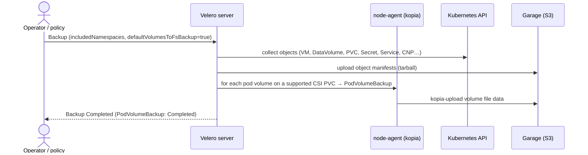
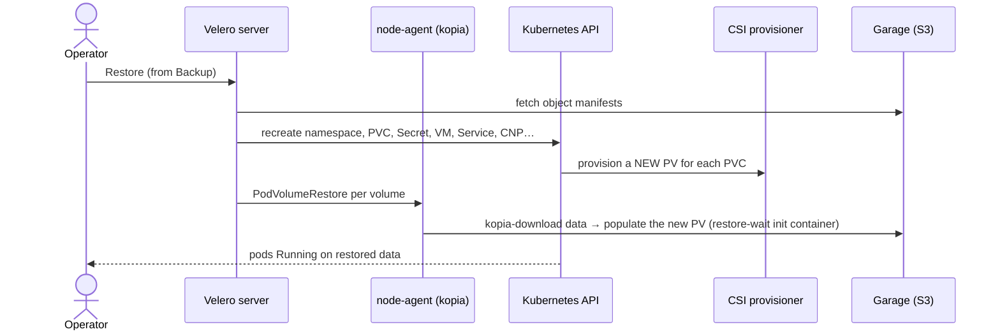

# Backup & restore

Three independent tiers, each protecting a different failure domain. **A backup you have not
restored is a hypothesis** — every flow below has been exercised end-to-end on the lab (see
[Validated](#validated-on-the-lab)), including a destroy-and-restore that recovered **disk data**,
not just Kubernetes objects.

| Tier | Tool | Protects against | Granularity | Off-cluster? |
|---|---|---|---|---|
| **1 · System** | `talosctl etcd snapshot` | control-plane loss (etcd corruption, node rebuild) | whole cluster state | yes (file you copy off) |
| **2 · Per-VM** | KubeVirt `VirtualMachineSnapshot` / `VirtualMachineRestore` | tenant mistake, bad in-guest change, rollback | one VM + its disks | no (lives in the cluster's storage) |
| **3 · Platform / DR** | Velero (+ node-agent file-system backup) → **Garage** S3 | namespace/cluster loss, site DR, migration | namespace → whole cluster, incl. volume data | yes (S3 bucket) |

Tiers are complementary: Tier 2 is a fast, storage-native undo that never leaves the cluster; Tier 3
is the one that survives losing the cluster. Use both.

> **Productization status.** Tier 1 and Tier 2 are built-in (Talos, KubeVirt). Tier 3 ships as
> **[`components/platform/backup/`](../../components/platform/backup/)** — Velero (chart `12.1.0` /
> app `v1.18.1`) + node-agent + Garage, with secrets kept out of Git. The *flows* below are
> lab-validated; the component's **HelmRelease wiring is not yet exercised on the lab** (which
> installed Velero directly, because helm-controller is flaky on the nested node) — that is the
> remaining gap.

---

## Tier 1 — System (Talos etcd snapshot)

The out-of-cluster survival kit: without etcd there is no cluster to restore *into*. Take snapshots on
a schedule and copy them **off the host**.

**Backup**

```sh
# from the operator host (talosconfig points at the control plane)
talosctl etcd snapshot /var/lib/talu/etcd-$(date +%F).snapshot
# then copy the file OFF the node — it is worthless if it burns with the host
```

**Restore** (into a scratch / rebuilt control-plane node): bootstrap from the snapshot rather than
forming a fresh cluster —

```sh
talosctl bootstrap --recover-from=/var/lib/talu/etcd-YYYY-MM-DD.snapshot
```

Upstream: [Talos — Disaster Recovery](https://www.talos.dev/v1.11/advanced/disaster-recovery/)
(etcd snapshot & recover).

---

## Tier 2 — Per-VM (KubeVirt VirtualMachineSnapshot)

Storage-native, application-consistent point-in-time copy of a single VM. If the qemu-guest-agent is
installed (the Talu golden images bake it in), KubeVirt **freezes/thaws** the guest filesystem around
the snapshot for consistency. Requires a CSI storage class with a `VolumeSnapshotClass` — on Talu that
is **CephFS** (`cephfs-snapclass`); see gotcha [#14/#15](../development/lab-notes.md) for why RBD does
not work on the nested lab.

**Backup**

```yaml
apiVersion: snapshot.kubevirt.io/v1beta1
kind: VirtualMachineSnapshot
metadata: { name: app1-snap-1, namespace: tenant-acme }
spec:
  source: { apiGroup: kubevirt.io, kind: VirtualMachine, name: app1 }
```

Watch `.status.phase → Succeeded` and `.status.readyToUse: true`.

**Restore** (rolls the VM's disks back to the snapshot — stop the VM first):

```yaml
apiVersion: snapshot.kubevirt.io/v1beta1
kind: VirtualMachineRestore
metadata: { name: app1-restore-1, namespace: tenant-acme }
spec:
  target: { apiGroup: kubevirt.io, kind: VirtualMachine, name: app1 }
  virtualMachineSnapshotName: app1-snap-1
```

Upstream: [KubeVirt — Snapshot & Restore API](https://kubevirt.io/user-guide/storage/snapshot_restore_api/).

---

## Tier 3 — Platform / DR (Velero + file-system backup)

The tier that survives losing the cluster: Velero backs up the **Kubernetes objects** to an S3 bucket
and, via the **node-agent** (kopia), backs up **volume file data** too. The `kubevirt-velero-plugin`
teaches Velero the VM↔VMI↔DataVolume↔PVC ownership graph so a VM restores as a coherent unit.

Deployed on the lab: `velero v1.18.1`, `velero-plugin-for-aws v1.11.1`,
`kubevirt-velero-plugin v0.7.1`, node-agent DaemonSet, and **Garage** at
`http://garage.garage.svc:3900` (bucket `velero`).

### Why Garage and not MinIO

Talu used MinIO here originally and migrated. MinIO's community edition is **no longer an open-source
option**: the admin console was removed from Community Edition (May 2025), the community docs were
pulled (Oct 2025), and the `minio/minio` repository was **archived and made read-only in 2026** — no
CVE stream, no binaries, no docs. For a *backup* tier, which must stay restorable for years, standing
on an abandoned upstream is the wrong trade.

[**Garage**](https://garagehq.deuxfleurs.fr/) (Deuxfleurs, AGPLv3) is the closest actively-maintained
like-for-like: Rust, ~50 MB binary, one TOML file, and a CPU/memory footprint roughly **3–6× smaller**
than MinIO — which matters directly on constrained nodes (this lab trips `disk-pressure` and has a
standing pids-limit gotcha, [#25](../development/lab-notes.md)). It is geo-distributed by design with
no consensus leader, which suits Tier 3's actual job. It works with the **stock
`velero-plugin-for-aws`, unmodified**, and kopia works against it out of the box.

**What you give up — read before adopting:**

| | Garage | Note |
|---|---|---|
| Multipart upload, ListObjectsV2, presigned URLs | ✅ | everything Velero + kopia need |
| Bucket versioning | ❌ | not required by Velero |
| ACLs / bucket policies | ❌ | Garage uses its own key-permission model |
| Server-side encryption | ❌ | kopia encrypts fs-backup data client-side; object *manifests* are not encrypted — rely on disk encryption |
| **S3 Object Lock / retention / legal hold** | ❌ | **the real regression** — see below |

⚠️ **No Object Lock means no WORM immutability.** MinIO supported it; Garage does not
([S3 compatibility table](https://garagehq.deuxfleurs.fr/documentation/reference-manual/s3-compatibility/)).
Anyone holding the Velero credentials can delete the backups, so this is *not* a
ransomware-resistant target on its own. Mitigate with a tightly-scoped Garage key, an offsite copy, or
a second target that does support locking.

> **Don't put backups on Ceph RGW.** The tempting shortcut is "Talu already runs Ceph, and RGW even
> has Object Lock." Avoid it **for this tier**: backing a cluster up to the same storage it depends on
> is a correlated-failure anti-pattern — a Ceph outage takes the backups with it (see
> [lab-notes #26](../development/lab-notes.md) for exactly such an outage). RGW is the right answer for
> *tenant-facing* object storage, not for Tier 3. Likewise, in production run Garage **outside** the
> cluster it protects; the in-cluster deployment below is a lab convenience.

### Deploying Garage

Config (`garage.toml`) for a single node — `replication_factor = 1`; use 3 with three nodes:

```toml
metadata_dir = "/var/lib/garage/meta"
data_dir     = "/var/lib/garage/data"
db_engine    = "sqlite"
replication_factor = 1

rpc_bind_addr   = "[::]:3901"
rpc_public_addr = "127.0.0.1:3901"
rpc_secret      = "<openssl rand -hex 32>"

[s3_api]
s3_region     = "garage"
api_bind_addr = "[::]:3900"
root_domain   = ".s3.garage.localhost"

[admin]
api_bind_addr = "[::]:3903"
admin_token   = "<openssl rand -base64 32>"
```

Run `dxflrs/garage:v2.3.0` with that file at `/etc/garage.toml`, a PVC at `/var/lib/garage`, and a
Service exposing **3900** (S3) and **3903** (admin).

**Garage will not store anything until a cluster layout is applied** — the step that is easy to miss:

```sh
garage status                                   # note the node ID
garage layout assign -z dc1 -c 6G <NODE_ID>     # zone + capacity
garage layout apply --version 1                 # <-- required, or the node has "NO ROLE ASSIGNED"
garage bucket create velero
garage key create velero-key                    # prints Key ID + Secret key
garage bucket allow --read --write --owner velero --key velero-key
```

### Pointing Velero at Garage

```sh
# credentials file, AWS format
cat > /tmp/creds <<'EOF'
[default]
aws_access_key_id=<Key ID>
aws_secret_access_key=<Secret key>
EOF
kubectl -n velero create secret generic velero --from-file=cloud=/tmp/creds \
  --dry-run=client -o yaml | kubectl apply -f -
```

> **Gotcha:** the Velero Deployment mounts a *volume* named `cloud-credentials` that is backed by a
> **Secret named `velero`**. Creating a secret literally called `cloud-credentials` silently changes
> nothing and the BSL keeps failing with the old key
> (`AccessDenied: Forbidden: No such key: minio`). Check
> `kubectl -n velero get deploy velero -o jsonpath='{.spec.template.spec.volumes[*].secret.secretName}'`.

```sh
kubectl -n velero patch backupstoragelocation default --type=merge -p '{
  "spec":{"objectStorage":{"bucket":"velero"},
  "config":{"region":"garage","s3Url":"http://garage.garage.svc:3900","s3ForcePathStyle":"true"}}}'

# when MIGRATING backends, drop the kopia repo bound to the old bucket, else fs-backup reuses it:
kubectl -n velero delete backuprepository --all
kubectl -n velero rollout restart deploy/velero ds/node-agent
kubectl -n velero get bsl default        # PHASE must reach Available
```

### Backup flow



```sh
# object + file-system data backup of one tenant namespace
velero backup create tenant-acme-$(date +%F) \
  --include-namespaces tenant-acme \
  --default-volumes-to-fs-backup \
  --snapshot-volumes=false
```

Or declaratively (a scheduled policy is a `Schedule` with the same `spec.template`):

```yaml
apiVersion: velero.io/v1
kind: Backup
metadata: { name: tenant-acme, namespace: velero }
spec:
  includedNamespaces: [tenant-acme]
  defaultVolumesToFsBackup: true   # kopia file-level backup of volume data
  snapshotVolumes: false
  ttl: 720h0m0s
```

Confirm the **data** was captured, not just the manifests — there must be a `PodVolumeBackup` per
volume:

```sh
kubectl -n velero get podvolumebackup -l velero.io/backup-name=tenant-acme
# NAME ... STATUS=Completed  BYTES  (bytesDone>0)
```

> ⚠️ **Volume-type gotcha (cost real time — see [lab-notes #27](../development/lab-notes.md)).**
> Velero file-system backup **silently skips `hostPath` volumes** — the backup reports
> `Completed (warnings=1)` but creates **zero** `PodVolumeBackup`s and your data is **not** backed up.
> Talu's default storage class is `local-path`, whose PVs are **hostPath-backed**, so they are skipped.
> Back VM/tenant data with a **CSI filesystem** class (**CephFS** on Talu) for file-system backup to
> work, or use Tier 2 snapshots. This is by design, not a Talu bug —
> [Velero: File System Backup](https://velero.io/docs/main/file-system-backup/) ("hostPath volumes are
> not supported"), [velero#8251 — Local Path Provisioner and Velero](https://github.com/velero-io/velero/issues/8251),
> [velero#7441](https://github.com/vmware-tanzu/velero/issues/7441).

### Restore flow



```sh
velero restore create tenant-acme-restore --from-backup tenant-acme-2026-07-19
```

Or declaratively:

```yaml
apiVersion: velero.io/v1
kind: Restore
metadata: { name: tenant-acme-restore, namespace: velero }
spec:
  backupName: tenant-acme
  includedNamespaces: [tenant-acme]
  existingResourcePolicy: none
```

Verify the round-trip actually restored **data**:

```sh
kubectl -n velero get podvolumerestore -l velero.io/restore-name=tenant-acme-restore   # Completed
kubectl -n tenant-acme exec <pod> -- cat /path/to/known/file                            # data present
```

Upstream: [Velero docs](https://velero.io/docs/main/),
[kubevirt-velero-plugin](https://github.com/kubevirt/kubevirt-velero-plugin).

### node-agent prerequisite (Talos PSA)

The node-agent DaemonSet mounts host paths (`/var/lib/kubelet/pods`, `…/plugins`). Talos enforces Pod
Security **`baseline`** cluster-wide, which forbids hostPath — so the DaemonSet schedules **0 pods**
until the namespace is labelled privileged (gotcha [#5](../development/lab-notes.md)):

```sh
kubectl label ns velero pod-security.kubernetes.io/enforce=privileged --overwrite
```

---

## Monitoring backups (sizes, freshness, dashboards)

Backups are scraped like everything else: a **Backup & DR** Perses dashboard (operator, via Pomerium)
on top of `talu:backup_*` recording rules. ServiceMonitors live in the backup component (Velero
`:8085`, Garage `:3903`); the rules, KSM config and dashboard live in
[`components/platform/monitoring/`](../../components/platform/monitoring/).

### ⚠️ Velero's own size metric is not the size of your backup

`velero_backup_tarball_size_bytes` measures the **Kubernetes object manifest tarball only** — it does
**not** include the volume data the node-agent (kopia) uploads, which on any real tenant is
essentially the whole backup. Measured on the lab: a backup whose actual payload was **524,288 B**
reported `tarball_size_bytes = 10,050` — a **~52× understatement**. It is also labelled **only by
`schedule`**, so it carries no per-namespace attribution whatsoever.

Two consequences for how you operate:

1. **Back up via a `Schedule` per tenant.** The `schedule` label is the only dimension Velero's own
   metrics expose, so `schedule: <tenant>` is what makes freshness and outcome metrics
   attributable. Ad-hoc backups all collapse into `schedule=""`.
2. **True size comes from `PodVolumeBackup`**, surfaced through a kube-state-metrics
   **CustomResourceState** config ([`ksm-velero-crs.yaml`](../../components/platform/monitoring/ksm-velero-crs.yaml)).
   `spec.pod.namespace` carries the tenant — note the PVB object itself lives in the `velero`
   namespace, so `metadata.namespace` is the wrong field to attribute on.

### The series

| Series | Meaning |
|---|---|
| `talu:backup_volume_bytes:by_tenant` | **the real backup size** — kopia volume data per tenant |
| `talu:backup_volume_bytes:by_backup` | same, broken out per backup (which one grew?) |
| `talu:backup_tarball_bytes:by_schedule` | object manifests only — small, see warning above |
| `talu:backup_last_success_age_seconds` | **the number that matters most** — staleness per schedule |
| `talu:backup_{successes,failures,partial_failures}:increase24h` | outcomes |
| `talu:restore_{successes,failures}:increase24h` | restore drills |
| `talu:backup_store_disk_{used_bytes,avail_bytes,avail_ratio}` | capacity runway of the **disk hosting Garage** — *not* backup bytes (see below) |

> **`garage_local_disk_*` measures the filesystem, not your backups.** On the lab it reported
> ~105.6 GB total / 81.9 GB used — the entire host disk (Ceph OSD images and all), matching `df`.
> It answers "will backups run out of room?", not "how big are my backups?". It only approximates the
> backup footprint when Garage owns a **dedicated disk**, which is the recommended production layout.

### Alerts

Shipped in [`backup-rules.yaml`](../../components/platform/monitoring/backup-rules.yaml):
`TaluBackupStale` (>48 h without a successful backup — a schedule that silently stopped is the
classic failure), `TaluBackupFailing`, `TaluBackupHasWarnings` (Velero reports a **skipped** volume as
a warning, which is how the hostPath trap shows up), `TaluBackupStoreNearFull`, and
`TaluBackupStoreUnhealthy`.

> Alertmanager is **disabled** in this stack, so these evaluate into Prometheus `/alerts` and the
> dashboards only. Wire an Alertmanager (or route to the orchestrator) before relying on them to page.

---

## Validated on the lab

Real results from the rocky-sandbox lab (see [lab-notes.md](../development/lab-notes.md)):

- **Tier 1** — `talosctl etcd snapshot` produced a portable snapshot file. ✓
- **Tier 2** — `VirtualMachineSnapshot` reached `readyToUse` on a CephFS-backed VM disk. ✓
  **Not yet proven: the Tier 2 `VirtualMachineRestore`** — it stalled on the nested lab, where a
  CephFS clone-from-snapshot times out (`DeadlineExceeded`) on MicroCeph's loop-backed OSDs. The
  snapshot side is validated; treat the restore side as **unverified until exercised on real disks**.
- **Tier 3, objects** — backed up a tenant namespace (36 items), **deleted the namespace**, restored;
  the VM and all objects came back. ✓
- **Tier 3, volume data (the full destroy-and-restore proof)** — wrote a marker to a **CephFS** PVC →
  `PodVolumeBackup Completed (kopia, 19 bytes)` → **destroyed the whole namespace** (pod + PVC + PV +
  cephfs subvolume) → restored → `PodVolumeRestore Completed` recreated the pod on a **brand-new PV**
  and the marker survived **byte-for-byte**. ✓ The earlier attempt on a `local-path` PVC produced no
  `PodVolumeBackup` — the hostPath gotcha above.
- **Tier 3 on Garage (the migration re-proof)** — the same destroy-and-restore was re-run end-to-end
  against **Garage v2.3.0** after repointing the BSL: `BackupStorageLocation … Available` → backup
  `Completed` with `PodVolumeBackup Completed (kopia, 18 bytes)` → `garage bucket info velero` showed
  the data physically present (**21 objects / 43 kB**) → **namespace destroyed** → restore `Completed`
  with `PodVolumeRestore Completed`, pod rescheduled onto a **new PV**, marker recovered byte-for-byte.
  ✓ Stock `velero-plugin-for-aws`, **no Velero changes** — MinIO was then removed from the lab and the
  BSL stayed `Available`.
- **Backup monitoring** — both scrape targets `up` (`job="velero"`, `job="garage"`); the KSM
  CustomResourceState emits `talu_velero_pvb_bytes{tenant_namespace="bkdemo"} = 524288` (the real
  volume payload, correctly attributed to the tenant) against
  `velero_backup_tarball_size_bytes{schedule="bkdemo"} = 10050` for the same backup — the ~52×
  discrepancy that motivates the CRS config. All `talu:backup_*` rules and all five alerts report
  `health: ok` with no evaluation errors, and the Backup & DR dashboard syncs
  (`Available=True, Degraded=False`). ✓

## Recovering the substrate itself

If the storage or control plane is unhealthy (not just a tenant), these are lab-substrate runbooks, not
Talu backups:

- **Full/crashed MicroCeph OSDs** (CephFS provisioning hangs `DeadlineExceeded`, `HEALTH_ERR N full
  osd(s)`): the OSDs abort on boot (`bluefs enospc`). Non-destructive fix — grow the backing file +
  `ceph-bluestore-tool bluefs-bdev-expand` (+ `repair`). Full procedure and upstream refs:
  [lab-notes #26](../development/lab-notes.md).
- **Host lockout / etcd loss:** see the [operations README](README.md) and Tier 1 above.
