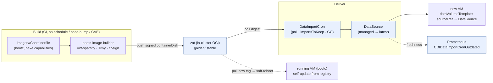

# Image build & patch automation — options and a plan

*Analysis / decision doc. Goal: golden-image creation, cataloguing, and **patching as automatic as
possible** — for both new and already-running VMs.*

## Decisions (locked)

1. **Build = bootc image mode.** One signed containerDisk serves both new-VM provisioning *and*
   running-VM self-update.
2. **Running VMs = bootc self-update** from the registry channel — atomic stage→(soft-)reboot→activate,
   rollback; `download-only` + maintenance window for controlled apply.
3. **New-VM root disk = persistent `DataVolume` via `sourceRef`→`DataSource` (default).** This is *forced*
   by decision 2: bootc self-update writes the new image to disk and must survive reboot, so the disk has
   to be persistent — an ephemeral `containerDisk` would drop the update. `containerDisk` stays an opt-in
   for stateless/cattle VMs (patched by re-roll, not self-update).
4. **Stand up zot in-cluster** as the golden-image registry + `DataImportCron` source.
5. **Gates are togglable** (cosign-verify + Trivy scan = values flags, warn/off by default), and **image
   freshness/version is exposed to Prometheus** (`CDIDataImportCronOutdated` + `DataImportCron`/`DataSource`
   status) and surfaced on the operator dashboard.
6. **Catalog = minimal, upstream base.** Start with **one** image built from an **upstream bootc base**
   (e.g. `quay.io/fedora/fedora-bootc` or CentOS Stream bootc — OpenSSH guests, so Pomerium cert-auth works)
   with minimal bake; expand later. Channels `testing`→`stable`.

> **Lab-feasibility note — the build needs privileged + loop, NOT KVM.** `bootc-image-builder` produces a
> QCOW2/containerDisk with `--privileged` (loopback) alone; `/dev/kvm` is only required for *rootless* builds
> and for *boot-testing* the result. So a **rootful `sudo podman run --privileged`** build runs on the **Rocky
> host** (podman + loop devices already present — the Ceph loop-OSDs prove loopback works), **without nested
> virt** — just slower than KVM-accelerated. The build runs on the host, *not* inside the nested Talos cluster.
> The imported containerDisk then boots under KubeVirt TCG like every other lab VM. Net: the whole chain —
> build → zot → `DataImportCron` → `DataSource` → VM `sourceRef` → freshness monitoring — is lab-validatable.

## 1. Where Talu stands

The **design intent is right and already written down; almost nothing is built.**

- `images/` is scaffolding: a **bootc-shaped** stub `Containerfile` (all TODO), empty `scripts/`+`apt-repo/`.
  `images/README.md` already states the target flow: *"CI runs `virt-sparsify` + `cosign` and pushes a
  containerDisk to zot; a `DataImportCron` imports on digest change and rolls the DataSource pointer."*
- **CDI** component = empty skeleton; **no `DataImportCron`/`DataSource`** anywhere. `zot` (the intended
  in-cluster golden-image registry) = empty skeleton, not deployed. `ci/` = a README, no pipelines.
- **VMs boot a raw upstream `containerDisk`** (`quay.io/containerdisks/ubuntu:24.04`) — the tenant chart
  has no `DataVolume`/`DataSource`, so **there is no update path**: a VM is pinned to whatever tag it named.
- `cosign` is installed on the host but wired to nothing. No `renovate`/`packer`/`image-builder`/
  `dnf-automatic`/scanning. The design invariant is **"bake capabilities, inject identity"** (golden images
  carry software; per-tenant identity/secrets arrive at boot via cloud-init).
- (`components/platform/upgrades/` = tuppr for **Talos/K8s node** upgrades — not VM images.)

## 2. The problem has two halves

| Half | Question |
|---|---|
| **A. Build / rebuild** | how a golden image is produced, and re-produced when a patch/CVE/base update lands |
| **B. Deliver the update** | (b1) to **new** VMs, and (b2) to **already-running** VMs — the hard, "make it automatic" part |

## 3. How similar solutions solve it

**Maintained upstream images (the free base cadence).** [kubevirt/containerdisks](https://github.com/kubevirt/containerdisks)
auto-rebuilds Ubuntu/Fedora/Debian/CentOS cloud images at `quay.io/containerdisks/*` when upstream releases.
Talu already consumes these — so the *base* OS already gets patched upstream; the question is your *own* bake
on top, and how running VMs pick changes up.

**Build custom golden images — two schools:**
- **Packer / image-builder** — the classic "golden image": provision a VM, snapshot it, publish. CI rebuilds on
  a schedule / on CVEs, scans, signs, promotes ([Red Hat: automate golden images for OpenShift with Packer](https://developers.redhat.com/articles/2025/11/07/automate-vm-golden-image-builds-openshift-packer)).
  Produces an image; **says nothing about patching running VMs** (you re-roll).
- **bootc / image mode** ([CNCF Sandbox, Jan 2025](https://developers.redhat.com/blog/2025/07/23/shape-future-linux-contribute-bootc-open-source-project)) —
  the **OS *is* an OCI container** (kernel+bootloader+userspace). Build once with `bootc-image-builder`
  (→ qcow2/containerDisk); **running systems auto-update from the registry**: pull new tag → stage →
  (soft-)reboot → activate, with one-command **rollback**, and `download-only` for maintenance windows.
  This is the same `docker build` muscle for the OS, and it answers b2 directly.

**Deliver updates to new VMs — the KubeVirt-native primitive: [CDI `DataImportCron`](https://github.com/kubevirt/containerized-data-importer/blob/main/doc/os-image-poll-and-update.md).**
It polls a registry containerDisk on a `schedule`, imports each new version into a golden-image PVC, and points a
**`managedDataSource`** (a stable name) at the newest; `importsToKeep` retains N for rollback, `garbageCollect:
Outdated` prunes. VMs use a `dataVolumeTemplate` with **`sourceRef: {kind: DataSource, name: …}`** → every new VM
clones the latest patched image with **zero spec change**. (This is exactly how OpenShift Virtualization ships its
gold images.)

```yaml
# DataImportCron (poll → import → roll the DataSource)          # VM disk (always the latest)
apiVersion: cdi.kubevirt.io/v1beta1                             dataVolumeTemplates:
kind: DataImportCron                                              - metadata: { name: root }
spec:                                                                spec:
  schedule: "30 1 * * *"                                                sourceRef:
  managedDataSource: ubuntu-lts                                          kind: DataSource
  importsToKeep: 3                                                        name: ubuntu-lts     # ← managed
  garbageCollect: Outdated                                              storage: { resources: { requests: { storage: 10Gi } } }
  template: { spec: { source: { registry: {
    url: "docker://zot.talu.svc/golden/ubuntu-lts:stable" } } } }
```

**Patch running VMs — three philosophies:**
- **Cattle / golden-image roll** — don't patch in place; recreate VMs from the rolled `DataSource` (rolling,
  drain-aware). Fully automatic **if** VMs are stateless/reprovisionable.
- **bootc self-update** — long-lived/stateful VMs update themselves in place from the registry, atomically,
  with rollback. The most "automatic" answer for pets.
- **In-guest** `unattended-upgrades`/`dnf-automatic` — simple, but drift-prone, no atomic rollback, not
  image-based. Fallback only.

**Trust & freshness (everyone, increasingly):** sign with **cosign** + verify at admission; **scan** (Trivy/Grype)
as a gate; **promote** through channels (`testing`→`stable`); and alert on staleness — CDI ships a
**`CDIDataImportCronOutdated`** metric, which drops straight into the monitoring stack we just built.

## 4. Recommended architecture for Talu

Talu is already pointed the right way (bootc-shaped Containerfile, CDI+zot+cosign in the plan, the
bake-capabilities invariant, GitOps, and a Prometheus that can watch freshness). Fill it in as five layers:

1. **Base = upstream containerdisks.** Keep `quay.io/containerdisks/*` for generic OSes — free, auto-maintained
   base patching. Pin by digest, let CI bump it (below).
2. **Build = bootc image mode** (the Containerfile is already "bootc-shaped"). One artifact serves both new-VM
   provisioning *and* running-VM self-update — it's the lever that makes b2 automatic. `images/<os>/Containerfile`
   bakes capabilities (qemu-guest-agent, cloud-init, serial console, platform CA, `TrustedUserCAKeys`), never
   identity. `bootc-image-builder` also emits a containerDisk for the CDI path.
3. **CI pipeline** (fill `ci/`): **trigger** = schedule (nightly/weekly) **+** base-image digest change
   (renovate/`podman auto-update`-style watch) **+** manual/CVE. **Steps** = build → `virt-sparsify` → **Trivy
   scan (gate)** → **cosign sign** → push containerDisk to the in-cluster **zot** under a channel tag
   (`:testing`, promote to `:stable`). Golden images are versioned, signed, tested artifacts.
4. **Deliver to new VMs = CDI `DataImportCron` per catalog image** (fill `components/infrastructure/cdi/` +
   an `images/catalog/`). Each poll → `managedDataSource` (`ubuntu-lts`, `fedora`, …) with `importsToKeep: 3`.
   **Change the tenant chart**: VM root disk becomes a `dataVolumeTemplate` with `sourceRef → DataSource`
   (opt-in `image.source: dataSource|containerDisk`, default containerDisk for ephemeral). The **set of
   DataSources is the Talu image catalog** — stable names, GitOps-declared, versioned, rollback-able.
5. **Patch running VMs** — pick per workload (a tenant-chart/values choice):
   - **bootc self-update** (recommended default for long-lived VMs): the guest tracks the registry channel and
     auto-applies on a schedule/maintenance window (`download-only` + soft-reboot) — atomic, rollback-able.
   - **cattle roll** (stateless): a small controller/orchestrator recreates VMs when the `DataSource` rolls.
   - **in-guest unattended-upgrades** (fallback for non-bootc images).
6. **Trust & freshness**: cosign-verify at admission (Kyverno/KubeVirt policy), Trivy gate in CI, channel
   promotion, and wire **`CDIDataImportCronOutdated`** into the Phase-1 Prometheus (an image-freshness panel +
   alert on the operator dashboard).



## 5. Why this fits Talu
- **bake capabilities, inject identity** stays exactly as-is — bootc bakes software; cloud-init still injects
  identity/secrets at boot. Golden images stay generic.
- **GitOps**: DataImportCrons + the image catalog + channel pointers are declarative objects under
  `components/`/`environments/` — the same clone-and-adjust model.
- **Reuses what's already chosen**: zot (registry), cosign (already on the host), CDI (in the stack), and the
  Phase-1 Prometheus (freshness alerting). Nothing new-in-kind to operate.
- **"As automatic as possible"** is answered on both axes: **new VMs** patch via `DataImportCron`+`sourceRef`
  (zero spec change), **running VMs** patch via **bootc** self-update (atomic, rollback) — the registry tag is
  the single control point.

## 6. Decisions to make
1. **Build tool** — **bootc/image-mode** (recommended: unifies build + running-VM auto-update; Containerfile is
   already bootc-shaped) vs Packer/image-builder (classic; needs a separate running-VM patch story) vs
   *consume-upstream-only* (no custom bake).
2. **Running-VM patch model** — bootc self-update (default for pets) vs cattle-roll (stateless) vs in-guest
   (fallback). Likely a per-workload mix, expressed in tenant values.
3. **New-VM disk** — move the chart to `DataSource`/`sourceRef` (persistent, patchable) as the default, or keep
   `containerDisk` default and make DataSource opt-in?
4. **Registry** — stand up **zot** in-cluster as the golden-image home + DataImportCron source (recommended).
5. **Gates** — Trivy scan + cosign verify at admission: enforce, or warn-only to start?
6. **Catalog scope** — which OSes ship as Talu golden images (Ubuntu LTS first?), and the channel scheme
   (`testing`→`stable`).

## 7. Phasing
1. **Build + registry + delivery + freshness — ✅ BUILT & validated on the lab (no KVM):** built a real
   **`images/centos-bootc`** containerDisk **on the lab host** (`sudo podman --privileged` bootc-image-builder,
   no `/dev/kvm` — loopback only); deployed **zot** (`components/infrastructure/zot/`, ingests via skopeo);
   **`DataImportCron`→`managedDataSource`** for both upstream `ubuntu` and the self-built `centos-bootc`
   (`components/infrastructure/cdi/catalog.yaml`, with cross-namespace clone RBAC); tenant chart gains
   `source: dataSource` (root = `dataVolumeTemplate sourceRef → DataSource`, the new default) + `containerDisk`
   opt-in; `kubevirt_cdi_dataimportcron_outdated` → `talu:image_outdated` recording rule + a "Golden-image
   freshness" panel on the operator Perses dashboard. **Proven:** VMs boot cloned from a DataSource
   (same- and cross-namespace), and the self-built bootc image boots end-to-end.
2. **CI-ify the build — ✅ BUILT (both models):** `ci/image-build.sh` (forge-agnostic core:
   build→scan→publish→sign, gates togglable) + GitHub Actions (`ci/github/`) and GitLab CI (`ci/gitlab/`)
   wrappers (schedule + base-change + manual/CVE triggers), **plus** an in-cluster privileged build CronJob
   (`components/infrastructure/image-builds/`). Validated: the **cosign SIGN gate** (signed the zot image,
   `cosign verify` passed); the in-cluster Job harness runs (privileged pod + git clone). Not lab-validatable:
   the forge runners (no forge) and the bootc *build inside the nested pod* (loop-in-nested; runs on a real
   node — the host build already proved the no-KVM build itself). Trivy gate wired (installed in CI).
3. **Running-VM auto-update:** bootc self-update on the golden image (channel + maintenance window,
   `download-only`); validate an in-place atomic update + rollback. cattle-roll option for stateless VMs.
4. **Trust/promotion:** flip on cosign-verify admission + Trivy gate; CVE/base-digest-triggered rebuild.
