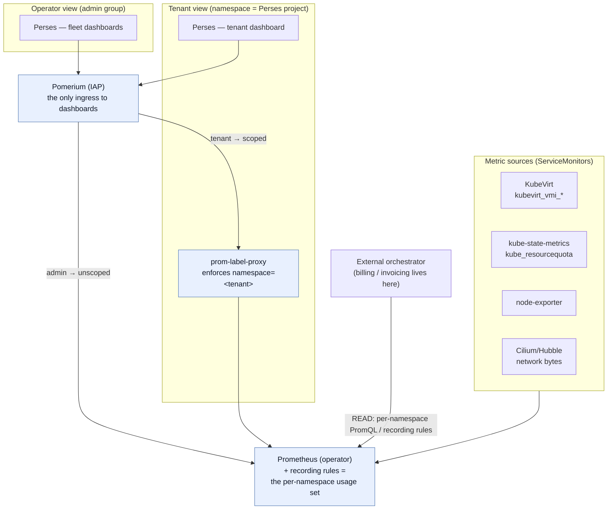

# Monitoring & Accounting — options and a plan

*Analysis / decision doc. Nothing here is wired yet; this is to choose a direction.*

## Decisions (locked)

1. **Visualization = Perses**, and **all dashboards (operator + tenant) sit behind Pomerium** — the
   access plane is the only ingress, same as every other Talu UI. No public dashboard endpoint.
2. **Per-tenant isolation label = `namespace`** (== tenant `slug`; ubiquitous on every metric).
3. **Accounting scope = usage recording rules + component-level collection only. No OpenCost. Billing
   is external** — Talu emits the per-namespace usage PromQL/recording rules; the orchestrator reads
   them (§ READ verb) and does the €-conversion/invoicing. This keeps Talu orchestrator-agnostic.
4. **ResourceQuota becomes a chart default** (was opt-in) — always-present metering envelope.
5. **Single Prometheus now**; Thanos/Mimir remain the documented scale path (multi-cluster / retention).

The sections below keep the full option analysis for the record; the recommendations now match the
decisions above.

## 1. Where Talu stands today

The contract is **specified but not built**:

- `components/platform/monitoring/` is an **empty kustomize skeleton** (`resources: []`). Its README already
  states the intent: *"Prometheus + recording rules for the per-namespace billing PromQL set (the metrics
  half of the integration API)."*
- The **§ integration contract, verb 3** (`docs/integrations/README.md`): *"Read the Prometheus HTTP API for
  usage — the per-namespace PromQL set (**the same queries that render tenant dashboards are what you
  invoice**)."* → a hard design principle: **one PromQL set powers both tenant dashboards and billing.**
- **Tenant model** (the scoping key): every object carries `talu.io/project-uuid` (join key) + `talu.io/slug`
  (= the namespace name); namespace-per-tenant; per-VM `kubevirt.io/vm` / `talu.io/vm`. KubeVirt VMI metrics
  and kube-state-metrics both carry `namespace`, so **`namespace` (== slug) is the universal scoping label.**
- **ResourceQuota** is rendered per tenant but **optional and off by default** — the only accounting envelope,
  and today it's usually absent.
- **Latent metric sources, nothing scraped:** KubeVirt (`kubevirt_vmi_*`), CDI, and Cilium/Hubble are all
  deployed but no ServiceMonitors / Prometheus / kube-state-metrics / node-exporter exist. Hubble is enabled
  for *flow visibility* only (metrics endpoint not turned on).
- **Packaging convention to follow:** Flux `HelmRelease` wrapped in a kustomize dir with a `configMapGenerator`
  for values (Cilium is the reference); `components/` = product, `environments/<site>/` = values. Ansible is
  day-0 only — a monitoring stack lives in the Flux/kustomize layer.

## 2. Break the problem into four layers

The viz-tool question (Perses?) is only **one** of four, and deliberately the *last* one to fix — because if
the pipeline is built tool-agnostically, the dashboard tool can be swapped cheaply.

| Layer | Question | Where the Perses/Grafana choice bites |
|---|---|---|
| **A. Collection & storage** | what scrapes what; retention | none — tool-agnostic |
| **B. Per-tenant isolation** | how a tenant sees only their data | none — done at the query proxy, not the UI |
| **C. Visualization** | operator + per-tenant dashboards | **here** |
| **D. Accounting / billing** | usage → showback/chargeback → the READ API | none — recording rules + OpenCost |

## 3. Layer A — collection & storage

| Option | What | Verdict |
|---|---|---|
| **A1** kube-prometheus-stack | Prom-operator + Prometheus + Alertmanager + node-exporter + KSM **+ Grafana** | fast, but bundles Grafana (couples the viz choice) |
| **A2** Prometheus-operator + à la carte | Prometheus + kube-state-metrics + node-exporter, **no Grafana** | **recommended** — lean, ServiceMonitor CRDs, viz stays decoupled |
| **A3** Prometheus Agent → Thanos/Mimir | remote-write, long retention, multi-cluster | growth path, not now |

**Sources to wire (all values-level, fit the overlay model):**
- **KubeVirt** — set the CR's `monitorNamespace` so `virt-operator` auto-creates its ServiceMonitor
  ([KubeVirt component monitoring](https://kubevirt.io/user-guide/user_workloads/component_monitoring/));
  metrics `kubevirt_vmi_vcpu_seconds`, `kubevirt_vmi_memory_resident_bytes`,
  `kubevirt_vmi_network_traffic_bytes_total` — all labeled `namespace`/`name`, i.e. per-tenant, per-VM.
- **kube-state-metrics** — `kube_resourcequota` (the envelope), `kube_pod_container_resource_requests`.
- **node-exporter** — host CPU/mem/disk/net.
- **Cilium + Hubble** — enable `prometheus.enabled` + `hubble.metrics` (per-namespace network/egress — needed
  for network accounting; currently off).
- **cert-manager / Pomerium / Flux** — ops health (operator dashboards only).

> **Recommendation:** A2, packaged as the `monitoring` HelmRelease(s), following the Cilium pattern. Keep
> Thanos/Mimir (A3) documented as the scale path.

## 4. Layer B — per-tenant data isolation (the crux)

Requirement: a tenant sees **only** their namespace; the operator sees everything. Options:

| Option | Mechanism | Verdict |
|---|---|---|
| **B1** [prom-label-proxy](https://github.com/prometheus-community/prom-label-proxy) behind Pomerium | proxy enforces `namespace=<tenant>` on every PromQL query; **Pomerium** (already Talu's IAP) authenticates the tenant and injects the trusted namespace/project | **recommended** — this is exactly how OpenShift does it (kube-rbac-proxy + prom-label-proxy); reuses our access plane and the *same* join key |
| **B2** Grafana Enterprise/Cloud LBAC | label-based access at query time | **reject** — not OSS ([LBAC is Enterprise/Cloud only](https://grafana.com/docs/grafana/latest/administration/data-source-management/teamlbac/)); conflicts with Talu's no-lock-in positioning |
| **B3** Mimir/Cortex native multi-tenancy | `X-Scope-OrgID` per tenant, hard write+read isolation | scale path — heavier than needed now |
| **B4** Prometheus-per-tenant | one Prometheus per namespace | **reject** — N× resource cost; operator view needs federation |

The elegance of **B1**: the enforced label (`namespace`) is the **same key that powers billing** — one scoping
concept end to end. The tenant's dashboard route goes *through Pomerium* (which we already run), so no new
auth system. prom-label-proxy does no authz itself — Pomerium in front is the required piece, and we have it.

> **Recommendation:** B1 now; B3 (Mimir) when Talu spans many clusters/tenants.

## 5. Layer C — visualization: Perses vs the field

| | **Perses** | **Grafana OSS** | **Grafana Ent/Cloud** |
|---|---|---|---|
| Status / license | CNCF **Sandbox** (Aug 2024), **Apache-2.0** | mature, **AGPLv3** | commercial |
| Dashboards-as-code | **native** (CUE/Go SDK, CLI, static validation) | possible (JSON + provisioning sidecar), clunkier | same as OSS |
| K8s-native | **`PersesDashboard`/`PersesDatasource` CRDs; namespace → Perses "project"** | DB-backed; configmap/sidecar provisioning | same |
| Per-tenant fit | **CRD-per-tenant, auto-scoped as a project** — the tenant chart just renders one | Organizations (awkward provisioning) or folders | LBAC (paid) |
| Ecosystem / panels | **young**, thinner panel + community-dashboard library; CRDs at **`v1alpha2` (unstable)** | huge, everyone knows it | huge |
| Momentum | RedHat (OpenShift observability UI), SAP, Chronosphere building on it | ubiquitous | — |

Sources: [Perses](https://perses.dev/) · [perses-operator](https://github.com/perses/perses-operator) ·
[Grafana multi-team access](https://grafana.com/docs/grafana/latest/setup-grafana/configure-access/multi-team-access/).

**Why Perses is the on-brand choice.** Talu is lean, GitOps-first, Apache-friendly OSS, namespace-per-tenant,
clone-and-adjust. Perses maps onto every one of those: dashboards are code (Flux-reconciled like everything
else), and **a namespace *is* a Perses project**, so the tenant chart can render a per-tenant `PersesDashboard`
+ `PersesDatasource` in the tenant namespace and it is automatically scoped. That is a materially cleaner
per-tenant story than Grafana's Organizations.

**The honest cost of Perses.** It's young — Sandbox maturity, `v1alpha2` CRDs that "change frequently", fewer
panels, a thinner community-dashboard catalog. If you want turn-key richness and universal familiarity today,
Grafana OSS + prom-label-proxy is the safe pick (accept AGPL + clunkier tenant provisioning).

**Three viable directions:**
- **C-Perses (recommended for alignment):** Perses for operator *and* tenant dashboards; per-tenant dashboards
  as CRDs in the tenant chart. Best fit; bets on a young tool.
- **C-Grafana (recommended for pragmatism):** Grafana OSS + prom-label-proxy. Mature/familiar; AGPL, weaker
  GitOps/tenant story.
- **C-Hybrid:** Grafana for the operator (rich fleet dashboards), Perses per-tenant (clean CRD-per-tenant).
  Reasonable, but two tools to run.

**→ Decided: C-Perses.** Both operator and per-tenant dashboards run on Perses, and **both are exposed only
through Pomerium** (admin group → operator instance/full data; tenant members → their namespace project →
prom-label-proxy). The per-tenant dashboard is a `PersesDashboard`/`PersesDatasource` CRD the tenant chart
renders into the tenant namespace (auto-scoped as a Perses project).

> **Key architectural point:** because both consume the *same* Prometheus + prom-label-proxy, **Layer C is
> decoupled** — build A/B/D first and the viz layer sits cleanly on top; it could even be reversed for the
> price of re-authoring dashboards. The pipeline is not blocked on it.

## 6. Layer D — accounting / metering / billing

Two distinct things:

1. **Usage metering (the contract).** `PrometheusRule` recording rules producing per-namespace series — e.g.
   `talu:tenant_vcpu_seconds:rate`, `:memory_bytes`, `:disk_bytes`, `:net_rx_bytes` / `:net_tx_bytes`, quota
   utilisation — from `kubevirt_vmi_*`, `kubelet_volume_stats_*` / `kube_persistentvolumeclaim_*`,
   Hubble/`cilium_*` network bytes, and `kube_resourcequota`. **These recording rules *are* the §-contract READ
   API**, and — per the "dashboards == invoices" principle — the *same* rules back the tenant dashboards.
2. **Cost allocation (money).** [OpenCost](https://github.com/opencost/opencost) (CNCF Incubating, Apache-2.0)
   allocates by namespace/label. A KubeVirt VM runs as its **virt-launcher pod** (CPU request ≈ vCPU/`cpuAllocationRatio`
   + memory + qemu overhead), so OpenCost attributes VM cost to the tenant namespace **automatically**, with
   your own node pricing → per-tenant showback/chargeback, and it emits Prometheus metrics that feed dashboards.

> **→ Decided:** recording rules + component-level collection only (item 1). **No OpenCost** — cost/€ conversion
> and invoicing are the **external orchestrator's** job; Talu just exposes the per-namespace usage set via the
> Prometheus HTTP API (the § READ verb). This keeps Talu orchestrator-agnostic. **Per-tenant `ResourceQuota`
> becomes a chart default** (+ optional `LimitRange`), so there is always an envelope to meter against and
> `kube_resourcequota` yields utilisation.

## 7. Recommended architecture

**How it maps onto the repo:**
- Fill `components/platform/monitoring/` (Cilium HelmRelease-in-kustomize pattern): prometheus-operator +
  kube-state-metrics + node-exporter; `PrometheusRule` (the recording rules); `prom-label-proxy` Deploy/Service;
  the chosen viz tool; optional OpenCost.
- Values overlays to light up sources: KubeVirt CR `monitorNamespace`; Cilium `prometheus.enabled` +
  `hubble.metrics`.
- Extend the **tenant chart**: default `ResourceQuota`; (if Perses) a per-tenant `PersesDashboard` +
  `PersesDatasource`; a Pomerium `https://<tenant>.dashboards…` route scoped to tenant members → prom-label-proxy.
- No new Ansible role; this is the Flux/kustomize layer. (This is Stage 7 in `validation-plan.md`.)

## 8. Phasing

1. **Pipeline (tool-agnostic):** prometheus-operator + KSM + node-exporter + ServiceMonitors (KubeVirt,
   Cilium/Hubble); recording rules = the billing set; make ResourceQuota a chart default. → **§ READ verb
   works; operator can `curl` per-tenant usage.**
2. **Operator dashboards:** stand up Perses (or Grafana); fleet views — nodes, VMs, storage, network,
   quota utilisation, control-plane health.
3. **Per-tenant isolation + dashboards:** prom-label-proxy behind Pomerium; per-tenant dashboard scoped to
   `namespace` (CRD-per-tenant if Perses); tenant SSO via Dex groups.
4. **Cost + scale:** OpenCost showback; Thanos/Mimir for retention/scale when multi-cluster.

## 9. Build breakdown (per phase, mapped to files)

**Phase 1 — pipeline + usage rules (tool-agnostic; delivers the § READ verb) — ✅ BUILT & validated on the lab:**
- `components/platform/monitoring/` — HelmRelease-in-kustomize (Cilium pattern): **kube-prometheus-stack**
  with `grafana.enabled: false` (Prometheus-operator + Prometheus + Alertmanager + kube-state-metrics +
  node-exporter + the ServiceMonitor CRDs) + `values.yaml` + `configMapGenerator`.
- `components/platform/monitoring/recording-rules.yaml` — a `PrometheusRule` = the **per-namespace usage set**
  (`talu:tenant_vcpu_seconds`, `:memory_bytes`, `:disk_bytes`, `:net_rx_bytes`/`:net_tx_bytes`, quota
  utilisation) — this is the READ-verb contract surface.
- ServiceMonitors for **KubeVirt** and **Cilium/Hubble** (via the stack's `additionalServiceMonitors` or a
  small manifest).
- Values overlays to light up sources: KubeVirt CR `monitorNamespace: monitoring`; Cilium
  `prometheus.enabled: true` + `hubble.metrics: [...]`.
- Tenant chart: make **`ResourceQuota` a default** (sane starter `spec.hard`), keep it overridable.

**Phase 2 — operator dashboards — ✅ BUILT & validated on the lab:** Perses (`perses-operator` + a
`Perses` instance + Prometheus datasource) behind Pomerium (admin-scoped `perses.<domain>` route,
302→Dex confirmed); fleet `PersesDashboard` (`talu-fleet-overview`) on the `talu:tenant_*` rules +
node-exporter — VMs / vCPU / memory / egress / quota per tenant, node CPU/memory.

**Phase 3 — per-tenant isolation + dashboards — ✅ BUILT & validated on the lab:** the tenant chart's
`dashboards.yaml` (gated by `dashboards.enabled`) renders, per tenant, a `prom-label-proxy` (Deploy/Service,
`--label-value=<slug>` — hard-enforces `namespace`, no client-supplied value to trust), its own `Perses`
instance + `PersesDatasource` (proxy → the proxy) + `PersesDashboard`, and a CNP pinning the proxy to Perses.
A Pomerium `https://<slug>-dashboard.<domain>` route (scoped to tenant members) fronts it, rendered from a
`talu.io/dashboard-expose` Service the chart labels — the **dashboard route-sync** (`route-sync` CronJob +
`expose-vm.sh`) emits one `https://<ns>-dashboard` route per such Service, exactly like the SSH routes.
Validated for `acme`: every query through the tenant's Perses returns only `namespace=acme` (a
`namespace="pomerium"` attempt is silently rewritten to acme); the label-derived route authenticates 302→Dex.

**Phase 4 — scale (later):** Thanos/Mimir for retention + multi-cluster remote-write.

*(Open items intentionally deferred: alerting rules/routes, dashboard content authoring, and the exact
starter `ResourceQuota` numbers.)*
